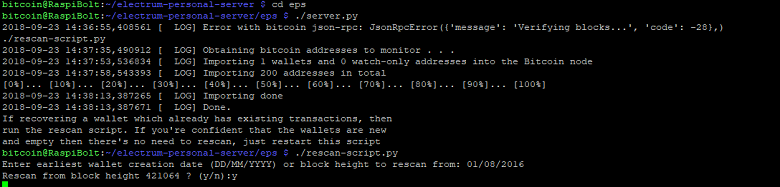

[ [Intro](README.md) ] -- [ [Preparations](raspibolt_10_preparations.md) ] -- [ [Raspberry Pi](raspibolt_20_pi.md) ] -- [ [Bitcoin](raspibolt_30_bitcoin.md) ] -- [ [Lightning](raspibolt_40_lnd.md) ] -- [ [Mainnet](raspibolt_50_mainnet.md) ] -- [ **Bonus** ] -- [ [FAQ](raspibolt_faq.md) ] -- [ [Updates](raspibolt_updates.md) ]

------

### Beginner’s Guide to ️⚡Lightning️⚡ on a Raspberry Pi

------

# Bonus

#### Add system overview

To get a quick overview over the system status, I created [a shell script](https://gist.github.com/Stadicus/ffbbd855d23cd068f7b739cae6440f4b) that is shown on login or on demand.


This script will run as root, so please check it before blindly trusting me.

```
$ cd /home/admin/download/
$ wget https://gist.githubusercontent.com/Stadicus/57122492cb3ea4b5ce606ac0df6db8ae/raw/2b9ca6b03357bc581758f155746dbd0febf7d7a8/20-raspibolt-welcome
  
# check script & exit
$ nano 20-raspibolt-welcome

# delete existing welcome scripts and install
$ sudo mv /etc/update-motd.d /etc/update-motd.d.bak
$ sudo mkdir /etc/update-motd.d
$ sudo cp 20-raspibolt-welcome /etc/update-motd.d/
$ sudo chmod +x /etc/update-motd.d/20-raspibolt-welcome
$ sudo ln -s /etc/update-motd.d/20-raspibolt-welcome /usr/local/bin/raspibolt
```

You can now start the script with `raspibolt` and it is shown every time you log in.


### Pimp the command line prompt

You can prettify your command prompt for each user by enabling color output and setting a custom prompt. Use either the yellow or red user, not both.

I use the red prompt for user “admin”, and the yellow prompt for “bitcoin”.

```
# edit .bashrc with user "admin", use options from below.

$ nano /home/admin/.bashrc
$ sudo nano /home/bitcoin/.bashrc
# reload .bashrc (or just wait until next login)
$ source /home/admin/.bashrc
```

```bash
# enable color prompt (uncomment)
force_color_prompt=yes

# pimp prompt (replace the PS1 line), use only one yellow OR red, not both.
# yellow user
PS1="${debian_chroot:+($debian_chroot)}\[\e[33m\]\u \[\033[01;34m\]\w\[\e[33;40m\] ฿\[\e[m\] "
# red user
PS1="${debian_chroot:+($debian_chroot)}\[\e[31m\]\u \[\033[01;34m\]\w\[\e[33;40m\] ฿\[\e[m\] "

# set "ls" to always use the -la option
alias ls='ls -la --color=always'
```


### Electrum Personal Server

The best way to safekeep your bitcoin (meaning the best combination of security and usability) is to use a hardware wallet (like [Ledger](https://www.ledgerwallet.com) or [Trezor](https://trezor.io)) in combination with your own Bitcoin node. This gives you security, privacy and eliminates the need to trust a third party to verify transactions. 

At the moment, the direct combination of Bitcoin Core with a hardware wallet is not possbile. One way was to use Bitcoin Core, setup an additional [ElectrumX](https://github.com/kyuupichan/electrumx) server and then use the great [Electrum wallet](https://electrum.org) (on your regular computer) that integrates with hardware wallets. Besides the setup not being easy, the overhead is significant, however, and more than a Raspberry Pi can handle.

The new [Electrum Personal Server](https://github.com/chris-belcher/electrum-personal-server) makes it possible to connect Electrum (using your hardware wallet) directly to your RaspiBolt. Before using this setup, please familiarize yourself with all components.

#### Install Electrum Personal Server

* Open a "bitcoin" user session and change into the home directory  
  `$ sudo su bitcoin`  
  `$ cd`
* Clone the EPS GitHub repository  
  `$ git clone https://github.com/chris-belcher/electrum-personal-server`
* Copy and edit configuration template  
  `$ cd electrum-personal-server`  
  `$ cp config.cfg_sample config.cfg`  
  `$ nano config.cfg`
  * Add your wallet master public keys or watch-only addresses to the `[master-public-keys]` and `[watch-only-addresses]` sections. Master public keys for an Electrum wallet can be found in the Electrum client menu `Wallet` -> `Information`.
  *  Uncomment and complete the lines  
    `rpc_user = raspibolt`  
    `rpc_password = [PASSWORD_B]`
  * Change the listening `host` to `0.0.0.0`, so that you can reach it from a remote computer. Please note that the firewall only accepts connections from within the home network, not from the internet.  
    `host = 0.0.0.0`
  * Save & exit


#### Initial blockchain scan

Before starting the server for real, the bitcoin addresses need to be generated and looked up on the blockchain.

* Start the server to generate addresses from your master public keys  
  `$ ./server.py`
* Scan the blockchain (this can take several hours, depending on the startdate you choose)  
  `$ ./rescan-script.py`



* Exit the "bitcoin" user session  
  `$ exit`

#### Automate startup

* As "admin", set up the systemd unit for automatic start on boot  
  `$ sudo nano /etc/systemd/system/eps.service`

```bash
# THIS DOES NOT WORK YET...

[Unit]
Description=Electrum Personal Server
After=bitcoind.service

[Service]
Type=simple
ExecStart=/usr/bin/python3 /home/bitcoin/electrum-personal-server/server.py

[Install]
WantedBy=multi-user.target
```

#### Connect Electrum 

On your regular computer, configure Electrum to use your RaspiBolt: 

* In menu: `Tools > Network > Server` 

* Uncheck "Select server automatically"

* Enter the IP of your RaspiBolt (eg. 192.168.0.20) in the address field

  

* `Close` and check connection in tab "Console" 

  


------

Next: [FAQ >>](raspibolt_faq.md)