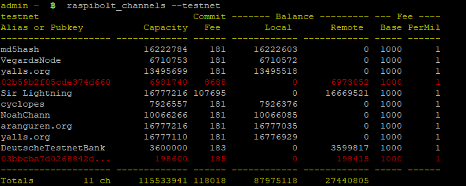

[ [Intro](README.md) ] -- [ [Preparations](raspibolt_10_preparations.md) ] -- [ [Raspberry Pi](raspibolt_20_pi.md) ] -- [ [Bitcoin](raspibolt_30_bitcoin.md) ] -- [ [Lightning](raspibolt_40_lnd.md) ] -- [ [Mainnet](raspibolt_50_mainnet.md) ] -- [ [**Bonus**](raspibolt_60_bonus.md) ] -- [ [Troubleshooting](raspibolt_70_troubleshooting.md) ]

------

### Beginner’s Guide to ️⚡Lightning️⚡ on a Raspberry Pi

------

## Bonus guide: Additional scripts

*Difficulty: easy*

The following scripts were created by [RobClark56](https://github.com/robclark56) and help getting a better system overview. 

As user "admin", download the scripts, make them executable and copy them to the global bin folder.

### Balance


```
$ cd /home/admin/download/
$ wget https://raw.githubusercontent.com/Stadicus/guides/master/raspibolt/resources/lnbalance
$ chmod +x lnbalance
$ sudo cp lnbalance /usr/local/bin
$ cd
$ lnbalance
```


### Channels



```
$ cd /home/admin/download/
$ wget https://raw.githubusercontent.com/Stadicus/guides/master/raspibolt/resources/lnchannels
$ chmod +x lnchannels
$ sudo cp lnchannels /usr/local/bin
$ cd
$ lnchannels
```

### Aliases
Aliases are shortcuts for commands that can save time and make it easier to execute common and frequent commands. The following aliases do not display information in a fancy way, but they make it easier to execute commands.

##### -- Testnet
* Logged in as Admin, open the .bashrc file in nano
``` > sudo nano /home/admin/.bashrc```
* Add the following lines to the end of the .bashrc file
```
alias lndstatus='sudo journalctl -f -u lnd'
alias bitcoindstatus='sudo tail -f /home/bitcoin/.bitcoin/testnet3/debug.log'
alias unlock='lncli unlock'
alias newaddress='lncli --network=testnet newaddress np2wkh'
alias txns='lncli --network=testnet listchaintxns'
alias getinfo='lncli --network=testnet getinfo'
alias walletbalance='lncli --network=testnet walletbalance'
alias peers='lncli --network=testnet listpeers'
alias channels='lncli --network=testnet listchannels'
alias channelbalance='lncli --network=testnet channelbalance'
alias pendingchannels='lncli --network=testnet pendingchannels'
```
* Execute a source command to register changes to the .bashrc file
``` > source /home/admin/.bashrc ```
* Add new file called "openchannel" in /usr/local/bin and set to executable
``` > sudo nano /usr/local/bin/openchannel; chmod +x /usr/local/bin/openchannel ```
* Add the following lines to the "openchannel" file
```
#!/bin/bash

# Opens a channel with connected peer for specified sat amount
# param ${1} : remote node's pub_key, param ${2} : local sat amt
lncli --network=testnet openchannel ${1} ${2}
```
* Add new file called "connect" in /usr/local/bin and set to executable
``` > sudo nano /usr/local/bin/connect; chmod +x /usr/local/bin/connect ```
* Add the following lines to the "connect" file
```
#!/bin/bash

# Connects to peer
# param ${1} : remote node's URI (format of pub_key@ip:port)
lncli --network=testnet connect ${1}
```

##### -- Mainnet
When switching to mainnet, follow the **Testnet** section but removing all instances of --network=testnet from the code.
------

<< Back: [Bonus guides](raspibolt_60_bonus.md) 
