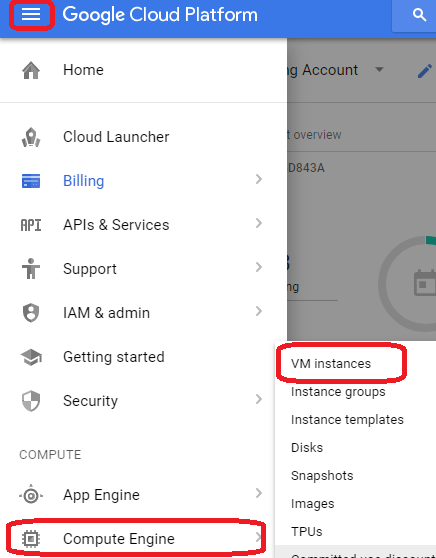
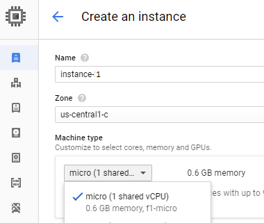
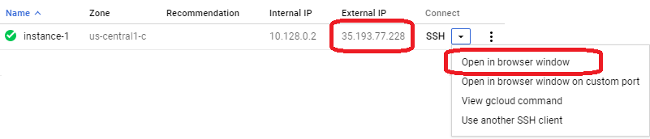

# Introduction #
This guide explains how to automatically unlock the RaspiBolt LND wallet using a computer at a different location. The objective is to have a 'Lights Off' RaspiBolt that recovers automatically all the way to an unlocked wallet in the event that it has rebooted and is unattended - e.g. a power failure.

If the wallet remains unlocked, the lnd server is effectively offline and can not participate in the Lightning Network.

This guide uses a free virtual machine on [Google Cloud Platform](https://cloud.google.com/), but any 24/7 linux server to which you have access should work. It could be another Raspberry Pi at a different location.

# Security #
To unlock a wallet, the password must be entered. If that password is stored on the RaspiBolt, the wallet funds are vulnerable to anyone with physical access to the RaspiBolt. This guide uses a remote computer to store the Password, but limits the functionality that the remote computer can perform; specifically it can not spend any wallet funds.


|Hacker access after RaspiBolt reboot| Hacker Can ...|Hacker Can Not ...|
|------|---|-------|
|RaspiBolt Physical Access||Login, See Wallet Password, Open Wallet, Spend BTC |
|Remote Computer Login|See Wallet Password, Open Wallet|Spend BTC, Login to OS|

# Preparation #
* You will need a (free) [Google](https://google.com) account. 

* Your RaspiBolt must be behind a firewall with either:
  * A static public IP, or
  * A static public [Fully Qualified Domain Name=FQDN](https://en.wikipedia.org/wiki/Fully_qualified_domain_name). This can be provided using a [Dynamic DNS Service](https://en.wikipedia.org/wiki/Dynamic_DNS).

# Procedure #
## Create Free Google Cloud Platform (GCP) Virtual Machine (VM) instance ##
* Visit [https://cloud.google.com/free/](https://cloud.google.com/free/). 
  * Alternatives to GCP are:
    * [Amazon Web Services (Free)](https://aws.amazon.com/free)
    * [Digital Ocean](https://www.digitalocean.com/)

* Click *Try It Free* 

Setup Billing as needed. You get US$300 free usage.

* Click the Hamburger menu icon > Compute Engine > VM Instances

* Click *Create Instance*
* Select Machine Type = *Micro*
* Select Boot Disk = *Debian GNU/Linux*
* Click *Create*
 




* Select Connect > Open in browser window

```
GCP_username@instance-1:~$ 

```

* Note the External IP, and GCP Username of your new VM.

|Parameter|Your value|
|--------------|---------------------|
|GCP External IP|__________________________________|
|GCP Username|__________________________________|


### Install latest lncli ###
* With a normal bowser, visit [https://github.com/lightningnetwork/lnd/releases](https://github.com/lightningnetwork/lnd/releases)
* For the most recent release: Copy the link to the linux-amd64 file
* In the GCP VM window
``` 
$ wget <paste link>
$ tar -xvzf *.gz
$ cp lnd*/lncli .
$ rm *.gz 
$ rm -r lnd*
$ mkdir .lnd
$ ls -la
$ ./lncli
```

**Example**
```
$ wget https://github.com/lightningnetwork/lnd/releases/download/v0.4.1-beta/lnd-linux-amd64-v0.4.1-beta.tar.gz
...
HTTP request sent, awaiting response... 200 OK
Length: 14064932 (13M) [application/octet-stream]
Saving to: ‘lnd-linux-amd64-v0.4.1-beta.tar.gz’
lnd-linux-amd64-v0.4.1-beta. 100%[=============================================>]  13.41M  7.66MB/s    in 1.8s    
2018-04-08 03:49:56 (7.66 MB/s) - ‘lnd-linux-amd64-v0.4.1-beta.tar.gz’ saved [14064932/14064932]

$ tar -xvzf *.gz
lnd-linux-amd64-v0.4.1-beta/
lnd-linux-amd64-v0.4.1-beta/lncli
lnd-linux-amd64-v0.4.1-beta/lnd
$ cp lnd*/lncli .
$ rm *.gz 
$ rm -r lnd*
$ mkdir .lnd
$ ls -la
drwxr-xr-x 5 GCP_Username GCP_Username     4096 Apr  8 07:14 .
drwxr-xr-x 3 root         root             4096 Apr  7 23:07 ..
-rw-r--r-- 1 GCP_Username GCP_Username      220 May 15  2017 .bash_logout
-rw-r--r-- 1 GCP_Username GCP_Username     3526 May 15  2017 .bashrc
-rwxr-xr-x 1 GCP_Username GCP_Username 16231264 Apr  8 03:56 lncli
drwxr-xr-x 2 GCP_Username GCP_Username     4096 Apr  8 07:15 .lnd
drwxr-xr-x 2 GCP_Username GCP_Username     4096 Apr  8 05:10 .nano
-rw-r--r-- 1 GCP_Username GCP_Username      675 May 15  2017 .profile
drwx------ 2 GCP_Username GCP_Username     4096 Apr  8 05:30 .ssh
-rw-r--r-- 1 GCP_Username GCP_Username      165 Apr  8 03:49 .wget-hsts
$ ./lncli -h
[You should see the lncli help]
```
## Modify local firewall and port forwarding ##
* Add a new Port Forward for port 10009 on your router. See [ Rasberry Pi ](raspibolt_20_pi.md)
* login as admin to your RaspiBolt
* Allow rpc from your VM in RaspiBolt firewall

Subsitute GCP_External_IP with your GCP External IP

```
admin ~  ฿  sudo su
root@RaspiBolt:/home/admin# ufw allow from GCP_External_IP to any port 10009 comment 'allow lnd rpc from GCP VM'
root@RaspiBolt:/home/admin# exit
```

## Create new Certificate/Key file pair ##
* login as admin to your RaspiBolt

* Edit and save the lnd.conf file with the changes shown. 

  * Change the *rpclisten* line as shown
  * If you have:
    * A static IP address: Add *tlsextraip=my.vm.ip.address* (i.e. your External IP address).
    * A static FQDN: Add *tlsextradomain=my.fqdn* (i.e. your FQDN).
```
admin ~  ฿  sudo nano /home/bitcoin/.lnd/lnd.conf
```

```
[Application Options]
#rpclisten=localhost:10009
rpclisten=0.0.0.0:10009
# use tlsextraip ONLY if you have a static public IP address
tlsextraip=my.vm.ip.address
# use tlsextradomain ONLY if you have a static public FQDN
tlsextradomain=my.fqdn
```
* Hide the existing tls.key and tls.cert files so that lnd regenerates them
```
admin ~  ฿  sudo mv /home/bitcoin/.lnd/tls.cert  /home/bitcoin/.lnd/tls.cert.backup
admin ~  ฿  sudo mv /home/bitcoin/.lnd/tls.key   /home/bitcoin/.lnd/tls.key.backup
``` 

* Restart lnd to generate new tls files
```
admin ~  ฿  sudo systemctl restart lnd
admin ~  ฿  openssl x509 -in /home/bitcoin/.lnd/tls.cert -text -noout
```

You should see *my.vm.ip.address* or *my.fqdn* in the result
```
X509v3 Subject Alternative Name:
    DNS:RaspiBolt, DNS:localhost, DNS:my.fqdn, 
    IP Address:127.0.0.1, IP Address:0:0:0:0:0:0:0:1, IP Address:192.168.0.141, 
    IP Address:FE80:0:0:0:2481:BA24:A7E5:3DA1
```
*  Copy the TLS cert to user admin 
```
admin ~  ฿  sudo cp /home/bitcoin/.lnd/tls.cert /home/admin/.lnd
admin ~  ฿  sudo chown -R admin:admin /home/admin/.lnd
```

* Create an SSH key to use with GCP

Substitute *GCP_Username* with Your GCP Username. 

Use an empty passphrase when you see "Enter passphrase (empty for no passphrase):"

```
admin ~  ฿  sudo ssh-keygen -t rsa -f ~/.ssh/gcp_ssh -C GCP_Username
admin ~  ฿  cat .ssh/gcp_ssh.pub
ssh-rsa AAAAB3NzaC1yc2
[....deleted...]
47QMfLdEZQVXh2RgI+CQfWCiFrimq4h GCP_Username
```
* Copy the SSH key to GCP
  * On GCP: Hamburger Menu > Compute Engine > Metadata >SSH Keys > Edit > + Add Item
  * Paste the contents of .ssh/gcp_ssh.pub where it says *Enter entire data key*, and Click save
 
* Copy files from RaspiBolt to GCP
  * Use the commands below, substituting *GCP_Username* and *GCP_External_IP*

When you see "Are you sure you want to continue connecting (yes/no)?", answer *yes*

```
admin ~  ฿  sudo scp -i .ssh/gcp_ssh /home/bitcoin/.lnd/tls.cert          GCP_Username@GCP_External_IP:.lnd/
admin ~  ฿  sudo scp -i .ssh/gcp_ssh /home/bitcoin/.lnd/readonly.macaroon GCP_Username@GCP_External_IP:.lnd/
```

## Setup the VM ##
* Login to your GCP VM
  * Visit: https://console.cloud.google.com
  * Compute Engine > VM Instances > Connect > Open in browser window

* Check you have these 3 files

```
$ ls -l . .lnd
.:
total 15852
-rwxr-xr-x 1 GCP_Username GCP_Username 16231264 Apr  8 03:56 lncli

.lnd:
total 8
-rw-r--r-- 1 GCP_Username GCP_Username 183 Apr  8 07:19 readonly.macaroon
-rw-r--r-- 1 GCP_Username GCP_Username 741 Apr  8 07:15 tls.cert
```

## Check Wallet hourly, and Unlock if needed ##
* Login to your GCP VM
* Install expect

`$ sudo apt-get install expect`
* Create and save an lncli wrapper
```
$ sudo touch run_lncli
$ sudo chmod +x run_lncli
$ sudo nano run_lncli
```
Add the code below, after changing *GCP_Username*, and *my.fqdn*
```
#!/bin/bash
# Wrapper for lncli executable
# <home_dir>/run_lncli

#
# Change next 2 lines`
#
home_dir="/home/GCP_Username"
RaspiBoltExternal="my.fqdn"

############################
$home_dir/lncli --rpcserver=$RaspiBoltExternal:10009 \
                --macaroonpath=$home_dir/.lnd/readonly.macaroon  \
                --lnddir=$home_dir/.lnd \
                $1
```
* Create and save Expect script

Change *MyLndWalletPassword* and *GCP_Username*.

```
$ sudo nano .lnd/lnd_unlock.exp

#!/usr/bin/expect
#
# File invoked by /ect/cron.hourly to unlock the lnd wallet
# <home_dir>/.lnd/lnd_unlock.exp

#
# Change next 2 lines
#
set walletPW "MyLndWalletPassword"
set home_dir "/home/GCP_Username"

##################################
set lncli "$home_dir/run_lncli"
set timeout 40
spawn $lncli unlock
log_user 0
expect "Input wallet password: "
send "$walletPW\r"
log_user 1
expect "lnd successfully unlocked!"
```

* Create and save hourly cron job.  

Note: The cron job will run approximately every 60 mins, but not usually at 'the top of the hour'.

```
$ sudo touch /etc/cron.hourly/lnd_unlock
$ sudo chmod +x /etc/cron.hourly/lnd_unlock
$ sudo nano /etc/cron.hourly/lnd_unlock
```
Change *GCP_Username*
```
#!/bin/bash
# RaspiBolt LND: Script to unlock wallet
# /etc/cron.hourly/lnd_unlock

#
# Change next 1 line
#
home_dir="/home/GCP_Username"

################################
lncli="$home_dir/run_lncli"
$lncli getinfo  2>&1 | grep "identity_pubkey" >/dev/null
wallet_unlocked=$?
if [ "$wallet_unlocked" -eq 1 ] ; then
 echo "Wallet Locked"
 /usr/bin/expect $home_dir/.lnd/lnd_unlock.exp  2>&1 > /dev/null
else
 echo "Wallet UnLocked"
fi
```

# Test #
On GCP:

```
$ ./run_lncli getinfo
[lncli] Wallet is encrypted. Please unlock using 'lncli unlock', or set password using 'lncli create' if this is the first time starting lnd.
```
If you see the above, it confirms the communication from your GCP instance to your RaspiBolt is working.

Repeat the above command every 10 mins or so for at max. 1 hour, until you see somwething like:
```
$ ./run_lncli getinfo
{
    "identity_pubkey": "xxxxx4",
    "alias": "xxxxx",
    "num_pending_channels": 0,
    "num_active_channels": 1,
    "num_peers": 2,
    "block_height": 1291957,
    "block_hash": "00000000000000ca546331fbe0d83df81b8f4bf2b24f081cce359920faaa8dc1",
    "synced_to_chain": true,
    "testnet": true,
    "chains": [
        "bitcoin"
    ],
    "uris": [
        "xxx@x.x.x.x:9735"
    ],
    "best_header_timestamp": "1523192388"
}
```

