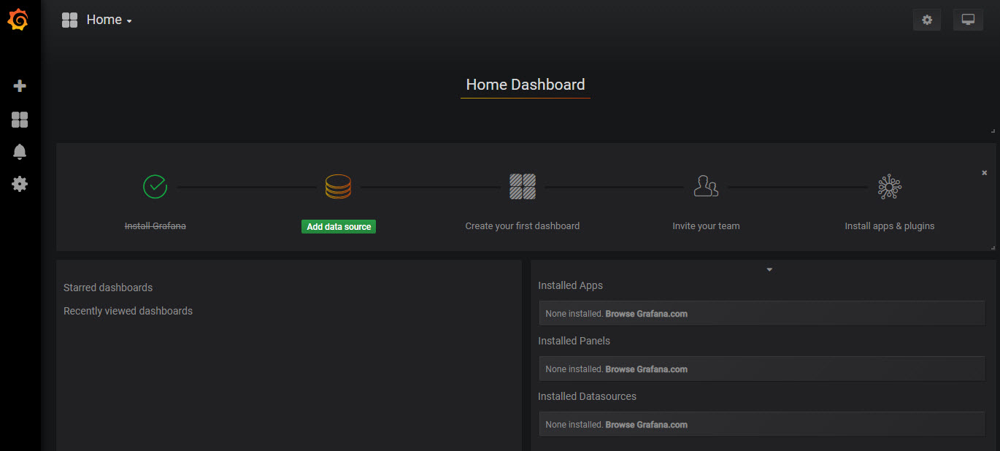
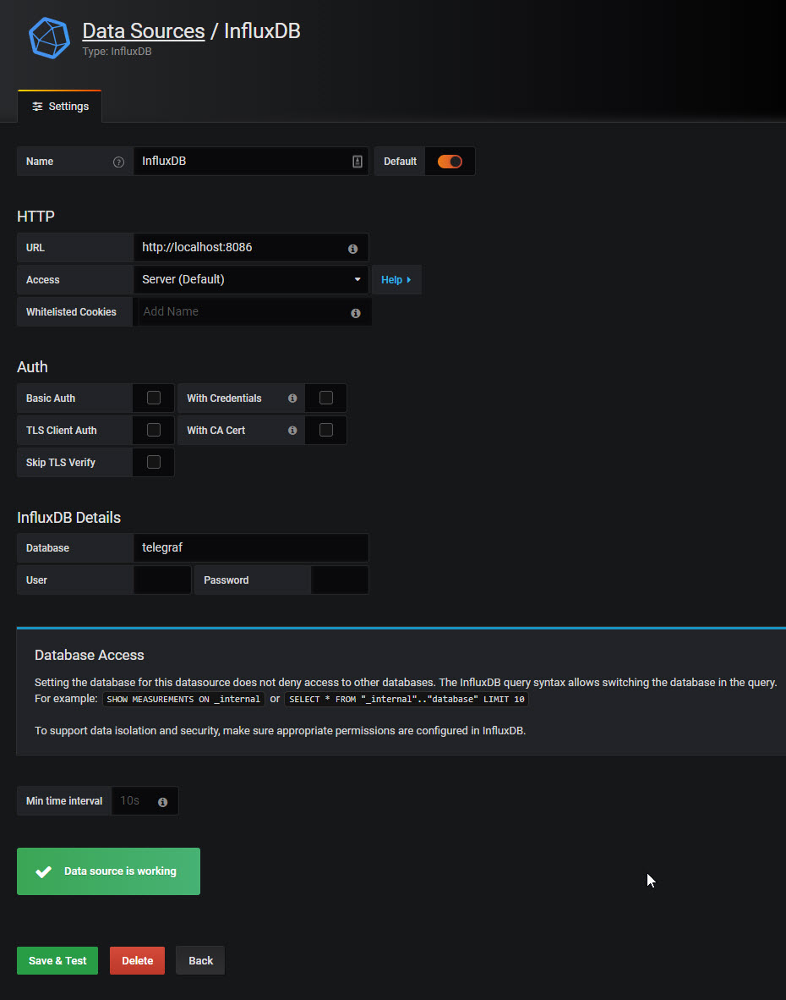
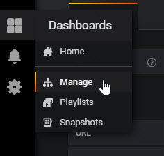
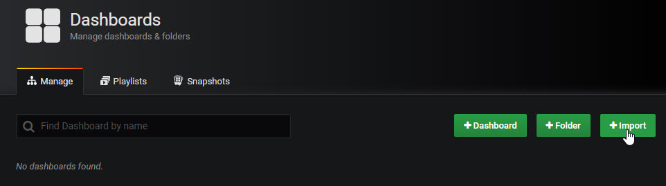
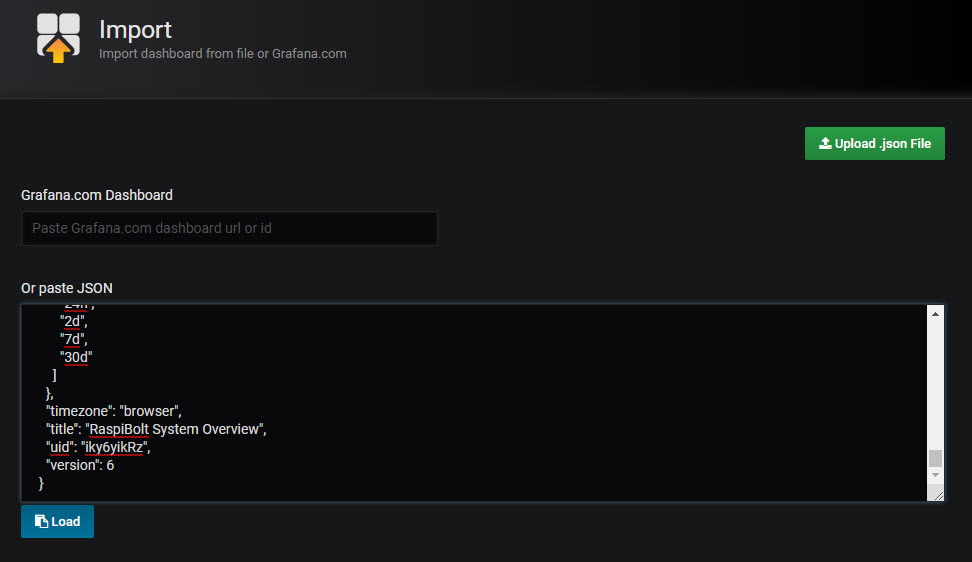
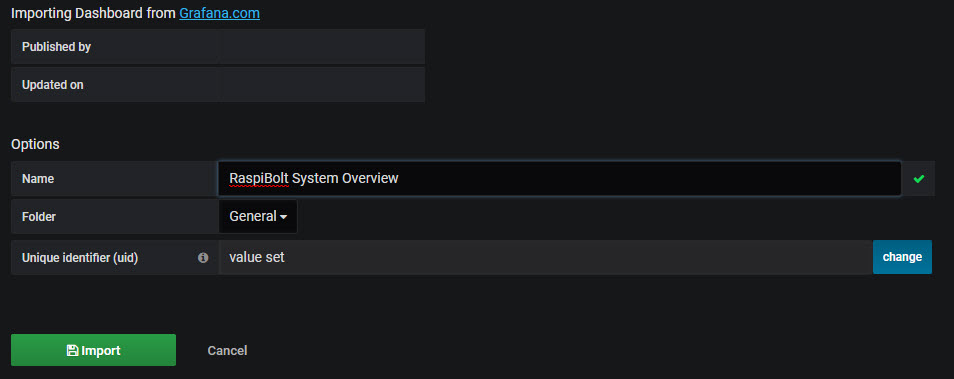
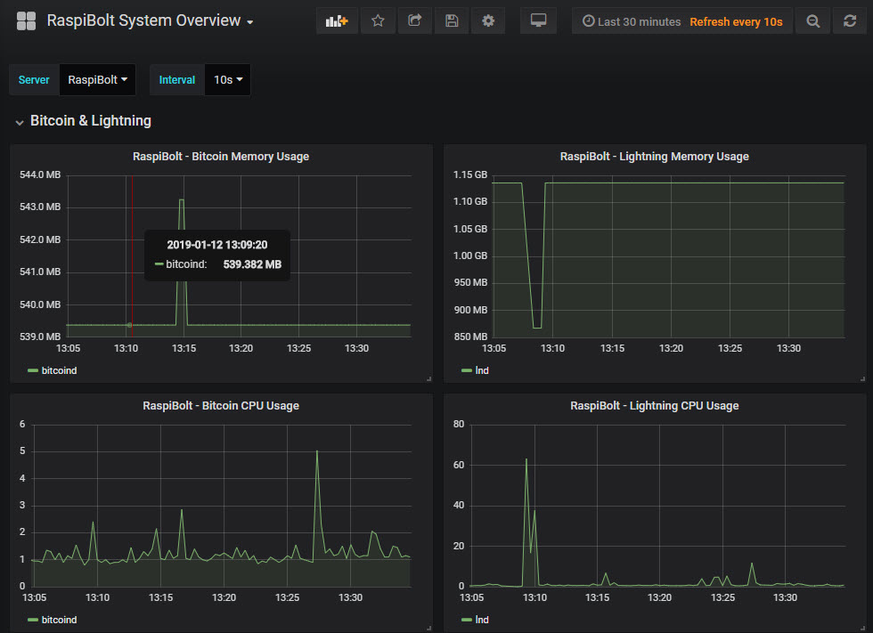

[ [Intro](README.md) ] -- [ [Preparations](raspibolt_10_preparations.md) ] -- [ [Raspberry Pi](raspibolt_20_pi.md) ] -- [ [Bitcoin](raspibolt_30_bitcoin.md) ] -- [ [Lightning](raspibolt_40_lnd.md) ] -- [ [Mainnet](raspibolt_50_mainnet.md) ] -- [ [**Bonus**](raspibolt_60_bonus.md) ] -- [ [Troubleshooting](raspibolt_70_troubleshooting.md) ]

------

### Beginner’s Guide to ️⚡Lightning️⚡ on a Raspberry Pi

------

## Bonus guide: Performance Monitoring
*Difficulty: intermediate*

It's useful to have insights into RaspiBolt's performance metrics. This may help in debugging all sorts of potential problems, e.g. network latency, CPU performance, block propagation etc. 

Observing anomolies and doing performance tuning is greatly improved when you have these insights.

### Overview

There are a few required pieces to get this working. They are:
- Docker
- InfluxDB
- Telegraf
- Grafana

> Reference: Thanks to Pete Shima's [medium post](https://medium.com/@petey5000/monitoring-your-home-network-with-influxdb-on-raspberry-pi-with-docker-78a23559ffea) that helped greatly in setting this up.

# [Docker](https://www.docker.com)

Install docker by running the following commands
```
$ cd download/
$ curl -fsSL get.docker.com -o get-docker.sh
$ sudo sh get-docker.sh
```

Confirm that it's working
```
$ sudo docker --version
Docker version 18.09.0, build 4d60db4
```

If you're willing to take the security risk as [outlined here](https://docs.docker.com/engine/security/security/#docker-daemon-attack-surface) you can execute `docker` commands without the `sudo` prefix, alternatively include `sudo` before all docker commands that follow in this guide

```
$ sudo usermod -aG docker $USER
```

Logout and connect again for the changes to take effect, and test with the command below
```
$ docker run hello-world
```

# [InfluxDB](https://www.influxdata.com/)

Running InfluxDB with auto-restart in the event of a system restart
```
$ docker run -d --name=influxdb --net=host --restart always --volume=/var/influxdb:/data hypriot/rpi-influxdb 
```

Add a retention policy so we don't have to worry about the InfluxDb growing in size
```
admin@RaspiBolt:~ $ docker ps
CONTAINER ID        IMAGE                       COMMAND                  CREATED             STATUS              PORTS               NAMES
0d209e38b24f        badokun/lnd-metrics:arm32   "./lnd-metrics --inf…"   43 hours ago        Up 5 hours                              lnd-metrics-arm32
9557f9e7ad87        grafana/grafana:5.4.3       "/run.sh"                45 hours ago        Up 5 hours                              grafana
b9f31d893601        hypriot/rpi-influxdb        "/usr/bin/entry.sh /…"   6 days ago          Up 5 hours                              influxdb
a
```

Use the influxDb's `CONTAINER ID`. In the example above it's `b9f31d893601`

```
docker exec -it b9f31d893601 /usr/bin/influx
CREATE DATABASE telegraf
USE telegraf
CREATE RETENTION POLICY "six_months" ON "telegraf" DURATION 180d REPLICATION 1 DEFAULT
SHOW RETENTION POLICIES ON "telegraf"
```

Enter `exit` to quit

# [Telegraf](https://docs.influxdata.com/telegraf)

```
$ wget https://dl.influxdata.com/telegraf/releases/telegraf_1.7.0-1_armhf.deb
$ sudo dpkg -i telegraf_1.7.0-1_armhf.deb
$ rm telegraf_1.7.0-1_armhf.deb
$ sudo systemctl status telegraf
```

This would have installed Telegraf as a service. Confirm by running:
```
$ sudo systemctl status telegraf
```

Enter `Ctrl-C` or `q` to exit after entering the status command above

We need to update the `telegraf.conf` so it publishes the data we'll be using later in our Grafana dashboard

```
cd /etc/telegraf/
sudo cp telegraf.conf telegraf.conf.bak
sudo rm telegraf.conf
sudo wget https://raw.githubusercontent.com/badokun/guides/master/raspibolt/resources/telegraf.conf
sudo systemctl restart telegraf
```

# [Grafana](https://grafana.com/)

```
[ A ] Grafana Admin password
```

Create persistent storage for Grafana so when it's upgraded in future you won't lose all your configuration
```
docker volume create grafana-storage
```

Run the Grafana's docker image, replacing the `admin` password setting `PASSWORD_[A]` with your password. This will be used when logging into Grafana's UI

```
 docker run \
    -d \
    -e "GF_SECURITY_ADMIN_PASSWORD=PASSWORD_[A]" \
    --name grafana \
    -v grafana-storage:/var/lib/grafana \
    --restart always \
    --net=host \
    grafana/grafana:5.4.3
```

Confirm Grafana is running as a docker container by executing 
```
docker ps
```

You should see something like this:
```
CONTAINER ID        IMAGE                    COMMAND                  CREATED              STATUS              PORTS               NAMES
3194df6aff01        grafana/grafana:master   "/run.sh"                About a minute ago   Up About a minute                       grafana
b9f31d893601        hypriot/rpi-influxdb     "/usr/bin/entry.sh /…"   38 hours ago         Up 2 hours                              influxdb

```

We need to modify the firewall configuration to allow for port 3000. 
> Note the IP address range, yours may be 192.168.0.0/24

```
ufw allow from 192.168.1.0/24 to any port 3000 comment 'allow grafana from local LAN'
```

At this point we can start to setup a Grafana's Dashboard.

Browse to `http://192.168.1.40:3000` in your browser and replace the IP address with your RaspiBolt's.

After logging  into the Grafana website with `admin` and `PASSWORD_[A]` you should see this



## Add a data source

Click on Add data source, then InfluxDB. Enter `telegraf` into the Database field



## Add a Dashboard

### Locate the shortcut to the left of the page and click on Manage



###  Importing an existing Dashboard



### Enter the Grafana Dashboard Id of `9653` and click Load


### Select the InfluxDB from the drop down list and click on Import



### You should see the dashboard in all its glory



> Once you've successfully completed this guide on performance monitoring, you can take things to the next level by following 
[Running on RaspiBolt](https://github.com/badokun/lightning-metrics#running-on-raspibolt) section of the [lightning-metrics](https://github.com/badokun/lightning-metrics) project. This will give you additional metrics on the Lightning Network's status.

------

<< Back: [Bonus guides](raspibolt_60_bonus.md) 
