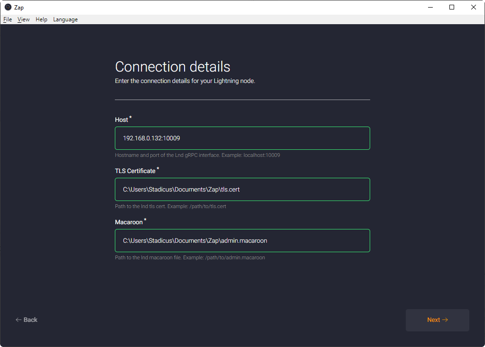

[ [Intro](README.md) ] -- [ [Preparations](raspibolt_10_preparations.md) ] -- [ [Raspberry Pi](raspibolt_20_pi.md) ] -- [ [Bitcoin](raspibolt_30_bitcoin.md) ] -- [ [Lightning](raspibolt_40_lnd.md) ] -- [ [Mainnet](raspibolt_50_mainnet.md) ] -- [ [**Bonus**](raspibolt_60_bonus.md) ] -- [ [Troubleshooting](raspibolt_70_troubleshooting.md) ]

------

### Beginner’s Guide to ️⚡Lightning️⚡ on a Raspberry Pi

------

## Bonus guide: Zap Desktop Lightning Wallet
*Difficulty: easy*

The desktop app Zap (https://github.com/LN-Zap/zap-desktop) is a cross platform Lightning Network wallet focused on user experience and ease of use.

Download Zap for your operating sytem:
https://github.com/LN-Zap/zap-desktop/releases  
Install instructions: https://github.com/LN-Zap/zap-desktop#install

### Preparation on the Pi

* Allow connections to the RaspiBolt from your own network. Check how the ip address of your Pi is starting with, eg. 192.168.0 or 192.168.1 , and use the address accordingly. Ending with .0/24 will allow all IP addresses from that network.  
    `$ sudo nano /home/bitcoin/.lnd/lnd.conf`  

    Add the following lines to the section `[Application Options]`:  
   ```
   tlsextraip=192.168.0.0/24
   rpclisten=0.0.0.0:10009
   ```
  
* Delete tls.cert (restarting LND will recreate it):  
    `$ sudo rm /home/bitcoin/.lnd/tls.*`

* Restart LND :  
  `$ sudo systemctl restart lnd`  
  
* Copy the new tls.cert to user "admin", as it is needed for lncli:  
    `$ sudo cp /home/bitcoin/.lnd/tls.cert /home/admin/.lnd`

* Unlock wallet  
  `$ lncli unlock` 

* Allow the ufw firewall to listen on 10009 from the LAN:  
  `$ sudo ufw allow from 192.168.0.0/24 to any port 10009 comment 'allow LND grpc from local LAN'`

 * restart and check the firewall:  
  `$ sudo ufw enable`  
  `$ sudo ufw status`

### Copying the authentication files
For Zap to access your Lightning node, it needs to authenticate itself. For that, the two files `tls.cert` (for Transport Layer Security) and `admin.macaroon` (to access LND) are necessary.

#### On Windows
We are using "Secure Copy" (SCP), so [download and install WinSCP](https://winscp.net), a free open-source program. It needs to be configured to log into your RaspiBolt using your SSH private key.

* Start WinSCP, configure a New Site with the following details:
  * File protocol: `SCP`
  * Host name: `192.168.0.20`
  * Port number: `22`
  * User name: `root`  
  
  
  
* Click on Advanced / SSH / Authentication and select your SSH private key from your file system (see [base guide](raspibolt_20_pi.md#login-with-ssh-keys) for additional information). Confirm with OK.

  
  
* Click "Save" to keep the configuration, give it a name and then click "Login". You might need to enter your SSH private key passphrase.

    
  
  :warning: Login as root is necessary to access these files. This will only work if you copied the `authorized_keys` to the root home directory (see [base guide](raspibolt_20_pi.md#login-with-ssh-keys). 

* Navigate to the local folder where you want to store the authentication files in the left pane, and to `/mnt/hdd/lnd` in the right pane of WinSCP. 

* Download the file `/mnt/hdd/lnd/tls.cert`
  

* Download the file `/mnt/hdd/lnd/data/chain/bitcoin/mainnet/admin.macaroon`
  

* Exit WinSCP

#### On your Linux desktop terminal:  

* Copy the tls.cert to your home directory:  
  `$ scp admin@your.RaspiBolt.LAN.IP:/home/admin/.lnd/tls.cert ~/`

* Copy the admin.macaroon to your home directory:  
  `$ scp root@your.RaspiBolt.LAN.IP:/home/bitcoin/.lnd/data/chain/bitcoin/mainnet/admin.macaroon ~/`

### Configure Zap

* Start the app and select:  
  ```Connect your own node```
  


* Fill in the next screen:  
  Host: `192.168.0.20:10009` (use your own RaspiBolt ip address)  
  TLS Certificate: `C:\path\to\your\tls.cert`  
  Macaroon: `C:\path\to\your\admin.macaroon`  
  
 
* Confirm the settings on the following screen and you are done!


------

<< Back: [Bonus guides](raspibolt_60_bonus.md) 
