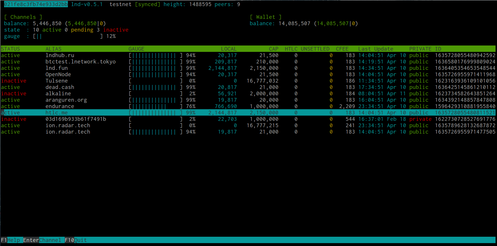

[ [Intro](README.md) ] -- [ [Preparations](raspibolt_10_preparations.md) ] -- [ [Raspberry Pi](raspibolt_20_pi.md) ] -- [ [Bitcoin](raspibolt_30_bitcoin.md) ] -- [ [Lightning](raspibolt_40_lnd.md) ] -- [ [Mainnet](raspibolt_50_mainnet.md) ] -- [ [**Bonus**](raspibolt_60_bonus.md) ] -- [ [Troubleshooting](raspibolt_70_troubleshooting.md) ]

------

### LN Terminal Dashboard

------
*Difficulty: easy*



```lntop``` is an interactive text-mode channels viewer for Unix systems.

Login as ```admin``` and install the required [golang](https://golang.org/) (version >= 1.11).

```
# download golang
wget https://dl.google.com/go/go1.12.4.linux-armv6l.tar.gz

# check checksum matches: c43457b6d89016e9b79b92823003fd7858fb02aea22b335cfd204e0b5be71d92
sha256sum go1.12.4.linux-armv6l.tar.gz | awk -F " " '{ print $1 }'

# install binaries
tar -C /usr/local -xzf go1.12.4.linux-armv6l.tar.gz

# setup environment variables
sudo nano ~/.profile

#add to end of .profile
export PATH=$PATH:/usr/local/go/bin
```

At this point, you should set in ```.bashrc``` your ```$GOPATH``` environment variable, which represents the path to your workspace. You will also need to add ```$GOPATH/bin``` to your ```PATH```. This ensures that your shell will be able to detect the binaries you install.

```$ sudo nano ~/.bashrc```

Add the following to the end of the ```.bashrc``` file.

```
$ export GOPATH=~/gocode
$ export PATH=$PATH:$GOPATH/bin
```

Reload both .bashrc and .profile

```
$ source ~/.bashrc
$ source ~./profile
```

Now that you have installed the required latest go programming language, it is time to install ```lntop```.

```
$ git clone https://github.com/edouardparis/lntop.git
$ cd lntop
$ export GO111MODULE=on
$ go install ./...
```

The first time running ```lntop``` a config file ```.lntop/config.toml``` is created in the user home directory. No modification of config is necessary. ```lntop``` may stall upon first use. Just be patient.
```
# run lntop
$ lntop
```

------

<< Back: [Bonus guides](raspibolt_60_bonus.md) 
