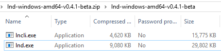
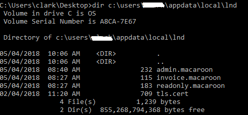

# Use lncli on a Different Computer
It is possible to run lnd on the RaspiBolt, and run lncli on a different computer. The instructions below explain how to install and run lncli on a Windows PC and communicate with the RaspiBolt. Instructions for running on a different computer (MAC, Linux, ...) will be basically identical.

In these instructions, it is assumed the lncli computer is on the local LAN, but it is possible to also have the lncli computer outside the local LAN.

## RaspiBolt

- Login as admin

- Allow port 10009 in firewall

```
admin ~  ฿  sudo su
admin ~  ฿  ufw allow from 192.168.0.0/24 to any port  10009 comment 'allow lnd rpc from Local LAN'
admin ~  ฿  ufw status
admin ~  ฿  exit
```
- Add one new line in the [Application Options] section of lnd.conf to allow rpc from more than just the default localhost

`admin ~  ฿  sudo nano /home/bitcoin/.lnd/lnd.conf`
  
```
[Application Options]
rpclisten=0.0.0.0:10009

```

- Temporarily allow admin.macaroon to be copied

`sudo chmod 777 /home/bitcoin/.lnd/admin.macaroon`


## Windows PC

Download and install lncli

- Use your browser to visit https://github.com/lightningnetwork/lnd/releases

- Download the file for your OS. For Windows10 it will generally be lnd-windows-amd64-vx.x.x-beta.zip
  
- Open the compressed file and extract the lncli application (e.g. lncli.exe) to your desktop.
 

- Open a CMD window

`Press Win+R, then enter cmd, then press Enter` 

- Change to the directory where you saved lncli.exe, and view the help information

```
> cd %USERPROFILE%\desktop
> lncli
...
GLOBAL OPTIONS:
   --rpcserver value        host:port of ln daemon (default: "localhost:10009")
   --lnddir value           path to lnd's base directory (default: "C:\\Users\\xxxx\\AppData\\Local\\Lnd")
   --tlscertpath value      path to TLS certificate (default: "C:\\Users\\xxxx\\AppData\\Local\\Lnd\\tls.cert")
   --no-macaroons           disable macaroon authentication
   --macaroonpath value     path to macaroon file (default: "C:\\Users\\xxx\\AppData\\Local\\Lnd\\admin.macaroon")
   --macaroontimeout value  anti-replay macaroon validity time in seconds (default: 60)
   --macaroonip value       if set, lock macaroon to specific IP address
   --help, -h               show help
   --version, -v            print the version
```
- Take note of the default directory

- Make the necessary Lnd directory
   
`> mkdir %LOCALAPPDATA%\Lnd`

* Follow the instructions in [Mainnet] to use WinSCP to copy the files shown
  * Local:  `\Users\xxxx\AppData\Local\Lnd`
  * Remote: `/home/bitcoin/.lnd/`
  * Files: `See below`
 
  
 
