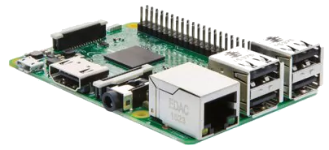
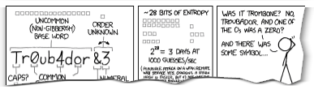

<!-- markdownlint-disable MD014 MD022 MD025 MD040 -->
# Preparations
{: .no_toc }

Let's get all the required parts and assemble the Raspberry Pi.

---

## Table of contents
{: .no_toc .text-delta }

1. TOC
{:toc}

---

This guide builds on the easily available and very flexible Raspberry Pi 4.
This amazing piece of hardware is a tiny computer-on-a-chip, costs about $60 and consumes very little energy.

## Hardware requirements

This guide is written for the fastest Raspberry Pi, as it makes a lot of hacks and workarounds obsolete.
You need

* Raspberry Pi 4, with 4 GB RAM
* microSD card: 8 GB or more, incl. adapter to your regular computer
* strong USB power adapter: 5V/3A + USB-C cable
* external hard disk: 500 GB or more
* optional: Raspberry Pi case



To run a Lightning node, the full Bitcoin blockchain must be stored locally, which is ~300 GB and growing.
You can buy a cheap hard disk enclosure and reuse an old 500 GB hard disk.
I recommend getting a modern 2.5" SSD that can be powered through the USB connection to the Pi directly, which also speeds up initial sync time significantly.

---

## Other computing platforms

This guide works with most Debian-based Linux distributions, be it on other computing platforms, a real laptop or a virtual machine.
Only the "Raspberry Pi" part is quite specific, but easily adaptable to other environments.
Over time, it would be great to describe the differences that need to be considered when using other environments like [Odroid](https://www.hardkernel.com/), [Pine64](https://www.pine64.org/) or [Libre Computer](https://libre.computer/).

---

## Write down your passwords

You will need several passwords and I find it easiest to write them all down in the beginning, instead of bumping into them throughout the guide.
They should be unique and very secure, at least 12 characters in length. Do **not use uncommon special characters**, spaces or quotes (‘ or “).

```console
[ A ] Master user password
[ B ] Bitcoin RPC password
[ C ] LND wallet password
[ D ] LND seed password (optional)
```



If you need inspiration for creating your passwords: the [xkcd: Password Strength](https://xkcd.com/936/) comic is funny and contains a lot of truth.
Store a copy of your passwords somewhere safe (preferably in an open source password manager like [KeePassXC](https://keepassxc.org/)) and keep your original notes out of sight once your system is up and running.

---
Next: [Raspberry Pi >>](raspibolt_20_pi.md)
