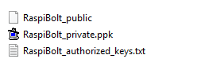
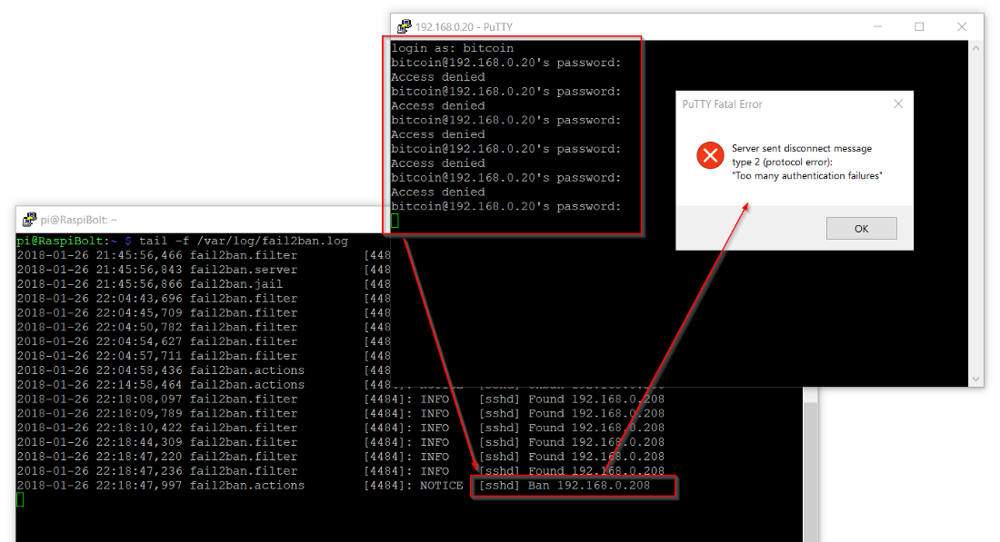

<!-- markdownlint-disable MD014 MD022 MD025 MD033 MD040 -->
# Security
{: .no_toc }

We make sure that your RaspiBolt is secure and reliable.

---

## Table of contents
{: .no_toc .text-delta }

1. TOC
{:toc}

---

The RaspiBolt will be visible from the internet and therefore needs to be secured against attacks using various methods.

## Login with SSH keys

One of the best options to secure the SSH login is to completely disable the password login and require a SSH key certificate.
Only someone with physical possession of the private key can login.

### Generate keys on Windows

Follow this guide [Configure “No Password SSH Keys Authentication” with PuTTY on Linux Servers](https://www.tecmint.com/ssh-passwordless-login-with-putty){:target="_blank"}

* You should have generated three new files. Keep them safe!

  {:target="_blank"}

### Generate keys on Mac / Linux

* In the Terminal on your regular computer, check if there are already existing private / public keys:

  ```sh
  $ ls -la ~/.ssh/*.pub
  ```

* If files are listed, your public key should be named something like `id_dsa.pub`, `id_ecdsa.pub`, `id_ed25519.pub` or `id_rsa.pub`.
   If one of these files exists, skip the next bullet point.

* If none of those files exist, or you get a `No such file or directory`, create a new key pair:

  ```sh
  $ ssh-keygen -t rsa -b 4096
  ```

  When you're prompted to "Enter a file in which to save the key," press Enter to use the default file location. Optionally, for maximum security, use `password [A]` to protect your key.

* The public key now needs to be copied to the Pi. 
  We use the command `ssh-copy-id`, which copies your public key to the remote machine (and creates files and directories, if needed).
  You will be prompted for your password once.

  ```sh
  $ ssh-copy-id admin@raspibolt.local
  ```

  💡 If you are on macOS and encounter an error, you might need to enable `ssh-copy-id` first, using [this guide](https://devtip.io/ssh-keys-remote-server).

<script id="asciicast-BvuWd8S8hvBLmsXBW4L2EEeRZ" src="https://asciinema.org/a/BvuWd8S8hvBLmsXBW4L2EEeRZ.js" async></script>

### Disable password login

* Log in to the Raspberry Pi with SSH as "admin" with your SSH key.
  You shouldn't be prompted for admin's password anymore.

* Edit ssh configuration by setting "ChallengeResponseAuthentication" and "PasswordAuthentication" to "no" (uncomment the line by removing # if necessary).
  Save and exit.

  ```sh
  $ sudo nano /etc/ssh/sshd_config
  ```

* Restart the SSH daemon, then exit and log in again.

  ```sh
  $ sudo systemctl restart sshd
  $ exit
  ```

  You can no longer log in with "pi" or "bitcoin", only "admin" has the necessary SSH keys.

<script id="asciicast-tm3A2UmR65pc63rHSAmHl2eHZ" src="https://asciinema.org/a/tm3A2UmR65pc63rHSAmHl2eHZ.js" async></script>

🚨 **Backup your SSH keys!** You will need to attach a screen and keyboard to your Pi if you lose it.

---

## Enabling the Uncomplicated Firewall

A firewall controls what traffic is permitted and closes possible security holes.
Only SSH and the Electrum server are reachable from the outside.
Bitcoin Core and LND are using Tor and don't need incoming ports.

The following steps need admin privileges and must be executed with the user "admin".

```sh
$ sudo apt install ufw
$ sudo su
$ ufw default deny incoming
$ ufw default allow outgoing
$ ufw allow 22    comment 'allow SSH'
$ ufw allow 50002 comment 'allow Electrum SSL'
$ ufw enable
$ systemctl enable ufw
$ ufw status
> Status: active
>
> To                         Action      From
> --                         ------      ----
> 22                         ALLOW       Anywhere                   # allow SSH
> 50002                      ALLOW       Anywhere                   # allow Electrum SSL
> ...
$ exit
```

<script id="asciicast-vRmJZZMgzolgH3ooLCGS5RCj8" src="https://asciinema.org/a/vRmJZZMgzolgH3ooLCGS5RCj8.js" async></script>

🔍 *more: [UFW Essentials](https://www.digitalocean.com/community/tutorials/ufw-essentials-common-firewall-rules-and-commands){:target="_blank"}*

💡 If you find yourself locked out by mistake, you can connect keyboard and screen to your Pi to log in locally and fix these settings (especially for the SSH port 22).

---

## fail2ban

The SSH login to the Pi must be especially protected.
Additional steps should be taken to prevent an attacker to just try out all possible passwords.

The first measure is to install “fail2ban”, a service that cuts off any system with five failed login attempts for ten minutes.
This makes a brute-force attack unfeasible, as it would simply take too long.

{:target="_blank"}
*Me locking myself out by entering wrong passwords*

```sh
$ sudo apt install fail2ban
```

The initial configuration should be fine as it is enabled for SSH by default.

<script id="asciicast-013bxZ8R7LktqzhP6O27LrorA" src="https://asciinema.org/a/013bxZ8R7LktqzhP6O27LrorA.js" async></script>

🔍 *more: [customize fail2ban configuration](https://linode.com/docs/security/using-fail2ban-for-security/){:target="_blank"}*

---

## Increase your open files limit

In case your RaspiBolt is swamped with internet requests (honest or malicious due to a DDoS attack), you will quickly encounter the `can't accept connection: too many open files` error.
This is due to a limit on open files (representing individual tcp connections) that is set too low.

Edit the following three files, add the additional line(s) right before the end comment, save and exit.

```sh
$ sudo nano /etc/security/limits.conf
*    soft nofile 128000
*    hard nofile 128000
root soft nofile 128000
root hard nofile 128000
```

```sh
$ sudo nano /etc/pam.d/common-session
session required pam_limits.so
```

```sh
$ sudo nano /etc/pam.d/common-session-noninteractive
session required pam_limits.so
```

<script id="asciicast-ZWxK6wLjrRs1AAnEJpXfIoyPb" src="https://asciinema.org/a/ZWxK6wLjrRs1AAnEJpXfIoyPb.js" async></script>

---

Next: [Privacy >>](raspibolt_22_privacy.md)
