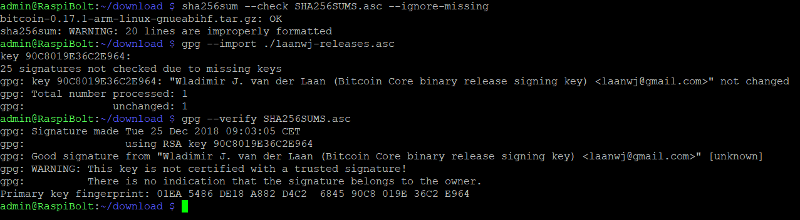
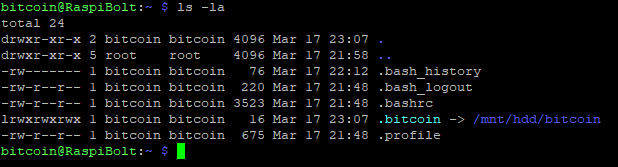
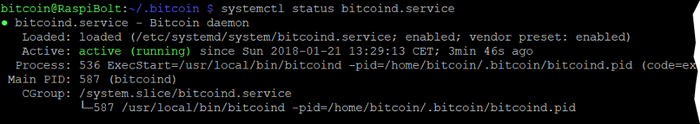

<!-- markdownlint-disable MD014 MD022 MD025 MD040 -->
# Bitcoin
{: .no_toc }

Let's get your Bitcoin full node operational.

---

## Table of contents
{: .no_toc .text-delta }

1. TOC
{:toc}

---

## Bitcoin Core

The base of a sovereign Bitcoin node is a fully validating Bitcoin client.
We are using [Bitcoin Core](https://bitcoin.org/en/bitcoin-core/), the reference implementation, but not the only option available.
This application will download the whole blockchain from other peers and validate every single transaction that ever happened.
After validation, the client can check all future transactions whether they are valid or not.

The validated blocks are also the base layer for other applications, like Electrs (to use with hardware wallets) or LND (the Lightning Network client).

Be already warned that the dowloading and validation of all transactions since 2009, more than 600'000 blocks with a size of over 250 GB, is not an easy task.
It's great that the Raspberry Pi 4 can do it, even if it takes a few days, as this was simply not possible with the Raspberry Pi 3.

## Installation

We download the latest Bitcoin Core binaries (the application) and compare the file with the signed checksum.
This is a precaution to make sure that this is an official release and not a malicious version trying to steal our money.

* Login as "admin" and change to the `tmp` directory, which is cleared on reboot.

  ```sh
  cd /tmp
  ```

* Get the latest download links at [bitcoincore.org/en/download](https://bitcoincore.org/en/download) (ARM Linux 32 bit), they change with each update.
  Then run the following  commands (with adjusted filenames) and check the output where indicated:

  ```sh
# download Bitcoin Core binary
$ wget https://bitcoincore.org/bin/bitcoin-core-0.19.0.1/bitcoin-0.19.0.1-arm-linux-gnueabihf.tar.gz
$ wget https://bitcoincore.org/bin/bitcoin-core-0.19.0.1/SHA256SUMS.asc
$ wget https://bitcoin.org/laanwj-releases.asc

# check that the reference checksum matches the real checksum
# (ignore the "lines are improperly formatted" warning)
$ sha256sum --check SHA256SUMS.asc --ignore-missing
> bitcoin-0.19.0.1-arm-linux-gnueabihf.tar.gz: OK

# import the public key of Wladimir van der Laan, verify the signed  checksum file
# and check the fingerprint again in case of malicious keys
$ gpg --import ./laanwj-releases.asc
$ gpg --refresh-keys
$ gpg --verify SHA256SUMS.asc
> gpg: Good signature from "Wladimir J. van der Laan ..."
> Primary key fingerprint: 01EA 5486 DE18 A882 D4C2 6845 90C8 019E 36C2 E964
```



* Extract the Bitcoin Core binaries, install them and check the version.

  ```sh
$ tar -xvf bitcoin-0.19.0.1-arm-linux-gnueabihf.tar.gz
  $ sudo install -m 0755 -o root -g root -t /usr/bin bitcoin-0.19.0.1/bin/*
$ bitcoind --version
> Bitcoin Core version v0.19.0.1
```

## Prepare data directory

We use the Bitcoin daemon, called `bitcoind`, that runs in the background without user interface.
It stores all data in a the directory `/home/bitcoin/.bitcoin`.
Instead of creating a real directory, we create a link that points to a directory on the external hard disk.

* Change to user “bitcoin” and add a symbolic link that points to the external drive.

  ```sh
  $ sudo su - bitcoin
  $ ln -s /mnt/ext/bitcoin /home/bitcoin/.bitcoin
  ```

* Navigate to the home directory and check the symbolic link (the target must not be red).
  The content of this directory will actually be on the external drive.

  ```sh
  $ cd ~
  $ ls -la
  ```



## Configuration

Now, the configuration file for bitcoind needs to be created.
Open it with Nano and paste the configuration below. Save and exit.

```sh
$ nano /mnt/ext/bitcoin/bitcoin.conf
```

# Bitcoind options
server=1
daemon=1

# Connection settings
rpcuser=raspibolt
rpcpassword=PASSWORD_[B]

onlynet=ipv4
zmqpubrawblock=tcp://127.0.0.1:28332
zmqpubrawtx=tcp://127.0.0.1:28333

# Raspberry Pi optimizations
dbcache=100
maxorphantx=10
maxmempool=50
maxconnections=40
maxuploadtarget=5000
```

🚨 **Change the rpcpassword** to your secure `password [B]`, otherwise your funds might get stolen.

🔍 *more: [configuration options](https://en.bitcoin.it/wiki/Running_Bitcoin#Command-line_arguments) in Bitcoin Wiki*

## Start bitcoind

Still logged in as user "bitcoin", let's start "bitcoind" manually.
Monitor the log file a few minutes to see if it works fine (it may stop at "dnsseed thread exit", that's ok).
Exit the logfile monitoring with `Ctrl-C`, check the blockchain info and, if there are no errors, stop "bitcoind" again.

```sh
$ bitcoind
```

## Autostart bitcoind

The system needs to run the bitcoin daemon automatically in the background, even when nobody is logged in.
We use “systemd“, a daemon that controls the startup process using configuration files.

* Exit the “bitcoin” user session back to user “admin”  

  ```sh
  $ exit
  ```

* Create the configuration file in the Nano text editor and copy the following paragraph.  
  Save and exit.

  ```sh
  $ sudo nano /etc/systemd/system/bitcoind.service
  ```
# RaspiBolt: systemd unit for bitcoind
# /etc/systemd/system/bitcoind.service

[Unit]
Description=Bitcoin daemon
After=network.target

[Service]
ExecStartPre=/bin/sh -c 'sleep 30'
ExecStart=/usr/local/bin/bitcoind -daemon -conf=/home/bitcoin/.bitcoin/bitcoin.conf -pid=/home/bitcoin/.bitcoin/bitcoind.pid
PIDFile=/home/bitcoin/.bitcoin/bitcoind.pid
User=bitcoin
Group=bitcoin
Type=forking
KillMode=process
Restart=always
TimeoutSec=120
RestartSec=30

[Install]
WantedBy=multi-user.target
```

* Enable the service

  ```sh
  $ sudo systemctl enable bitcoind.service
  ```

* Copy `bitcoin.conf` to user "admin" home directory for RPC credentials.
  We also set the `/home/admin/.bitcoin` directory to 'read-only', so that if the "admin" user starts `bitcoind`, it does not accidentally download the whole blockchain onto the microSD card.

  ```sh
  $ mkdir /home/admin/.bitcoin
  $ sudo cp /home/bitcoin/.bitcoin/bitcoin.conf /home/admin/.bitcoin/
  $ sudo chmod 550 /home/admin/.bitcoin
  ```

* Restart the Raspberry Pi  

  ```sh
  $ sudo reboot
  ```

## Verification of bitcoind operations

After rebooting, the bitcoind should start and begin to sync and validate the Bitcoin blockchain.

* Wait a bit, reconnect via SSH and login with the user “admin”.

* Check the status of the bitcoin daemon that was started by systemd (exit with `Ctrl-C`)  

  ```sh
  $ systemctl status bitcoind.service
  ```



* See bitcoind in action by monitoring its log file (exit with `Ctrl-C`)  

  ```sh
  $ sudo tail -f /mnt/ext/bitcoin/debug.log
  ```

* Use the Bitcoin Core client `bitcoin-cli` to get information about the current blockchain  

  ```sh
  $ bitcoin-cli getblockchaininfo
  ```

* Please note:
  * When “bitcoind” is still starting, you may get an error message like “verifying blocks”.
    That’s normal, just give it a few minutes.
  * Among other infos, the “verificationprogress” is shown.
    Once this value reaches almost 1 (0.999…), the blockchain is up-to-date and fully validated.

## Explore bitcoin-cli

If everything is running smoothly, this is the perfect time to familiarize yourself with Bitcoin Core and play around with `bitcoin-cli` until the blockchain is up-to-date.

* A great point to start is the book **Mastering Bitcoin** by Andreas Antonopoulos - which is open source - and in this regard especially chapter 3 (ignore the first part how to compile from source code):
  * you definitely need to have a [real copy](https://bitcoinbook.info/) of this book!
  * read it online on [Github](https://github.com/bitcoinbook/bitcoinbook)


* For a thorough deep dive, check out [**Learning Bitcoin from the Command Line**](https://github.com/ChristopherA/Learning-Bitcoin-from-the-Command-Line/blob/master/README.md) by Christopher Allen.

👉 additional information: [bitcoin-cli reference](https://en.bitcoin.it/wiki/Original_Bitcoin_client/API_calls_list)

Once the blockchain is synced, the Lightning node can be set up.

-----

## Bitcoin Core upgrade

If you want to upgrade to a new release of Bitcoin Core in the future, check out the FAQ section:  
[How to upgrade Bitcoin Core](raspibolt_faq.md#how-to-upgrade-bitcoin-core)

-----
Next: [Lightning >>](raspibolt_40_lnd.md)
