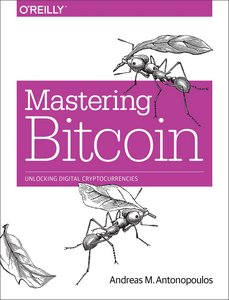

<!-- markdownlint-disable MD014 MD022 MD025 MD033 MD040 -->
# Bitcoin
{: .no_toc }

Let's get your Bitcoin full node operational.

---

## Table of contents
{: .no_toc .text-delta }

1. TOC
{:toc}

---

## Bitcoin Core

The base of a sovereign Bitcoin node is a fully validating Bitcoin client.
We are using [Bitcoin Core](https://bitcoin.org/en/bitcoin-core/){:target="_blank"}, the reference implementation, but not the only option available.
This application will download the whole blockchain from other peers and validate every single transaction that ever happened.
After validation, the client can check all future transactions whether they are valid or not.

The validated blocks are also the base layer for other applications, like Electrs (to use with hardware wallets) or LND (the Lightning Network client).

Be already warned that the downloading and validation of all transactions since 2009, more than 600'000 blocks with a size of over 300 GB, is not an easy task.
It's great that the Raspberry Pi 4 can do it, even if it takes a few days, as this was simply not possible with the Raspberry Pi 3.

---

## Installation

🚨 **Familiarize yourself with signature verification**
An important part of the trust-minimization setup is to verify signatures of software you install.
Take your time to read through [a detailed guide](https://medium.com/@lukedashjr/how-to-securely-install-bitcoin-9bfeca7d3b2a) from Luke-Jr.

We download the latest Bitcoin Core binaries (the application) and compare the file with the signed checksum.
This is a precaution to make sure that this is an official release and not a malicious version trying to steal our money.

* Login as "admin" and change to the `tmp` directory, which is cleared on reboot.

  ```sh
  cd /tmp
  ```

* Get the latest download links at [bitcoincore.org/en/download](https://bitcoincore.org/en/download){:target="_blank"} (ARM Linux 32 bit), they change with each update.
  Then run the following  commands (with adjusted filenames) and check the output where indicated:

  ```sh
  # download Bitcoin Core binary
  $ wget https://bitcoincore.org/bin/bitcoin-core-0.20.1/bitcoin-0.20.1-arm-linux-gnueabihf.tar.gz
  $ wget https://bitcoincore.org/bin/bitcoin-core-0.20.1/SHA256SUMS.asc
  $ wget https://bitcoin.org/laanwj-releases.asc

  # check that the reference checksum matches the real checksum
  # (ignore the "lines are improperly formatted" warning)
  $ sha256sum --check SHA256SUMS.asc --ignore-missing
  > bitcoin-0.20.1-arm-linux-gnueabihf.tar.gz: OK

  # import the public key of Wladimir van der Laan, verify the signed  checksum file
  # and check the fingerprint again in case of malicious keys
  $ gpg --import ./laanwj-releases.asc
  $ gpg --refresh-keys
  $ gpg --verify SHA256SUMS.asc
  > gpg: Good signature from "Wladimir J. van der Laan ..."
  > Primary key fingerprint: 01EA 5486 DE18 A882 D4C2 6845 90C8 019E 36C2 E964
  ```

* Extract the Bitcoin Core binaries, install them and check the version.

  ```sh
  $ tar -xvf bitcoin-0.20.1-arm-linux-gnueabihf.tar.gz
  $ sudo install -m 0755 -o root -g root -t /usr/local/bin bitcoin-0.20.1/bin/*
  $ bitcoind --version
  > Bitcoin Core version v0.20.1
  ```

<script id="asciicast-Ivlf954BGJNmOuJoj7FQ6qNKt" src="https://asciinema.org/a/Ivlf954BGJNmOuJoj7FQ6qNKt.js" async></script>

### Prepare data directory

We use the Bitcoin daemon, called `bitcoind`, that runs in the background without user interface.
It stores all data in a the directory `/home/bitcoin/.bitcoin`.
Instead of creating a real directory, we create a link that points to a directory on the external hard disk.

* Change to user “bitcoin” and add a symbolic link that points to the external drive.

  ```sh
  $ sudo su - bitcoin
  $ ln -s /mnt/ext/bitcoin /home/bitcoin/.bitcoin
  ```

* Navigate to the home directory and check the symbolic link (the target must not be red).
  The content of this directory will actually be on the external drive.

  ```sh
  $ ls -la
  ```

<script id="asciicast-zPnMRU6nHPdZZYpFc0kR2vtVs" src="https://asciinema.org/a/zPnMRU6nHPdZZYpFc0kR2vtVs.js" async></script>

### Configuration

First we neet to generate a password for rpcpassword:

```wget https://raw.githubusercontent.com/bitcoin/bitcoin/master/share/rpcauth/rpcauth.py
   $ python ./rpcuser.py raspibolt
     String to be appended to bitcoin.conf:
     rpcauth=raspibolt:[hashed password]
     Your password:
     [rpcpassword]

Keep note of the rpcpassword, needed for block explorer

Now, the configuration file for bitcoind needs to be created.
Still as user "bitcoin", open it with Nano and paste the configuration below. Modify the rpcauth=[hashed password] line accordingly with the value generated above. Save and exit.

```sh
$ nano /mnt/ext/bitcoin/bitcoin.conf
```

```ini
# RaspiBolt: bitcoind configuration
# /mnt/ext/bitcoin/bitcoin.conf

# Bitcoin daemon
server=1
txindex=1

# Network
listen=1
listenonion=1
proxy=127.0.0.1:9050
bind=127.0.0.1

# Connections
rpcauth=raspibolt:[hashed password]
zmqpubrawblock=tcp://127.0.0.1:28332
zmqpubrawtx=tcp://127.0.0.1:28333

# Raspberry Pi optimizations
maxconnections=40
maxuploadtarget=5000

# Initial block download optimizations
dbcache=2000
blocksonly=1
```

#### Transaction indexing (optional)

By default the above configuration enables transaction indexing.
This allows other applications to query Bitcoin Core about any transaction.
One example that needs this feature is the [BTC RPC Explorer](raspibolt_6B_btc_rpc_explorer.md), your personal blockchain explorer.

If you know that you don't need this feature, you can delete the line `txindex=1` in the configuration above.
This results in a faster initial blockchain verification, and saves about 20 GB of storage.
If in doubt, just leave it as-is, otherwise you might need to enable it later and reindex the whole blockchain again.

---

## Running bitcoind

Still logged in as user "bitcoin", let's start "bitcoind" manually.
Monitor the log file a few minutes to see if it works fine (it may stop at "dnsseed thread exit", that's ok).
Stop "bitcoind" with `Ctrl-C`.

```sh
$ bitcoind
```

_Note: the following screencast skips longer waiting times, the initial start is longer in real life._

<script id="asciicast-U8pYWC4noOazqJgXhoUzDoafC" src="https://asciinema.org/a/U8pYWC4noOazqJgXhoUzDoafC.js" async></script>

### Autostart on boot

The system needs to run the bitcoin daemon automatically in the background, even when nobody is logged in.
We use “systemd“, a daemon that controls the startup process using configuration files.

* Exit the “bitcoin” user session back to user “admin”

  ```sh
  $ exit
  ```

* Create the configuration file in the Nano text editor and copy the following paragraph.
  Save and exit.

  ```sh
  $ sudo nano /etc/systemd/system/bitcoind.service
  ```

  ```ini
  # RaspiBolt: systemd unit for bitcoind
  # /etc/systemd/system/bitcoind.service

  [Unit]
  Description=Bitcoin daemon
  After=network.target

  [Service]

  # Service execution
  ###################

  ExecStart=/usr/local/bin/bitcoind -daemon \
                                    -pid=/run/bitcoind/bitcoind.pid \
                                    -conf=/mnt/ext/bitcoin/bitcoin.conf \
                                    -datadir=/mnt/ext/bitcoin


  # Process management
  ####################

  Type=forking
  PIDFile=/run/bitcoind/bitcoind.pid
  Restart=on-failure
  TimeoutSec=300
  RestartSec=30


  # Directory creation and permissions
  ####################################

  # Run as bitcoin:bitcoin
  User=bitcoin
  Group=bitcoin

  # /run/bitcoind
  RuntimeDirectory=bitcoind
  RuntimeDirectoryMode=0710


  # Hardening measures
  ####################

  # Provide a private /tmp and /var/tmp.
  PrivateTmp=true

  # Mount /usr, /boot/ and /etc read-only for the process.
  ProtectSystem=full

  # Deny access to /home, /root and /run/user
  ProtectHome=true

  # Disallow the process and all of its children to gain
  # new privileges through execve().
  NoNewPrivileges=true

  # Use a new /dev namespace only populated with API pseudo devices
  # such as /dev/null, /dev/zero and /dev/random.
  PrivateDevices=true

  # Deny the creation of writable and executable memory mappings.
  MemoryDenyWriteExecute=true

  [Install]
  WantedBy=multi-user.target
  ```

* Enable the service

  ```sh
  $ sudo systemctl enable bitcoind.service
  ```

* Link the Bitcoin data directory in the user "admin" home.
  As a member or the group "bitcoin", admin has read-only access to certain files.

  ```sh
  $ ln -s /mnt/ext/bitcoin/ /home/admin/.bitcoin
  ```

* Restart the Raspberry Pi

  ```sh
  $ sudo reboot
  ```

<script id="asciicast-FY2i276fqYasiaBPr0bktHehE" src="https://asciinema.org/a/FY2i276fqYasiaBPr0bktHehE.js" async></script>

### Verification of bitcoind operations

After rebooting, the bitcoind should start and begin to sync and validate the Bitcoin blockchain.

* Wait a bit, reconnect via SSH and login with the user “admin”.

* Check the status of the bitcoin daemon that was started by systemd (exit with `Ctrl-C`)

  ```sh
  $ systemctl status bitcoind.service
  ```

* See bitcoind in action by monitoring its log file (exit with `Ctrl-C`)

  ```sh
  $ sudo tail -f /mnt/ext/bitcoin/debug.log
  ```

* Use the Bitcoin Core client `bitcoin-cli` to get information about the current blockchain

  ```sh
  $ bitcoin-cli getblockchaininfo
  ```

* Please note:
  * When “bitcoind” is still starting, you may get an error message like “verifying blocks”.
    That’s normal, just give it a few minutes.
  * Among other infos, the “verificationprogress” is shown.
    Once this value reaches almost 1 (0.999…), the blockchain is up-to-date and fully validated.

<script id="asciicast-ij6r5XKR4Hx2Nr7ViiO7M09kf" src="https://asciinema.org/a/ij6r5XKR4Hx2Nr7ViiO7M09kf.js" async></script>

🚨 **Please let Bitcoin Core sync fully before proceeding.**

This can take up to a week when using a Raspberry Pi 4, depending mostly on your external drive (SSD good, HDD bad; USB3 good, USB2 bad).

### Explore bitcoin-cli

If everything is running smoothly, this is the perfect time to familiarize yourself with Bitcoin, the technical aspects of Bitcoin Core and play around with `bitcoin-cli` until the blockchain is up-to-date.

* [**The Little Bitcoin Book**](https://littlebitcoinbook.com){:target="_blank"} is a fantastic introduction to Bitcoin, focusing on the "why" and less on the "how".

* [**Mastering Bitcoin**](https://bitcoinbook.info){:target="_blank"} by Andreas Antonopoulos is a great point to start, especially chapter 3 (ignore the first part how to compile from source code):
  * you definitely need to have a [real copy](https://bitcoinbook.info/){:target="_blank"} of this book!
  * read it online on [Github](https://github.com/bitcoinbook/bitcoinbook){:target="_blank"}

  {:target="_blank"}

* [**Learning Bitcoin from the Command Line**](https://github.com/ChristopherA/Learning-Bitcoin-from-the-Command-Line/blob/master/README.md){:target="_blank"} by Christopher Allen gives a thorough deep dive into understanding the technical aspects of Bitcoin.

* Also, check out the [bitcoin-cli reference](https://en.bitcoin.it/wiki/Original_Bitcoin_client/API_calls_list){:target="_blank"}

---

## Reduce 'dbcache' after full sync

Once Bitcoin Core is fully synced, we can reduce the size of the database cache.
A bigger cache speeds up the initial block download, now we want to reduce memory consumption to allow LND and Electrs to run in parallel.
We also now want to enable the node to listent to and relay transactions.

* As user "admin", comment the following lines out (add a `#` at the beginning) in the Bitcoin settings file.
  Bitcoin Core will then just use the default of 300 MB instead of 2 GB.
  Save and exit.

  ```sh
  $ sudo nano /mnt/ext/bitcoin/bitcoin.conf
  ```

  ```ini
  #dbcache=2000
  #blocksonly=1
  ```

* Restart Bitcoin Core for the settings to take effect.

  ```sh
  $ sudo systemctl restart bitcoind
  ```

---

## Bitcoin Core upgrade

If you want to upgrade to a new release of Bitcoin Core in the future, check out the FAQ section:
[How to upgrade Bitcoin Core](raspibolt_faq.md#how-to-upgrade-bitcoin-core)

---

Next: [Lightning >>](raspibolt_40_lnd.md)
