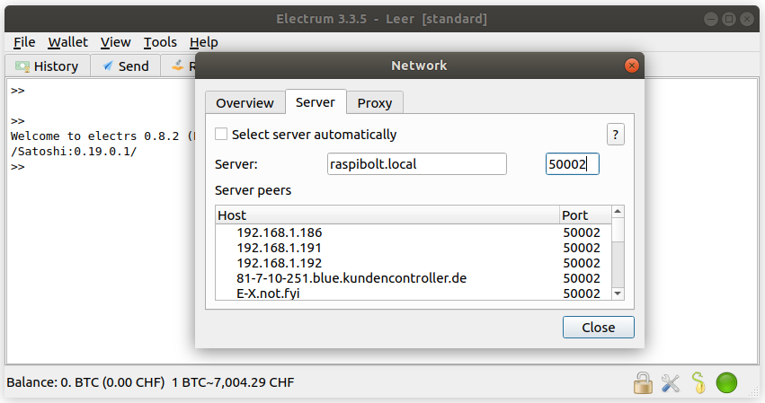
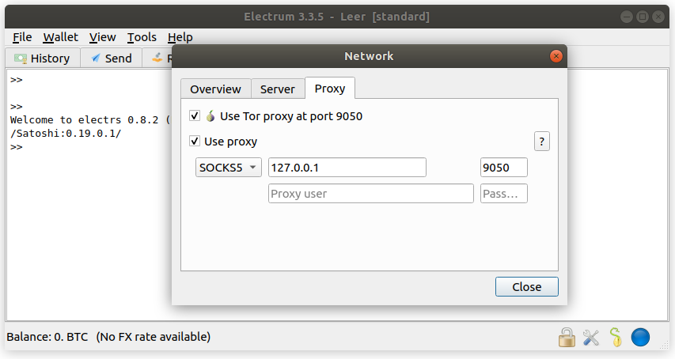
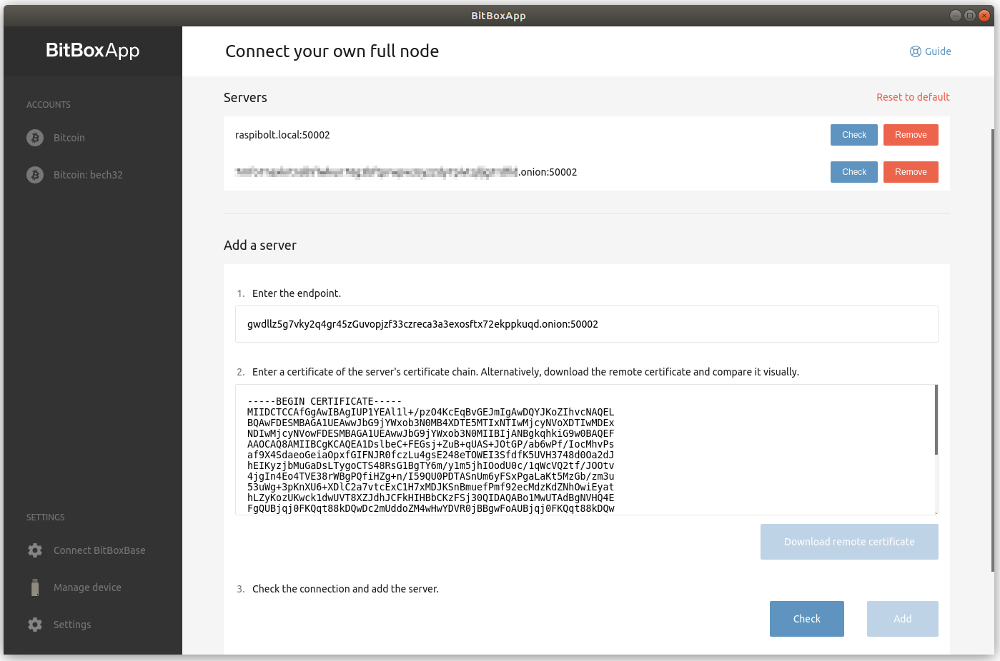

<!-- markdownlint-disable MD014 MD022 MD025 MD033 MD040 -->

# Electrum
{: .no_toc }

We set up Electrs to serve as a full Electrum server for use with hardware wallets.

---

## Table of contents
{: .no_toc .text-delta }

1. TOC
{:toc}

---

## Bitcoin with hardware wallets

The best way to safekeep your bitcoin (meaning the best combination of security and usability) is to use a hardware wallet (like [BitBox](https://shiftcrypto.ch/bitbox02){:target="_blank"}, [Ledger](https://www.ledgerwallet.com){:target="_blank"} or [Trezor](https://trezor.io){:target="_blank"}) in combination with your own Bitcoin node.
This gives you security, privacy and eliminates the need to trust a third party to verify transactions.

With the RaspiBolt setup, the Bitcoin Core wallet on the node can only be used from the command line as no graphical user interface is installed.
As Bitcoin Core does not offer easy support for hardware wallets quite yet, only a "hot wallet" (exposed to the internet) is possible.

One possibility to use Bitcoin Core with more functionality is to use an Electrum Server as middleware.
It imports data from Bitcoin Core and provides it to software wallets supporting the Electrum protocol.
Wallets like the [BitBoxApp](https://shiftcrypto.ch/app/){:target="_blank"} or [Electrum wallet](https://electrum.org/){:target="_blank"} that support hardware wallets can then be used with your own sovereign Bitcoin node.

The installation of your own Electrum server is optional and not essential for running a Lightning node.
It is very much recommended, however, as it is an important step to claim back your on-chain sovereignty and enforce the Bitcoin consensus.
In the article "[We need Bitcoin full nodes. Economic ones.](https://medium.com/shiftcrypto/we-need-bitcoin-full-nodes-economic-ones-fd17efcb61fb){:target="_blank"}", I outline why it is pointless to run an idle Bitcoin full node without using it to verify your own on-chain transactions.

---

🚨 Make sure that you have [reduced the database cache of Bitcoin Core](raspibolt_30_bitcoin.html#reduce-dbcache-after-full-sync) after full sync.

---

## Electrs

An easy and performant way is to run [Electrs](https://github.com/romanz/electrs){:target="_blank"}, the Electrum Server in Rust.
As there are no binaries available, we will compile the application directly from the source code.

### Install dependencies

* Install the Rust programming language

  🚨 This Rust installation is for Linux ARM32 systems only. Don't install the following binaries on other platforms, it could damage your system.

  ```sh
  # download
  $ cd /tmp
  $ curl https://static.rust-lang.org/dist/rust-1.48.0-armv7-unknown-linux-gnueabihf.tar.gz -o rust.tar.gz
  $ curl https://static.rust-lang.org/dist/rust-1.48.0-armv7-unknown-linux-gnueabihf.tar.gz.asc -o rust.tar.gz.asc
  $ curl https://keybase.io/rust/pgp_keys.asc | gpg --import

  # verify
  $ gpg --verify rust.tar.gz.asc rust.tar.gz
  > gpg: Signature made Do 07 Nov 2019 13:25:50 GMT
  > gpg:                using RSA key C13466B7E169A085188632165CB4A9347B3B09DC
  > gpg: Good signature from "Rust Language (Tag and Release Signing Key) <rust-key@rust-lang.org>" [unknown]
  > gpg: WARNING: This key is not certified with a trusted signature!
  > gpg:          There is no indication that the signature belongs to the owner.
  > Primary key fingerprint: 108F 6620 5EAE B0AA A8DD  5E1C 85AB 96E6 FA1B E5FE
  >     Subkey fingerprint: C134 66B7 E169 A085 1886  3216 5CB4 A934 7B3B 09DC

  # install
  $ mkdir /home/admin/rust
  $ tar --strip-components 1 -C /home/admin/rust -xzvf rust.tar.gz
  $ cd /home/admin/rust
  $ sudo ./install.sh
  ```

* Install build tools

  ```sh
  $ sudo apt install -y clang cmake
  ```

<script id="asciicast-IQ8ZYiBUxbHZM6AxL41oS2Hbd" src="https://asciinema.org/a/IQ8ZYiBUxbHZM6AxL41oS2Hbd.js" async></script>

### Build from source code

Now we download the latest release of the Electrs source code, compile it to an executable binary and install it.
The whole process takes about 30 minutes.

  ```sh
  # download
  $ cd /home/admin/rust
  $ electrsgit=$(curl -s https://api.github.com/repos/romanz/electrs/tags | jq -r '.[0].name')
  $ git clone --branch ${electrsgit} https://github.com/romanz/electrs.git
  $ cd electrs

  # compile
  $ cargo build --locked --release

  # install
  $ sudo cp ./target/release/electrs /usr/local/bin/
  ```

<script id="asciicast-PyEVzc5P0i4QX8mVu4zyKicgx" src="https://asciinema.org/a/PyEVzc5P0i4QX8mVu4zyKicgx.js" async></script>

### Configuration & indexing

* Create the Electrs data directory on the external drive and link it to the "bitcoin" user home.

  ```sh
  sudo su - bitcoin
  mkdir /mnt/ext/electrs
  ln -s /mnt/ext/electrs /home/bitcoin/.electrs
  ```

* Create config file

  ```sh
  $ nano /mnt/ext/electrs/electrs.conf
  ```

  ```ini
  # RaspiBolt: electrs configuration
  # /mnt/ext/electrs/electrs.conf

  # RPC cookie file
  cookie_file = "/mnt/ext/bitcoin/.cookie

  # Bitcoin Core settings
  network = "bitcoin"
  daemon_dir= "/mnt/ext/bitcoin"
  daemon_rpc_addr = "127.0.0.1:8332"

  # Electrs settings
  electrum_rpc_addr = "127.0.0.1:50001"
  db_dir = "/mnt/ext/electrs/db"
  txid_limit = 1000

  # Logging
  verbose = 4
  timestamp = true
  rust_backtrace = true
  ```

  🚨 **Change the password**, otherwise Electrs is not able to talk to Bitcoin Core.

* Let's start Electrs manually first, to check if it's running as expected.
  It will immediately start with the initial indexing of the Bitcoin blocks.
  That should take around 6 hours with a modern SSD.  The timestamps in sample output below are following this process with an older non-SSD drive.

  ```sh
  $ electrs --conf /mnt/ext/electrs/electrs.conf
  ```

    ```bash
  Config { log: StdErrLog { verbosity: Trace, quiet: false, timestamp: Millisecond, modules: [], writer: "stderr", color_choice: Auto }, network_type: bitcoin, db_path: "/mnt/ext/electrs/db/mainnet", daemon_dir: "/mnt/ext/bitcoin", blocks_dir: "/mnt/ext/bitcoin/blocks", daemon_rpc_addr: V4(127.0.0.1:8332), electrum_rpc_addr: V4(127.0.0.1:50001), monitoring_addr: V4(127.0.0.1:4224), jsonrpc_import: false, index_batch_size: 100, bulk_index_threads: 4, tx_cache_size: 10485760, txid_limit: 1000, server_banner: "Welcome to electrs 0.8.5 (Electrum Rust Server)!", blocktxids_cache_size: 10485760 }
  2020-07-11T17:24:15.776+01:00 - DEBUG - Server listening on 127.0.0.1:4224
  2020-07-11T17:24:15.778+01:00 - DEBUG - Running accept thread
  2020-07-11T17:24:15.779+01:00 - INFO - NetworkInfo { version: 200000, subversion: "/Satoshi:0.20.0/", relayfee: 0.00001 }
  2020-07-11T17:24:15.780+01:00 - INFO - BlockchainInfo { chain: "main", blocks: 638792, headers: 638792, verificationprogress: 0.999998834745944, bestblockhash: "00000000000000000007bcaf73926092f8765725795fba82fd8c9f0bd5df27fd", pruned: false, initialblockdownload: false }
  2020-07-11T17:24:15.781+01:00 - DEBUG - opening DB at "/mnt/ext/electrs/db/mainnet"
  2020-07-11T17:24:26.706+01:00 - TRACE - latest indexed blockhash: 0000000000000000000000000000000000000000000000000000000000000000
  2020-07-11T17:24:26.706+01:00 - INFO - listing block files at "/mnt/ext/bitcoin/blocks/blk*.dat"
  2020-07-11T17:24:27.836+01:00 - INFO - indexing 2150 blk*.dat files
  2020-07-11T17:24:27.837+01:00 - DEBUG - found 0 indexed blocks
  2020-07-11T17:24:27.855+01:00 - TRACE - downloading 100000 block headers
  2020-07-11T17:25:10.765+01:00 - TRACE - downloading 100000 block headers
  2020-07-11T17:25:39.281+01:00 - TRACE - downloading 100000 block headers
  2020-07-11T17:26:25.260+01:00 - TRACE - downloading 100000 block headers
  2020-07-11T17:26:43.626+01:00 - TRACE - downloading 100000 block headers
  2020-07-11T17:27:04.621+01:00 - TRACE - downloading 100000 block headers
  2020-07-11T17:27:38.230+01:00 - TRACE - downloading 38793 block headers
  2020-07-11T17:27:49.807+01:00 - DEBUG - applying 638793 new headers from height 0
  2020-07-11T17:28:12.078+01:00 - TRACE - indexed "/mnt/ext/bitcoin/blocks/blk00000.dat": 1711986 rows
  2020-07-11T17:28:23.918+01:00 - TRACE - indexed "/mnt/ext/bitcoin/blocks/blk00001.dat": 1652333 rows
  2020-07-11T17:28:38.673+01:00 - TRACE - indexed "/mnt/ext/bitcoin/blocks/blk00002.dat": 1742359 rows
  ```

* Wait until the initial sync is completed and the database is compacted.  The space used on disk will grow to over 125 GB before reducing to about 60 GB at the time of this writing.

  ```bash
  2020-07-12T08:32:08.581+01:00 - TRACE - indexed "/mnt/ext/bitcoin/blocks/blk02148.dat": 1471934 rows
  2020-07-12T08:32:26.334+01:00 - DEBUG - no more blocks to index
  2020-07-12T08:32:27.771+01:00 - DEBUG - no more blocks to index
  2020-07-12T08:32:27.822+01:00 - DEBUG - no more blocks to index
  2020-07-12T08:32:28.990+01:00 - DEBUG - no more blocks to index
  2020-07-12T08:32:28.990+01:00 - TRACE - indexed "/mnt/ext/bitcoin/blocks/blk02149.dat": 73105 rows
  2020-07-12T08:32:29.410+01:00 - DEBUG - last indexed block: best=00000000000000000007bcaf73926092f8765725795fba82fd8c9f0bd5df27fd height=638792 @ 2020-07-11T16:21:02Z
  2020-07-12T08:32:31.864+01:00 - INFO - starting full compaction
  2020-07-12T22:00:13.361+01:00 - INFO - finished full compaction
  2020-07-12T22:00:13.377+01:00 - INFO - enabling auto-compactions
  2020-07-12T22:00:16.577+01:00 - TRACE - latest indexed blockhash: 00000000000000000007bcaf73926092f8765725795fba82fd8c9f0bd5df27fd
  2020-07-12T22:01:58.360+01:00 - DEBUG - applying 638793 new headers from height 0
  2020-07-12T22:01:59.154+01:00 - INFO - enabling auto-compactions
  2020-07-12T22:06:38.385+01:00 - DEBUG - relayfee: 0.00001 BTC
  2020-07-12T22:06:38.410+01:00 - DEBUG - downloading new block headers (638793 already indexed) from 0000000000000000000581d1a3b9fadd27bfaae4797fc6e195617bc689615e86
  2020-07-12T22:06:38.827+01:00 - TRACE - downloaded 119 block headers
  2020-07-12T22:06:38.828+01:00 - INFO - best=0000000000000000000581d1a3b9fadd27bfaae4797fc6e195617bc689615e86 height=638911 @ 2020-07-12T11:58:10Z (119 left to index)
  2020-07-12T23:00:53.250+01:00 - DEBUG - applying 119 new headers from height 638793
  2020-07-12T23:00:53.251+01:00 - WARN - reconnecting to bitcoind: disconnected from daemon while receiving
  2020-07-12T23:03:07.478+01:00 - INFO - Electrum RPC server running on 127.0.0.1:50001 (protocol 1.4)
  ```

* Stop Electrs with `Ctrl`-`C` and exit the "bitcoin" user session.

  ```sh
  2020-07-12T23:22:37.498+01:00 - TRACE - notified via SIG2
  2020-07-12T23:22:37.498+01:00 - TRACE - stop accepting new RPCs
  2020-07-12T23:22:37.499+01:00 - TRACE - closing 0 RPC connections
  2020-07-12T23:22:37.499+01:00 - TRACE - RPC connections are closed
  2020-07-12T23:22:37.499+01:00 - TRACE - RPC server is stopped
  2020-07-12T23:22:37.499+01:00 - TRACE - closing DB at "/mnt/ext/electrs/db/mainnet"
  ```

  ```sh
  $ exit
  ```

<script id="asciicast-YxcQdbYzczkuv8OmAyUSZLske" src="https://asciinema.org/a/YxcQdbYzczkuv8OmAyUSZLske.js" async></script>

### Autostart on boot

Electrs needs to start automatically on system boot.

* As user "admin", create the Electrs systemd unit and copy/paste the following configuration. Save and exit.

  ```sh
  $ sudo nano /etc/systemd/system/electrs.service
  ```

  ```ini
  # RaspiBolt: systemd unit for electrs
  # /etc/systemd/system/electrs.service

  [Unit]
  Description=Electrs daemon
  Wants=bitcoind.service
  After=bitcoind.service

  [Service]

  # Service execution
  ###################

  ExecStart=/usr/local/bin/electrs --conf /mnt/ext/electrs/electrs.conf


  # Process management
  ####################

  Type=simple
  Restart=always
  TimeoutSec=120
  RestartSec=30
  KillMode=process


  # Directory creation and permissions
  ####################################

  User=bitcoin
  Group=bitcoin

  # /run/electrs
  RuntimeDirectory=electrs
  RuntimeDirectoryMode=0710


  # Hardening measures
  ####################

  # Provide a private /tmp and /var/tmp.
  PrivateTmp=true

  # Mount /usr, /boot/ and /etc read-only for the process.
  ProtectSystem=full

  # Disallow the process and all of its children to gain
  # new privileges through execve().
  NoNewPrivileges=true

  # Use a new /dev namespace only populated with API pseudo devices
  # such as /dev/null, /dev/zero and /dev/random.
  PrivateDevices=true

  # Deny the creation of writable and executable memory mappings.
  MemoryDenyWriteExecute=true

  [Install]
  WantedBy=multi-user.target
  ```

* Enable and start Electrs.

  ```sh
  $ sudo systemctl enable electrs
  $ sudo systemctl start electrs
  ```

* Check the systemd journal to see Electrs' log output.
  Exit with `Ctrl`-`C`.

  ```sh
  $ sudo journalctl -f -u electrs
  ```

<script id="asciicast-3ogdQBJnXnQ4xDh5GtnDLVdmH" src="https://asciinema.org/a/3ogdQBJnXnQ4xDh5GtnDLVdmH.js" async></script>

---

## Secure communication

We should only communicate with Electrs over an encrypted channel.
This is what SSL/TLS (Transport Layer Security) is for.
Electrs does not handle TLS communication itself, so we use NGINX as a reverse proxy for that.

### SSL encryption

This means that NGINX provides secure communication to the outside and routes it back without encryption to Electrs internally.

* Install NGINX

  💡 _Hint: NGINX is pronounced "Engine X"_

  ```sh
  $ sudo apt install -y nginx
  ```

* Create a self-signed TLS certificate (valid for 10 years)

  ```sh
  $ sudo openssl req -x509 -nodes -newkey rsa:2048 -keyout /etc/ssl/private/nginx-selfsigned.key -out /etc/ssl/certs/nginx-selfsigned.crt -subj "/CN=localhost" -days 3650
  ```

* To completely disable the NGINX webserver and configure the TCP reverse proxy for Electrs, remove the default configuration and paste the following into the `nginx.conf` file.

  ```sh
  $ sudo mv /etc/nginx/nginx.conf /etc/nginx/nginx.conf.bak
  $ sudo nano /etc/nginx/nginx.conf
  ```

  ```nginx
  user www-data;
  worker_processes 1;
  pid /run/nginx.pid;
  include /etc/nginx/modules-enabled/*.conf;

  events {
    worker_connections 768;
  }

  stream {
    ssl_certificate /etc/ssl/certs/nginx-selfsigned.crt;
    ssl_certificate_key /etc/ssl/private/nginx-selfsigned.key;
    ssl_session_cache shared:SSL:1m;
    ssl_session_timeout 4h;
    ssl_protocols TLSv1.2 TLSv1.3;
    ssl_prefer_server_ciphers on;

    upstream electrs {
      server 127.0.0.1:50001;
    }
    server {
      listen 50002 ssl;
      proxy_pass electrs;
    }
  }

  ```

* Test the NGINX configuration and restart the service.

  ```sh
  $ sudo nginx -t
  $ sudo systemctl restart nginx
  ```

<script id="asciicast-jW6Y0tSG9kCWedHWJKJUWJ7dt" src="https://asciinema.org/a/jW6Y0tSG9kCWedHWJKJUWJ7dt.js" async></script>

### Remote access

To use your Electrum server when you're on the go, you can easily create a Tor hidden service.
This way, you can connect the BitBoxApp or Electrum wallet also remotely, or even share the connection details with friends and family.
Note that the remote device needs to have Tor installed.

* Add the following three lines in the section for "location-hidden services" in the `torrc` file.

  ```sh
  $ sudo nano /etc/tor/torrc
  ```

  ```conf
  ############### This section is just for location-hidden services ###

  HiddenServiceDir /var/lib/tor/hidden_service_electrs/
  HiddenServiceVersion 3
  HiddenServicePort 50002 127.0.0.1:50002
  ```

* Restart Tor and get your connection address.

  ```sh
  $ sudo systemctl restart tor
  $ sudo cat /var/lib/tor/hidden_service_electrs/hostname
  > gwdllz5g7vky2q4gr45zGuvopjzf33czreca3a3exosftx72ekppkuqd.onion
  ```

<script id="asciicast-TgwG3Pb0LPTCkb4qcDYlXmEbT" src="https://asciinema.org/a/TgwG3Pb0LPTCkb4qcDYlXmEbT.js" async></script>

---

## Connect Electrum wallet

Electrum wallet is a well-established, feature-rich software wallet that supports most hardware wallets.

### General

On your regular computer, configure [Electrum wallet](https://electrum.org) to use your RaspiBolt:

* In menu: `Tools > Network > Server`
* Uncheck "Select server automatically"
* Enter the hostname (e.g. `raspibolt.local`) or or ip address (e.g. `192.168.0.20`) of your RaspiBolt in the address field
* Enter the port `50002`
* `Close` and check connection in tab "Console"

[](images/50_electrum_wallet_local.png){:target="_blank"}

The green LED in the bottom right indicates an active connection over clearnet.

You can force Electrum to only use your own server on startup with the following command line arguments:

```sh
$ electrum --oneserver --server raspibolt.local:50002:s
```

### Tor

Your RaspiBolt is also available remotely over Tor.
You need [Tor](https://www.torproject.org) installed locally on your computer.

* In the menu: `Tools > Network > Proxy`
* Check "Use Tor proxy at 9050"
* On the "Server" tab, enter your Tor onion address (e.g. `gwdllz5g7vky2q4gr45zGuvopjzf33czreca3a3exosftx72ekppkuqd.onion`)
* Enter the port `50002`
* `Close` and check connection in tab "Console"

[](images/50_electrum_wallet_local.png){:target="_blank"}

The blue LED in the bottom right indicates an active Tor connection.

You can force Electrum to only use your own server on startup with the following command line arguments:

```sh
$ electrum --oneserver --server <your-onion-address>.onion:50002:s --proxy socks5:127.0.0.1:9050
```

---

## Connect BitBoxApp

[BitBoxApp](https://shiftcrypto.ch/app/){:target="_blank"} is a beginner-friendly companion app to the BitBox02 hardware wallet by Shift Cryptosecurity.

### General

On your regular computer, configure the BitBoxApp to use your RaspiBolt:

* In the sidebar, select `Settings` > `Connect your own full node`
* In the field "Enter the endpoint" enter the hostname or ip address and the port, e.g. `raspibolt.local:50002`
* Click on "Download remote certificate"
* Click "Check", you should be prompted with the message "Successfully establised a connection"
* Click "Add" to add your server to the list on the top
* Remove the Shift servers to only connect to your own server

### Tor

If you have Tor installed on your computer, you can access your RaspiBolt remotely over Tor.

* In the sidebar, select `Settings` > `Enable tor proxy`
* Enable it and confirm the proxy address (usually the default `127.0.0.1:9050`)
* When adding your RaspiBolt full node as described above, use your Tor address (e.g. `gwdllz5g7vky2q4gr45zGuvopjzf33czreca3a3exosftx72ekppkuqd.onion:50002`)

[](images/50_BitBoxApp.png){:target="_blank"}

---

## Don't trust, verify.

Congratulations, you have now one of the best Bitcoin desktop wallet, capable of securing your bitcoin with support of a hardware wallet, running with your own trustless Bitcoin full node!

---

## Electrs upgrade

Updating a [new release](https://github.com/romanz/electrs/releases){:target="_blank"} should be straight-forward, but make sure to check out the [release notes](https://github.com/romanz/electrs/blob/master/RELEASE-NOTES.md){:target="_blank"} first.

* With user "admin", fetch the latest GitHub repository information and check out the new release.

  ```sh
  $ cd ~/rust/electrs
  $ git fetch
  $ git checkout v0.8.5
  ```

* Compile the new release.

  ```
  $ cargo build --release
  ```

* Stop the service, install new binaries and start the service again.

  ```sh
  $ sudo systemctl stop electrs
  $ sudo cp ./target/release/electrs /usr/local/bin/
  $ sudo systemctl start electrs
  ```

---

Next: [Block Explorer >>](raspibolt_55_explorer.md)
