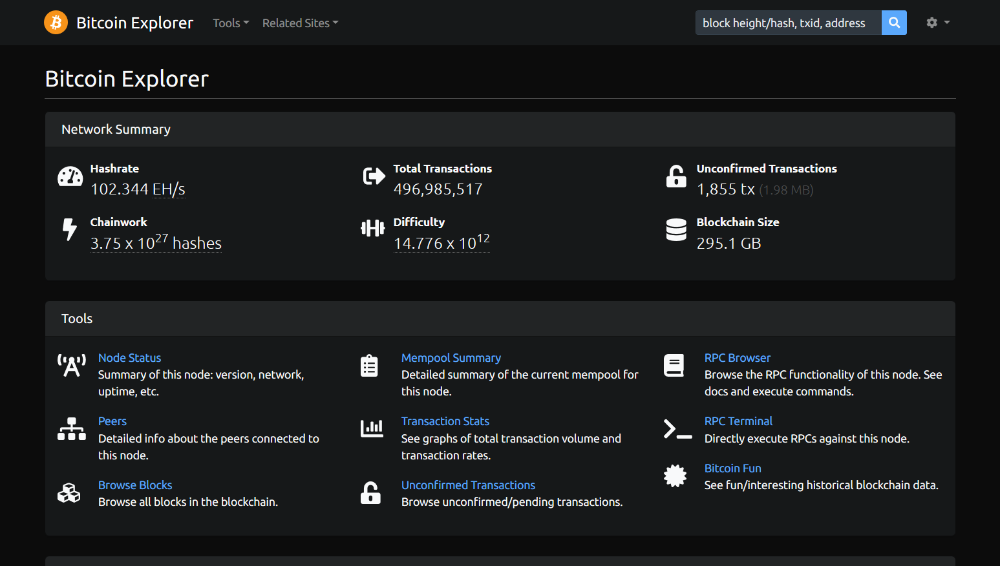

<!-- markdownlint-disable MD014 MD022 MD025 MD033 MD036 MD040 -->

# Block Explorer
{: .no_toc }

Run your own block explorer without depending on external services.

---

## Table of contents
{: .no_toc .text-delta }

1. TOC
{:toc}

---

## Run your own block explorer

After the RaspiBolt runs your own fully validated node, and maybe even acts as a backend for your hardware wallet with Electrs, the last important puzzle piece to improve privacy and financial sovereignty is your own Block Explorer.
This lets you query transactions, addresses and blocks of your choice.
You no longer need to leak information by querying a third-party block explorer that can be used to get your location and cluster addresses.

[BTC RPC Explorer](https://github.com/janoside/btc-rpc-explorer) provides a lightweight and easy to use web interface to accomplish just that.
It's a database-free, self-hosted Bitcoin block explorer, querying Bitcoin Core and optionally Electrs via RPC.
Built with Node.js, express, bootstrap-v4.

## Preparations

### Transaction indexing

For the BTC RPC Explorer to work, you need your full node to index all transactions.
Otherwise, the only transactions your full node will store are the ones pertaining to the node's wallets (which you probably are not going to use).
If not already enabled, you need to set the `txindex` parameter in your Bitcoin Core configuration file (`bitcoin.conf`): [Bitcoin node configuration](raspibolt_30_bitcoin.md#configuration).

After adding the parameter, just restart Bitcoin Core with `sudo systemctl restart bitcoind`.

As reindexing can take more than a day, you can follow the progress using `sudo tail -f /mnt/ext/bitcoin/debug.log`.

### Install NodeJS

* Starting with user "admin", we switch to user "root" and add the [Node JS](https://nodejs.org) package repository.
  We'll use version 12 which is the most recent stable one. Then, exit the "root" user session.

  ```sh
  $ sudo su
  $ curl -sL https://deb.nodesource.com/setup_12.x | bash -
  $ exit
  ```

* Install NodeJS using the apt package manager.

  ```sh
  $ sudo apt-get install nodejs
  ```

### Firewall

* Configure firewall to allow incoming HTTP requests from your local network to the web server.

  ```sh
  $ sudo ufw allow from 192.168.0.0/16 to any port 3002 comment 'allow BTC RPC Explorer from local network'
  $ sudo ufw status
  ```

## BTC RPC Explorer

### Installation

We do not want to run the explorer code alongside `bitcoind` and `lnd` because of security reasons.
For that we will create a separate user and we will be running the code as the new user.
We are going to install the BTC RPC Explorer in the home directory since it doesn't take much space and doesn't use a database.

* Create a new user with  your password [ A ] and open a new session

  ```sh
  $ sudo adduser btcrpcexplorer
  $ sudo su - btcrpcexplorer
  ```

* Download the source code directly from GitHub and install all dependencies using NPM.
  Since the program is written in JavaScript, there is no need to compile.

  ```sh
  $ git clone --branch v2.0.1 https://github.com/janoside/btc-rpc-explorer.git
  $ cd btc-rpc-explorer
  $ npm install
  ```

### Configuration

* Copy and edit the configuration template (skip this step when updating)

  ```sh
  $ cp .env-sample .env
  $ nano .env
  ```

* By default, the BTC RPC Explorer listens for local requests (localhost / 127.0.0.1).
  If you would like to access it from your local network or from somewhere else, make sure you configure the proper host and port by changing these parameters:

  ```conf
  BTCEXP_HOST=0.0.0.0
  BTCEXP_PORT=3002
  ```

* We instruct BTC RPC Explorer to connect to local Bitcoin Core by uncommenting and changing the following lines:

  ```conf
  BTCEXP_BITCOIND_HOST=127.0.0.1
  BTCEXP_BITCOIND_PORT=8332
  BTCEXP_BITCOIND_USER=raspibolt
  BTCEXP_BITCOIND_PASS=PASSWORD_[B]
  ```

* To compensate for the limited resources of the Raspberry Pi, let's extend the timeout period.

  ```conf
  BTCEXP_BITCOIND_RPC_TIMEOUT=10000
  ```

* To get address balances, either an Electrum server or an external service is necessary.
  It is important to use local RaspiBolt Electrs server, no real privacy is gained when we query external services anyway.
  The following configuration also works with Electrum Personal Server or ElectrumX.

  ```conf
  BTCEXP_ADDRESS_API=electrumx
  BTCEXP_ELECTRUMX_SERVERS=tcp://127.0.0.1:50001
  ```

* You can go further improve your privacy by enabling privacy mode, but you won't get certain feature like price exchange rates.

  ```conf
  BTCEXP_PRIVACY_MODE=true
  ```

* Make sure the RPC methods are not all allowed to avoid unnecessary security leaks.
  However, if you want to use the BTC RPC Explorer to send RPC commands to your node you might want to activate this with caution.

  ```conf
  BTCEXP_RPC_ALLOWALL=false
  ```

* Additionally, if you want or need to see more logs related to the functioning of the explorer, you can enable them by changing this line with the proper parameter.
  Here we are adding logs from the 'www' (http server) module.

  ```conf
  DEBUG=btcexp:app,btcexp:error,www
  ```

* Save and exit

### First start

Test starting the explorer manually first to make sure it works.

* Let's do a first start to make sure it's running as expected.
  Make sure we are in the BTC RPC Explorer directory and start the web server.

  ```sh
  $ cd ~/btc-rpc-explorer
  $ npm run start
  ```

* Now point your browser to `http://raspibolt.local:3002` (or whatever you chose as hostname) or the ip address (e.g. `http://192.168.0.20:3002`).
  You should see the home page of the BTC RPC Explorer.

  

* If you see a lot of errors on the RaspiBolt command line, then Bitcoin Core might still be indexing the blockchain.
  You need to wait until reindexing is done before using the BTC RPC Explorer.

* Stop the Explorer in the terminal with `Ctrl`-`C` and exit the "btcrpcexplorer" user session.

  ```sh
  $ exit
  ```

### Autostart on boot

Now we'll make sure our block explorer starts as a service on the Raspberry Pi so it's always running.
In order to do that we create a systemd unit that starts the service on boot directly after Bitcoin Core.

* As user "admin", create the service file.

  ```sh
  $ sudo nano /etc/systemd/system/btcrpcexplorer.service
  ```

* Paste the following configuration. Save and exit.

  ```ini
  # RaspiBolt: systemd unit for BTC RPC Explorer
  # /etc/systemd/system/btcrpcexplorer.service

  [Unit]
  Description=BTC RPC Explorer
  After=network.target bitcoind.service

  # If you use an Electrum server, uncomment the following line and make sure to use the correct the service
  # After=electrs.service

  [Service]
  WorkingDirectory=/home/btcrpcexplorer/btc-rpc-explorer
  ExecStart=/usr/bin/npm start
  User=btcrpcexplorer

  # Restart on failure but no more than 2 time every 10 minutes (600 seconds). Otherwise stop
  Restart=on-failure
  StartLimitIntervalSec=600
  StartLimitBurst=2

  [Install]
  WantedBy=multi-user.target
  ```

* Enable the service, start it and check log logging output.

  ```sh
  $ sudo systemctl enable btcrpcexplorer.service
  $ sudo systemctl start btcrpcexplorer.service
  $ sudo journalctl -f -u btcrpcexplorer
  ```

* You can now access your own BTC RPC Explorer from within your local network by browsing to <http://raspibolt.local:3002> (or your equivalent ip address).

### Remote access over Tor (optional)

Do you want to access your personal block explorer remotely?
You can easily do so by adding a Tor hidden service on the RaspiBolt and accessing the BTC RPC Explorer with the Tor browser from any device.

* Add the following three lines in the section for "location-hidden services" in the `torrc` file.
  Save and exit.

  ```sh
  $ sudo nano /etc/tor/torrc
  ```

  ```conf
  ############### This section is just for location-hidden services ###

  HiddenServiceDir /var/lib/tor/hidden_service_btcrpcexplorer/
  HiddenServiceVersion 3
  HiddenServicePort 80 127.0.0.1:3002
  ```

* Restart Tor and get your connection address.

  ```sh
  $ sudo systemctl restart tor
  $ sudo cat /var/lib/tor/hidden_service_btcrpcexplorer/hostname
  > abcdefg..............xyz.onion
  ```

* With the [Tor browser](https://www.torproject.org), you can access this onion address from any device.
  Please be aware that this access is not password protected and should not be shared widely.

**Congratulations!**
You now have the BTC RPC Explorer running to check the Bitcoin network information directly from your node.

---

## Upgrade

Updating to a [new release](https://github.com/janoside/btc-rpc-explorer/releases){:target="_blank"} should be straight-forward, but make sure to check out the [change log](https://github.com/janoside/btc-rpc-explorer/blob/master/CHANGELOG.md){:target="_blank"} first.

* From user "admin", stop the service and open a "btcrpcexplorer" user session.

  ```sh
  $ sudo systemctl stop btcrpcexplorer
  $ sudo su - btcrpcexplorer
  ```

* Fetch the latest GitHub repository information and check out the new release:

  ```sh
  $ cd ~/btc-rpc-explorer
  $ git fetch
  $ git checkout v2.0.1
  $ npm install
  $ exit
  ```

* Start the service again.

  ```sh
  $ sudo systemctl start btcrpcexplorer
  ```

---

Next: [Bonus guides >>](raspibolt_60_bonus.md)
