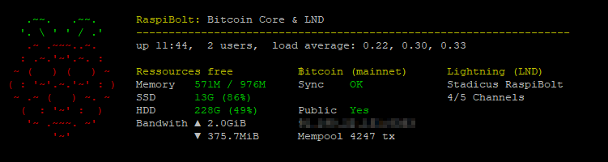
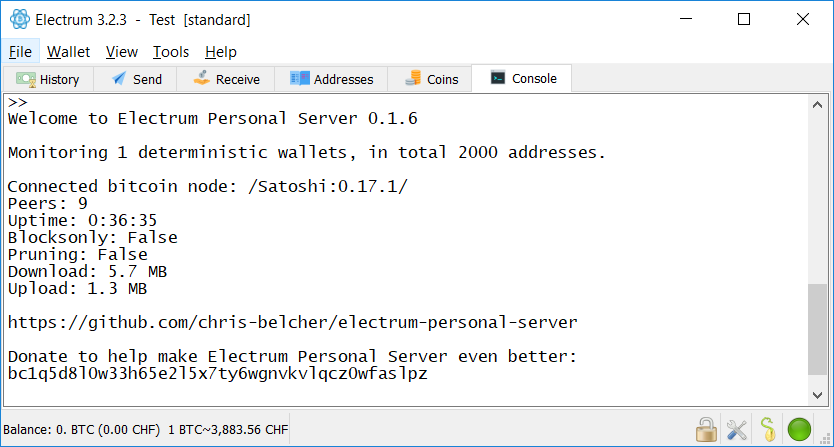
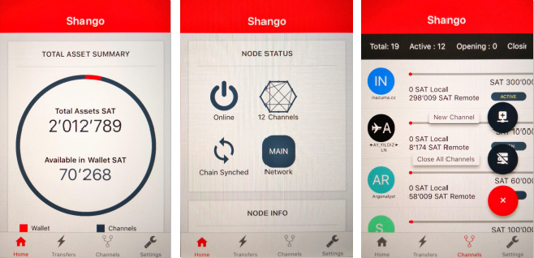

<!-- markdownlint-disable MD014 MD022 MD025 MD033 MD036 MD040 -->

# Bonus Section
{: .no_toc }

---

🚨 This section has not been updated to **RaspiBolt v2** yet.
There might be some inconsistencies with the updated configuration, so handle with care!

---
## Table of contents
{: .no_toc .text-delta }

1. TOC
{:toc}

---

In this section, you can find various optional topics that make your RaspiBolt running even smoother. I split this up in various subsections, as the individual tasks can be quite long.

## [System overview](raspibolt_61_system-overview.md)

*Difficulty: easy*

Your RaspiBolt will greet you with a quick system summary on login:

## [Auto unlock LND on startup](raspibolt_6A_auto-unlock.md)

*Difficulty: medium*

Manually unlocking the LND wallet every time the system starts is not really feasible if your RaspiBolt is meant to run reliably somewhere in a closet. This script automatically unlocks the wallet on startup or service-restart. This comes at a minimal security cost, however, as the password needs to be stored on the device.

## [Anonymous node with Tor](raspibolt_69_tor.md)

*Difficulty: medium*

Route all your Bitcoin traffic over the Tor network to stay anonymous and avoid leaking private information like your public IP address.
Only for older configurations, the latest RaspiBolt v2 has this already enabled by default.

## [Electrum Personal Server](raspibolt_64_electrum.md)

*Difficulty: medium*

The RaspiBolt is the perfect trustless Bitcoin backend for your regular on-chain transactions.
Together with the Electrum wallet, it works even with your Ledger or Trezor hardware wallet.
Mostly for older configurations, the latest RaspiBolt v2 already has a full Electrum server included by default.

## [Zap Desktop Lightning Wallet](raspibolt_71_zap.md)

*Difficulty: easy*

The Zap desktop app (https://github.com/LN-Zap/zap-desktop) is a cross platform Lightning Network wallet focused on user experience and ease of use.

## [Zap iOS Lightning Wallet](raspibolt_72_zap-ios.md)

*Difficulty: medium*

The Zap iOS app (https://zap.jackmallers.com) provides a neat interface for the RaspiBolt to manage peers & channels, make payments and create invoices.

## [Shango Mobile Wallet](raspibolt_68_shango.md)

*Difficulty: medium*

The iOS & Android app Shango provides a neat interface for the RaspiBolt, to manage peers & channels, make payments and create invoices.

## [lntop](raspibolt_74_lntop.md)

*Difficulty: easy*

lntop is an interactive text-mode channels viewer for Unix systems.

## [Pimp the command line](raspibolt_62_commandline.md)

*Difficulty: easy*

Make your command line prompt shine with a golden ฿ and use more colors overall:

## [Use lncli on a different computer](raspibolt_66_remote_lncli.md)

*Difficulty: easy*

Control your Lightning node from a different computer within you network, eg. from a Windows machine.

## [System recovery](raspibolt_65_system-recovery.md)

Difficulty: easy

In case your microSD card gets corrupted or you brick your node, it's handy to have a quick recovery image at hand. It's not a full backup solution, but allows a system recovery.

## [Additional scripts: show balance & channels](raspibolt_67_additional-scripts.md)

Difficulty: easy

These additional bash scripts display a balance overview (on-chain & in channels, active & inactive) as well as a nicely formatted channels overview.

## JoinMarket

*Difficulty: advanced*

[JoinMarket](https://github.com/JoinMarket-Org/joinmarket-clientserver) is a CoinJoin software, which allows you to increase privacy and fungibility of on-chain Bitcoin transactions. It includes it's own Bitcoin wallet, backed by `bitcoind`, and uses market maker / market taker model, which means that either you pay small fee for having CoinJoin privacy fast (taker) or just keep software running and then you get paid for providing liquidity for CoinJoin's, in addition gaining privacy in a longer periods of time (maker). 

Even if you aren't interested in privacy of your coins, you can use JoinMarket for some little passive income from your bitcoins, without giving up your private keys.

**[JoinMarket on RaspiBolt](https://github.com/kristapsk/raspibolt-extras/blob/master/joinmarket.md)** by Kristaps Kaupe

## Even more Extras

**[RaspiBolt-Extras](https://github.com/robclark56/RaspiBolt-Extras/blob/master/README.md)** by Rob Clark

* Lights-Out: automatic unlocking of wallet and dynamic ip
* RaspiBoltDuo: testnet & mainnet running simultaneously
* Using REST access
* Receiving Lightning payments: automatically create invoices / qr codes

---

Next: [Troubleshooting](raspibolt_70_troubleshooting.md) >>
