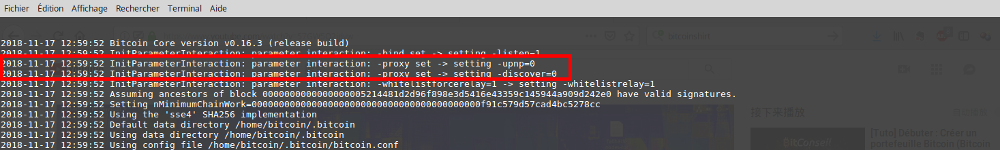
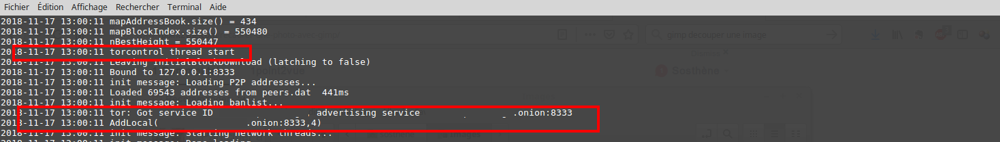
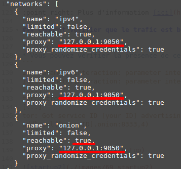
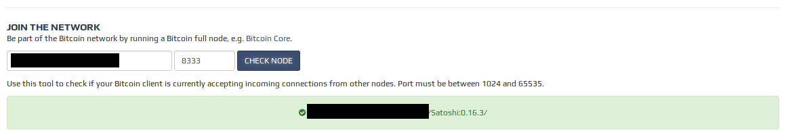

## Bonus guide: Anonymous node with Tor
*Difficulty: medium*

*Note:* this is the standalone version of the Tor configuration guide.
If you already followed the RaspiBolt2 guide (which is Tor-only by default), you do not need to follow this guide.

### What is Tor?

Tor is a free software that allows you to anonymize internet traffic by routing it through a network of nodes to hide the location and usage profile of end points.

It is called "Tor" for "The Onion Router": information is encrypted multiple times with the public keys of the nodes it passes through. Each node decrypts the layer of information that corresponds to its own private key, pretty much like peeling an onion, until the last that will reveal the clear message.

🔍 Learn more on [Wikipedia](https://en.wikipedia.org/wiki/Tor_%28anonymity_network%29).

### Why do you want to run Tor?

Tor is mainly useful as a way to impede traffic analysis, which means analyzing your internet activity (logging you IP address on websites you're browsing and services you're using) to learn about you and your interests. Traffic analysis is useful for advertisement and you might want to hide this kind of information merely out of privacy concerns. But it might also be used by outright malevolent actors, criminals or governments to harm you in a lot of possible ways.

Tor allows you to share data on the internet without revealing your location or identity, which can definitely be useful when running a Bitcoin node.

Out of all the reasons why you should run Tor, here are the most relevant to Bitcoin:
* By exposing your home IP address with your node, you are literally saying the whole planet "in this home we run a node". That's only one short step from "in this home, we do have bitcoins", which could potentially turn you and your loved ones into a target for thieves.
* In the eventuality of a full fledged ban and crackdown on Bitcoin owners in the country where you live, you will be an obvious target for law enforcement.
* Coupled with other privacy methods like CoinJoin you can gain more privacy for your transactions, as it eliminates the risk of someone being able to snoop on your node traffic, analyze which transactions you relay and try to figure out which UTXOs are yours, for example.

All the above mentioned arguments are also relevant when using Lightning, as someone that sees a Lightning node running on your home IP address could easily infer that there's a Bitcoin node at the same location.

### Installing Tor

This guide assumes that you're running a **Raspberry Pi 3** or better. If your RaspiBolt is built on an earlier version, it won't work as described below and you might want to [look at these instructions](https://tor.stackexchange.com/questions/242/how-to-run-tor-on-raspbian-on-the-raspberry-pi) instead.

Also, this guide builds on top of the RaspiBolt guide that runs with **Raspbian Buster Lite**. If you run a different operating system, you may need to build Tor from source and paths may vary.

For additional reference, the original instructions are available on the [Tor project website](https://www.torproject.org/docs/debian.html.en#ubuntu).

* Connect to the RaspiBolt via SSH as user "admin", as [described in the main guide](raspibolt_20_pi.md#connecting-to-the-pi).

* Add the following two lines to `sources.list` to add the torproject repository.

  ```sh
  $ sudo nano /etc/apt/sources.list
  ```

  ```console
  deb https://deb.torproject.org/torproject.org buster main
  deb-src https://deb.torproject.org/torproject.org buster main
  ```

* In order to verify the integrity of the Tor files, download and add the signing keys of the torproject using the network certificate management service (dirmngr).
  ```
  $ sudo apt install dirmngr apt-transport-https
  $ curl https://deb.torproject.org/torproject.org/A3C4F0F979CAA22CDBA8F512EE8CBC9E886DDD89.asc | gpg --import
  $ gpg --export A3C4F0F979CAA22CDBA8F512EE8CBC9E886DDD89 | sudo apt-key add -
  ```

* The latest version of Tor can now be installed. While not required, `tor-arm` provides a dashboard that you might find useful.
  ```
  $ sudo apt update
  $ sudo apt install tor tor-arm
  ```

* Check the version of Tor (it should be 0.3.3.6 or newer) and that the service is up and running.
  ```
  $ tor --version
  Tor version 0.3.4.9 (git-074ca2e0054fded1).
  $ systemctl status tor
  ```
* Check that within the "tor-service-defaults-torrc" file the "User" name is "debian-tor".
  ```
  $ cat /usr/share/tor/tor-service-defaults-torrc
  User debian-tor
  ```

* Check which users belong to the debian-tor group. If "bitcoin" is not there, which is most likely the case, you will need to add it and check again.
  ```
  $ cat /etc/group | grep debian-tor
  debian-tor:x:113:
  $ sudo adduser bitcoin debian-tor
  $ cat /etc/group | grep debian-tor
  debian-tor:x:123:bitcoin
  ```
* Modify the Tor configuration by uncommenting (removing the #) or adding the following lines.
  ```
  $ sudo nano /etc/tor/torrc
  ```
  ```
  # uncomment:
  ControlPort 9051
  CookieAuthentication 1

  # add:
  CookieAuthFileGroupReadable 1
  ```

* Restart Tor to activate modifications
  ```
  $ sudo systemctl restart tor
  ```

### Setup Tor for Bitcoin Core

#### Configuration

* In the "admin" user session, stop Bitcoin and LND.
  ```
  $ sudo systemctl stop lnd
  $ sudo systemctl stop bitcoind
  ```

* Open the Bitcoin configuration and add the following lines. The argument `onlynet` should not be specified (delete this line if present).
  ```
  $ sudo nano /home/bitcoin/.bitcoin/bitcoin.conf
  ```
  ```
  # add / change:
  proxy=127.0.0.1:9050
  bind=127.0.0.1
  listenonion=1
  ```

* Archive the current logfile and restart Bitcoin Core to use the adjusted configuration.
  ```
  $ sudo mv /home/bitcoin/.bitcoin/debug.log /home/bitcoin/.bitcoin/debug.log.old
  $ sudo systemctl start bitcoind
  ```

#### Validation
Bitcoin Core is starting and we now need to check if all connections are truly routed over Tor.

* Verify operations in the `debug.log` file. You should see your onion address after about one minute.

  ```
  $ sudo tail /home/bitcoin/.bitcoin/debug.log -f -n 200
  InitParameterInteraction: parameter interaction: -proxy set -> setting -upnp=0
  InitParameterInteraction: parameter interaction: -proxy set -> setting -discover=0
  ...
  torcontrol thread start
  ...
  tor: Got service ID [YOUR_ID] advertising service [YOUR_ID].onion:8333
  addlocal([YOUR_ID].onion:8333,4)
  ```
  
  

* Display the Bitcoin network info to verify that the different network protocols are bound to proxy `127.0.0.1:9050`, which is Tor on your localhost. Note the `onion` network is now `reachable: true`.
  ```
  $ bitcoin-cli getnetworkinfo
  ```
  

* Verify that your node is reachable within the Bitcoin network. Bitnodes' check for .onion addresses is very unreliable, generally the API method works better.

  If the result is negative, just try again a minute later as sometimes the lookup will fail to contact your node for some reasons. If your node is persistently not reachable, verify your [port forwarding](raspibolt_20_pi.md#port-forwarding--upnp) and [firewall](raspibolt_20_pi.md#enabling-the-uncomplicated-firewall) settings. Even if all say "not reachable" or "down", but you get 8 or more peers, you're just fine.

  * Go to [bitnodes.earn.com](https://bitnodes.earn.com/) and copy/paste your `.onion` address here:
  
  * Check directly using the API by using this link (insert your own .onion address, like https://bitnodes.earn.com/nodes/627jdioviypreq7v.onion-8333/):
  * If you dont see it as connectable, it does not mean that everything is not OK. Bitnode's site in combination with your new node sometimes takes some time to show properly. Try it again in few hours (or tomorrow).
    ```
    https://bitnodes.earn.com/nodes/[your-onion-adress.onion]-8333/
    ```

* Check the IP address that other peers use to connect to your node. First, get your real public IP address:
  ```
  $ curl icanhazip.com
  ```
* and then verify that it is not used as `localaddr` by Bitcoin.
  ```
  $ bitcoin-cli getpeerinfo | grep  local
  ```

  🚨 If you still see your real public IP address listed, something is wrong as one or many of your peers are currently connected with you on clearnet. This means that you're effectively deanonymized.

* If you're not going to configure LND at the moment, start the service as well. Otherwise you can skip this step.
  ```
  $ sudo systemctl start lnd
  ```

**Additional video guide**
🔍 If you're a bit lost, you can watch [this video](https://youtu.be/57GW5Q2jdvw) that is very clear and shows pretty much the same process (there are also some extra optional steps that I describe below).

### Setup Tor for LND

Two important points:
* LND needs Tor version 0.3.3.6 or newer. If you followed this tutorial to install Tor this shouldn't be an issue.
* In case you have been running a node on clearnet before, it is recommended to close all Lightning channels and start a brand new node on Tor. Your existing public key is already associated with your real IP address and known to your peers, so with this data you're pretty easy to deanonymize.

Ok, let's get to work.

* With the "admin" user, stop LND:
  ```
  $ sudo systemctl stop lnd
  ```

* Open the LND configuration file and add / change the following lines.
  ```
  $ sudo nano /home/bitcoin/.lnd/lnd.conf
  ```
  ```
  # add / change the following options within [Application Options]:
  listen=localhost
  nat=false

  # add:
  [Tor]
  tor.active=true
  tor.v3=true
  tor.streamisolation=true
  ```

* Restart LND as usual, give it some time and unlock the wallet:
  ```
  $ sudo systemctl start lnd
  $ lncli unlock
  ```

* The output of `lncli getinfo` or `lncli getnodeinfo [YOUR_PUBKEY]` commands should not display your IP address anymore.

🔍 More information is available [on the LND project Github repository](https://github.com/lightningnetwork/lnd/blob/master/docs/configuring_tor.md).

### Go a little further

Your Bitcoin and Lightning nodes are now connected to the world through the Tor network, and are much harder to isolate and associate with a geographical location. But you should be aware that Tor is no [silver bullet](https://security.stackexchange.com/questions/147402/how-do-traffic-correlation-attacks-against-tor-users-work) and that you are still vulnerable to a range of attacks from "simple" DoS to total deanonymization of users. This configuration aims to be a good compromise between performance and security for an average user that is exposed to average risks.

The attack surface can be reduced even further, but that can impede your ability to connect with other peers. However, this could make you fall out-of-sync with the rest of the network.

For example, you can:

* **Connect only to Tor nodes**
  Accept to connect only with peers that have a `.onion` address. In the Bitcoin configuration file, add the following line:

  ```
  $ sudo nano /home/bitcoin/.bitcoin/bitcoin.conf
  ```
  ```
  onlynet=onion
  ```

  If you check `bitcoin-cli getnetworkinfo` you will notice that `ipv4` and `ipv6` networks are no longer reachable. You can connect now only to peers on the Tor network.

* **Deactivate DNS lookup**
  DNS lookups for other peers could potentially be used to deanonymize you, at least it happened in the past. Some people might want to deactivate DNS request that are usually used to find other nodes on the network.

  With this configuration, your node is not capable to find peers on its own. That's why it is necessary to bootstrap it with a hardcoded list of a few nodes to contact on startup by specifying `addnode`. You need to add one line for each address. You can find address lists online, for example [here](https://bitcoin.stackexchange.com/questions/70069/how-can-i-setup-bitcoin-to-be-anonymous-with-tor), but it raises other risks so be careful...

  In the Bitcoin configuration file, add the following lines:
  ```
  $ sudo nano /home/bitcoin/.bitcoin/bitcoin.conf
  ```
  ```
  dnsseed=0
  dns=0
  addnode=[ADDRESS].onion(:port)
  addnode=[ADDRESS].onion(:port)
  ...
  ```

  If you want to know more about DNS, you can have a look at [Wikipedia](https://fr.wikipedia.org/wiki/Domain_Name_System) or the incredible (comic booklet) Zine [Networking](https://wizardzines.com/zines/networking/) by Julia Evans.

------

Don't forget to restart bitcoind with `sudo systemctl restart bitcoind` each time you change something.

------

<< Back: [Bonus guides](raspibolt_60_bonus.md)
