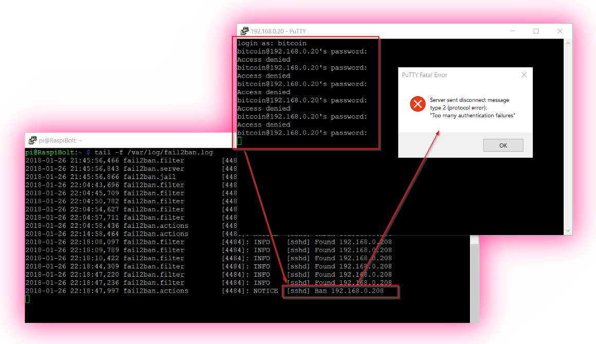

<!-- markdownlint-disable MD014 MD022 MD025 MD033 MD040 -->


# Security
{: .no_toc }

We make sure that your RaspiBolt is secured against unauthorized remote access.

---

## Table of contents
{: .no_toc .text-delta }

1. TOC
{:toc}

---

The RaspiBolt will be visible from the internet and therefore needs to be secured against online attacks using various methods.

## Login with SSH keys

One of the best options to secure the sensitive SSH login is to disable passwords altogether and require an SSH key certificate.
Only someone with physical possession of the private certificate key can log in.

### Generate SSH keys on Windows

Follow this guide [Configure “No Password SSH Keys Authentication” with PuTTY on Linux Servers](https://www.tecmint.com/ssh-passwordless-login-with-putty/){:target="_blank"}

* You have now generated three new files.
  Keep them safe!

  * `RaspiBolt-Private-Key.ppk`
  * `RaspiBolt-Public-Key`
  * `authorized-Keys.txt`

* You also copied the content of `authorized-Keys.txt` into the file `~/.ssh/authorized_keys` on your Pi and changed the directory's permissions to `700`.

* After specifying your private key file in the PuTTY configuration, you're all set.

### Generate SSH keys on macOS or Linux

* In the terminal on your regular computer, check if keys already exist:

  ```sh
  $ ls -la ~/.ssh/*.pub
  ```

* If files are listed, your public key should be named something like `id_dsa.pub`, `id_ecdsa.pub`, `id_ed25519.pub` or `id_rsa.pub`.
   If one of these files already exists, skip the next step.

* If none of those files exist, or you get a "No such file or directory" error, create a new public / private key pair:

  ```sh
  $ ssh-keygen -t rsa -b 4096
  ```

  When you're prompted to "Enter a file in which to save the key," press Enter to use the default file location.
  Optionally, for maximum security, use `password [A]` to protect your key.

* The public key now needs to be copied to the Pi.
  Use the command `ssh-copy-id`, which stores your public key on the remote machine (and creates files and directories, if needed).
  You will be prompted for your SSH login password once.

  ```sh
  $ ssh-copy-id admin@raspibolt.local
  ```

💡 If you are on macOS and encounter an error, you might need install `ssh-copy-id` first by running the following command on your Mac's command line:

* ```sh
  $ brew install ssh-copy-id
  ```

### Disable password login

* Log in to the Raspberry Pi as "admin" using SSH with your SSH key.
  You shouldn't be prompted for the admin's password anymore.

* Edit the ssh configuration file `/etc/ssh/sshd_config` by uncommenting the following two options and setting their value to `no`.
  Save and exit.

  ```sh
  $ sudo nano /etc/ssh/sshd_config
  ```
  ```sh
  PasswordAuthentication no
  ChallengeResponseAuthentication no
  ```

* Restart the SSH daemon, then exit your session

  ```sh
  $ sudo systemctl restart sshd
  $ exit
  ```

* Log in again with user "admin"

You can no longer log in with a password.
User "admin" is the only user that has the necessary SSH keys, no other user can log in remotely.

🚨 **Backup your SSH keys!**
You will need to attach a screen and keyboard to your Pi if you lose them.

---

## Enabling the Uncomplicated Firewall

A firewall controls what kind of outside traffic your machine accepts and which applications can send data out.
By default, many network ports are open and listening for incoming connections.
Closing unnecessary ports can mitigate many potential system vulnerabilities.

For now, only SSH should be reachable from the outside.
Bitcoin Core and LND are using Tor and don't need incoming ports.
We'll open the port for Electrs and web applications later if needed.

* With user "admin", configure and enable the firewall rules

  ```sh
  $ sudo apt install ufw
  $ sudo ufw default deny incoming
  $ sudo ufw default allow outgoing
  $ sudo ufw allow SSH
  $ sudo ufw logging off
  $ sudo ufw enable
  ```

* Make sure that the UFW is started automatically on boot

  ```sh
  $ sudo systemctl enable ufw
  ```

* Check if the UFW is properly configured and active

  ```sh
  $ sudo ufw status
  > Status: active
  >
  > To                         Action      From
  > --                         ------      ----
  > SSH                        ALLOW       Anywhere
  > SSH (v6)                   ALLOW       Anywhere (v6)
  ```

🔍 *more: [UFW Essentials](https://www.digitalocean.com/community/tutorials/ufw-essentials-common-firewall-rules-and-commands){:target="_blank"}*

💡 If you find yourself locked out by mistake, you can connect a keyboard and screen to your Pi to log in locally and fix these settings (especially for the SSH port 22).

---

## fail2ban

The SSH login to the Pi must be specially protected.
An additional measure is to install "fail2ban", which prevents an attacker from gaining access via brute force.
It simply cuts off any remote system with five failed login attempts for ten minutes.


*Me locking myself out by entering wrong passwords*

* Install "fail2ban", which activates automatically

  ```sh
  $ sudo apt install fail2ban
  ```

The initial configuration is fine, as it protects SSH by default.

🔍 *more: [customize fail2ban configuration](https://linode.com/docs/security/using-fail2ban-for-security/){:target="_blank"}*

---

## Increase your open files limit

If your RaspiBolt is swamped with internet requests (honest or malicious due to a DoS attack), you will quickly encounter the "can't accept connection: too many open files" error.
This is due to the limit of open files (representing individual TCP connections) set too low.

Edit each of the following three files, add the additional line(s) right before the end comment, save and exit.

```sh
$ sudo nano /etc/security/limits.conf

*    soft nofile 128000
*    hard nofile 128000
root soft nofile 128000
root hard nofile 128000
```

```sh
$ sudo nano /etc/pam.d/common-session
session required                        pam_limits.so
```

```sh
$ sudo nano /etc/pam.d/common-session-noninteractive
session required                        pam_limits.so
```
---

## Prepare NGINX reverse proxy

Several components of this guide will expose a communication port, for example the Electrum server, the Block Explorer, or the "Ride The Lightning" web interface for your Lightning node.
Even if you use these services only within your own home network, communication should always be encrypted.
Otherwise, any device in the same network can listen to the exchanged data, including passwords.

We use NGINX to encrypt the communication with SSL/TLS (Transport Layer Security).
This setup is called a "reverse proxy": NGINX provides secure communication to the outside and routes the traffic back to the internal service without encryption.

💡 _Hint: NGINX is pronounced "Engine X"_ ;)

* Install NGINX

  ```sh
  $ sudo apt install nginx
  ```

* Create a self-signed SSL/TLS certificate (valid for 10 years)

  ```sh
  $ sudo openssl req -x509 -nodes -newkey rsa:4096 -keyout /etc/ssl/private/nginx-selfsigned.key -out /etc/ssl/certs/nginx-selfsigned.crt -subj "/CN=localhost" -days 3650
  ```

* NGINX is also a full webserver.
  To use it only as a reverse proxy, remove the default configuration and paste the following configuration into the `nginx.conf` file.

  ```sh
  $ sudo mv /etc/nginx/nginx.conf /etc/nginx/nginx.conf.bak
  $ sudo nano /etc/nginx/nginx.conf
  ```

  ```nginx
  user www-data;
  worker_processes 1;
  pid /run/nginx.pid;
  include /etc/nginx/modules-enabled/*.conf;

  events {
    worker_connections 768;
  }

  stream {
    ssl_certificate /etc/ssl/certs/nginx-selfsigned.crt;
    ssl_certificate_key /etc/ssl/private/nginx-selfsigned.key;
    ssl_session_cache shared:SSL:1m;
    ssl_session_timeout 4h;
    ssl_protocols TLSv1.2 TLSv1.3;
    ssl_prefer_server_ciphers on;

    include /etc/nginx/streams-enabled/*.conf;

  }
  ```

* Create a new directory for future configuration files

  ```sh
  $ sudo mkdir /etc/nginx/streams-enabled
  ```

* Test this barebone NGINX configuration

  ```sh
  $ sudo nginx -t
  > nginx: the configuration file /etc/nginx/nginx.conf syntax is ok
  > nginx: configuration file /etc/nginx/nginx.conf test is successful
  ```

## Disable wireless interfaces

Raspberry Pis come with Wifi and Bluetooth built-in.
That's great for most projects, but we should turn off all radios that are not needed for a security-focused device.

* Open the RasPi OS configuration file, go to the following comment and add the applicable options below

  ```sh
  $ sudo nano /boot/config.txt
  ```

  ```sh
  # Additional overlays and parameters are documented /boot/overlays/README
  ```

  * Disable Bluetooth by adding this line

    ```
    dtoverlay=disable-bt
    ```

  * If you're running your RaspiBolt with a network cable, disable wifi by adding this line

    ```
    dtoverlay=disable-wifi
    ```

Save and exit.
The disabled radios will no longer be active on the next reboot.

<br /><br />

---

Next: [Privacy >>](privacy.md)
