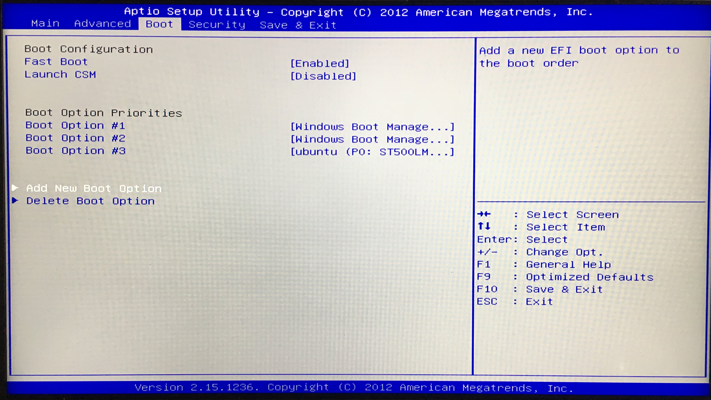
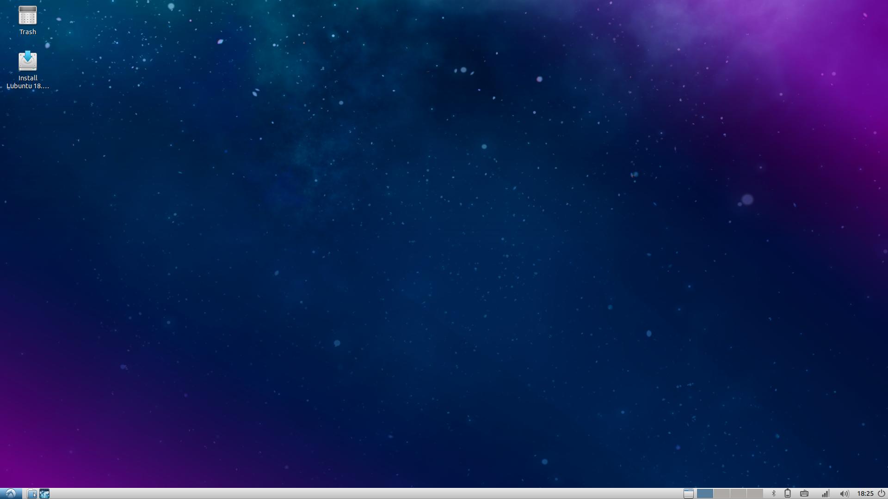
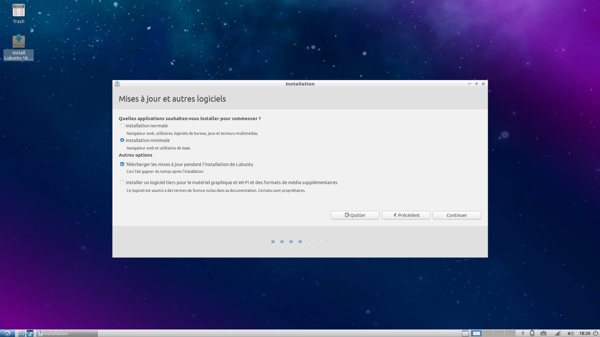

[ [Intro](README.md) ] -- [ **Preparations** ] -- [ [Raspberry Pi](raspibolt_20_pi.md) ] -- [ [Bitcoin](raspibolt_30_bitcoin.md) ] -- [ [Lightning](raspibolt_40_lnd.md) ] -- [ [Mainnet](raspibolt_50_mainnet.md) ] -- [ [Bonus](raspibolt_60_bonus.md) ] -- [ [FAQ](raspibolt_faq.md) ] -- [ [Updates](raspibolt_updates.md) ]

-------
### Un guide pour recycler votre vieux portable en noeud Bitcoin et ⚡Lightning️⚡
--------

# Installer Linux

## Quelle version (_distribution_) de Linux ?

Vous ne le savez sans doute pas, mais il existe en fait une tripotée de versions différentes de Linux, qui ont évidemment chacune leurs partisans et leurs détracteurs. La première question à nous poser est donc _quelle version devons-nous installer ?_

Comme vous vous foutez certainement de savoir quelle est la meilleure version de Linux, je vous propose sans attendre d'installer [Lubuntu](https://lubuntu.net/), qui est une version légère d'une des distributions les plus populaires de Linux, Ubuntu. 

J'ai choisi ce système pour deux raisons :
1. Ubuntu étant une, sinon la version la plus populaire de Linux, sa communauté est importante et il est relativement plus facile pour les néophytes de trouver la réponse à leurs questions.
2. Étant une version allégée et simplifiée d'Ubuntu, les requis techniques sont très faibles, et n'importe quelle machine produite après 2000 devrait être en mesure de la faire tourner (mon ordinateur date de 2009 et est très à l'aise avec).

Cet avis est bien entendu tout à fait contestable, et n'hésitez surtout pas à utiliser une autre distribution populaire, surtout si vous avez un ami geek qui l'utilise déjà et peut directement vous aider. Pour ma part, je suis parti avec Lubuntu qui ne m'a pour le moment donner aucune raison de regretter mon choix. 

Bref, à vous de voir.

## Tuto pas à pas

### 1. Télécharger Lubuntu

(Les étapes ci-dessous sont à réaliser sur votre ordinateur habituel)

Vous trouverez la dernière version de Lubuntu en téléchargement [ici](https://lubuntu.net/downloads/). Pas de piège, faites juste attention si le processeur de votre ordinateur est 32 ou 64 bits. 

* Vous trouverez généralement cette information dans le menu _Système_ de Windows. Si vous ne savez pas comment y accéder, googlez votre version de windows + "informations système"
* Si vous ne trouvez toujours pas, partez du principe que si votre ordinateur est plus ancien que 2007, son processeur est probablement un 32 bits.
* Si vraiment vous n'arrivez pas à lever le doute, télécharger la version 32 bits, elle marchera même avec un processeur 64 bits (mais l'inverse n'est pas vrai).

### 2. Télécharger Rufus

Rufus est un petit utilitaire Windows qui vous permettra de créer une clé USB _bootable_.

Si vous vous demandez ce que c'est encore que ce truc, cela signifie tout simplement que votre ordinateur sera en mesure de _boot_, c'est-à-dire de démarrer, à partir du système d'exploitation contenue sur cette clé USB. C'est un peu le même principe que le DVD d'installation de Windows qu'on ne vous a jamais donné/que vous avez perdu depuis longtemps. 

Vous pourrez télécharger la dernière version [ici](https://rufus.akeo.ie/).

### 3. Créer votre clé bootable de Lubuntu

Rufus ne nécessite pas d'installation. Contentez-vous donc d'exécuter le fichier que vous avez télécharger, et vous devriez voir apparaître la fenêtre suivante :

1. La clé USB qui va vous servir à installer Linux sur votre futur noeud Bitcoin. **Attention, la clé sera formatée durant l'opération et toutes les données existantes effacées, pensez bien à sauvegarder d'éventuels fichiers importants sur votre disque dur !**
2. La version de Linux que vous allez installer. Cliquez sur "Sélection" et sélectionnez le fichier .iso que vous avez téléchargé en 1.
3. Le schéma de partition est la façon dont sont organisée les données d'initialisation du système sur un disque dur. Il y a un ancien standard, _MBR_, et un nouveau, _GPT_. Dans la pratique, tous les ordinateurs utilisent GPT depuis une quinzaine d'années, et vous avez vraiment peu de chance de vous tromper en choisissant GPT. Si votre matériel est particulièrement vieux, renseignez-vous un peu plus. Ou essayez avec GPT, et si ça ne marche pas recommencez l'opération en MBR, cela ira probablement plus vite que d'essayer de comprendre. 
4. Comme dit plus haut, Rufus va formater votre clé. A priori, vous n'avez pas besoin de toucher aux options par défaut ici. 
5. Quand tout est bon, cliquez sur "Démarrer". L'opération ne devrait pas prendre plus de quelques minutes. 

### 4. Bootez sur votre nouvelle clé 

(les étapes ci-dessous sont à réaliser sur l'ordinateur que vous voulez transformer en noeud)

Pendant que votre ordinateur est éteint, branchez votre clé USB dans n'importe quel port. 

Nous allons maintenant ouvrir le BIOS de votre ordinateur, ce qui fait en général un peu peur.

Mais si, vous savez, le BIOS, c'est ça :

Le problème, c'est que ce menu et la façon d'y accéder varie selon les constructeurs ou même les modèles. Par conséquent, je ne peux pas vous donner de consignes précises pour le vôtre, il faudra éventuellement chercher sur internet si vous séchez.

En général, on accède au BIOS en appuyant (frénétiquement) soit sur la touche F2, soit sur la touche F8 au démarrage. Essayez l'une, puis l'autre, et si aucune ne marche recherchez sur internet avec la marque de votre ordinateur. 

Une fois que vous y êtes, vous devriez avoir une foule d'options différentes, et parmi elle recherchez "BOOT" (cf capture d'écran ci-dessus). Il vous faudra sûrement ajouter la clé USB comme option de boot, comme ci-dessous.

Ou bien peut-être que non, mais dans tous les cas cela ne devrait pas être trop compliqué !

Normalement vous devriez pouvoir démarrer sur le système Linux de votre clé USB après ça. 

### 5. Lubuntu _live_

Après quelques instants vous devriez voir apparaître un bureau vide identique à celui-là :

Il s'agit de ce que l'on appelle une version _live_ d'un système d'exploitation, c'est à dire que toutes les modifications que vous ferez disparaîtront quand vous éteindrez l'ordinateur (enfin... il est aussi possible de sauvegarder des fichiers sur ce type d'installation, mais en fait on s'en fout pour ce tuto).

Quand vous aurez terminé de jouer avec Linux, cliquez sur "Install Lubuntu" (la seule icone sur le bureau à part la poubelle). Vous pourrez ensuite suivre une procédure d'installation sans grande surprise.

Quand Lubuntu vous demande si vous préférez une installation "normale" ou "minimale", je vous conseille de choisir la seconde option. Après tout, cet ordinateur ne vous servira qu'à Bitcoin, inutile de le surcharger avec des applications multimédia !

Enfin, il vous demandera si vous souhaitez conserver votre installation de Windows. Cela n'a pas grand sens pour notre projet, sélectionnez donc la seconde option "Effacer le disque et installer Lubuntu". 
**Attention : jusque là, il est toujours possible de revenir en arrière et de récupérer le contenu de votre disque dur. Assurez-vous que vous avez récupéré tous les fichiers qui vous intéressent avant d'aller plus loin.**

Vous pouvez également encrypter votre disque dur. Concrètement, cela signifie qu'un mot de passe supplémentaire sera demandé à chaque démarrage. Je vous le déconseille car votre Thunder Badger ne devrait pas sortir de chez vous, et donc le gain de sécurité ne me semble pas très important. 

Cochez la seconde option LVM, même si vous ne comprenez pas ce que c'est, ça ne peut pas faire de mal.

Il ne vous reste plus qu'à cliquer sur "Installer maintenant" et à attendre quelques minutes. 

Félicitations, vous êtes désormais un utilisateur de Linux ! Débranchez votre clé USB, nous n'en n'aurons plus besoin. 

Vous pouvez désormais reprendre [la suite du tutoriel](old_laptop_10_preparations.md).