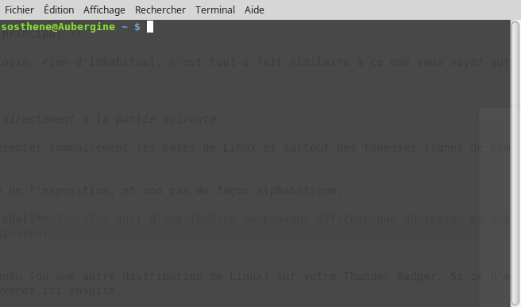
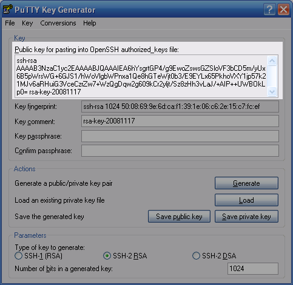

[ [Intro](README.md) ] -- [ [Préparatifs](thunderbadger_10_preparations.md) ] -- [ **Thunder Badger** ] -- [ [Bitcoin](thunderbadger_30_bitcoin.md) ] -- [ [LND](thunderbadger_40_lnd.md) ] -- [ [Mainnet](thunderbadger_50_mainnet.md) ] -- [ [Bonus](thunderbadger_60_bonus.md) ]

-------
### Thunder Badger : un noeud Bitcoin et ⚡Lightning️⚡ dans votre vieux portable pourri !
--------

# Le Thunder Badger

Vous devriez désormais avoir :
* le Thunder Badger avec une installation de Lubuntu toute neuve
* et un autre ordinateur en phase de synchronisation initiale de la blockchain

Il y a beaucoup à faire à cette étape, puisque nous allons apprendre :
* à nous servir du terminal de Linux
* à nous connecter à distance à un ordinateur en utilisant le protocole SSH
* à configurer notre réseau domestique pour interagir avec le réseau Bitcoin
* à sécuriser le Thunder Badger

Prenez votre temps, faites une recherche Google en cas de problème, et en cas de gros pépin (ou de suggestion pour améliorer le guide), ouvrez un ticket [ici](https://github.com/BobleChinois/guides), je ferai de mon mieux pour vous dépanner.

## Créer et noter vos mots de passe
Vous avez normalement déjà créé un mot de passe pour votre utilisateur principal en suivant le processus d'installation de Lubuntu. Notez que ce mot de passe vous sera nécessaire non seulement pour vous connecter avec cet utilisateur, mais aussi pour réaliser un certain nombre d'actions qui nécessitent des droits d'administrateur (voyez **Sudo** ci-dessous pour plus d'informations).

Mais vous allez encore avoir besoin de plusieurs mots de passe tout au long de ce guide. Il est plus simple de tous les inventer d'un coup et de les noter avant de commencer plutôt que de buter dedans au fur et à mesure. Chaque mot de passe doit être unique et sûr, et faire au moins 12 caractères de long. **L'utilisation de caractères spéciaux peu communs est déconseillée**, ainsi que celle des espaces ou des guillemets (' ou ").

1. un mot de passe pour l'utilisateur "bitcoin",
2. un mot de passe pour chiffrer votre portefeuille Bitcoin,
3. un mot de passe pour chiffrer votre portefeuille LND,
4. un dernier pour chiffrer la seed du portefeuille de LND **(facultatif)**


Si vous avez besoin d'inspiration pour créer vos mots de passe, [cette bande dessinée](https://xkcd.com/936/) devrait vous aider. 

Stockez vos mots de passe de préférence dans un gestionnaire de mots de passe plutôt que dans un fichier texte en clair, mais surtout évitez de les garder dans une app de prise de notes type Evernote. Personnellement j'utilise [Dashlane](https://www.dashlane.com/), mais il en existe plein d'autres tout aussi efficace. Garder une copie sur papier est fortement recommandé.

### Démarrer le Thunder Badger
Si ce n'est pas déjà fait, mettez le Thunder Badger sous tension comme vous le faites habituellement. 

Vous devriez rapidement arriver sur un écran de login, rien d'inhabituel, c'est tout à fait similaire à ce que vous voyez sur Windows ou Mac. Saisissez votre mot de passe et vous serez sur le bureau en quelques instants. 

## Présentation de Linux et du terminal
_Si vous utilisez déjà Linux, vous pouvez passer directement à la partie suivante._

Avant d'aller plus loin, je vais d'abord vous présenter sommairement les bases de Linux et surtout des fameuses lignes de commande.

### Vocabulaire
* **Terminal** (_aussi appelée **console**, ou **shell**_) : il s'agit d'une fenêtre ne pouvant afficher que du texte, et qui vous permet de taper des instructions qui sont ensuite exécutées par l'ordinateur. Le terminal peut être ouvert en pressant "Ctrl + Alt + t", ou bien en passant par le "menu" en bas à gauche du bureau.


*`sosthene` est l'utilisateur, `Aubergine` le nom de l'ordinateur (on l'appelle en général "l'hôte"), `~` est mon emplacement dans l'arborescence de dossiers de l'hôte (`~` symbolise mon propre répertoire utilisateur, l'équivalent de "Mes documents" dans Windows), `$` signifie que l'ordinateur attend une commande de l'utilisateur.*

**Note** : toutes les commandes que je vous demanderai de taper dans votre terminal commenceront par le symbole `$`. **Vous n'avez pas besoin de copier ce symbole**, uniquement ce qui le suit.

* **Repository** (_souvent abrégé en **repo**_) : Un repository est une sorte d'entrepôt virtuel duquel vous pouvez télécharger et mettre à jour des applications. Pensez au mode de fonctionnement de l'_app store_ sur votre smartphone.  
	
* **Sudo** (_on dit souvent que c'est l'abréviation de "superuser do", mais ce n'est peut-être qu'un moyen mnémotechnique_) : il est nécessaire de faire précéder certaines commandes sensibles par `sudo`. Un mot de passe vous sera alors demandé pour valider l'exécution de la commande. Tous les utilisateurs d'un ordinateur ne peuvent pas réaliser de `sudo`, dans le cas de notre installation nous aurons par exemple un utilisateur "bitcoin" qui n'aura pas l'autorisation d'utiliser la commande `sudo`.


_Lors de la première exécution, ma commande a échoué car je n'ai pas ajouté `sudo`. On voit en-dessous qu'on me demande mon mot de passe._

Voilà, cela devrait suffire pour commencer. Vous pouvez copier-coller directement les commandes que je vous donnerai (en enlevant le `$`), essayez par exemple avec `$ sudo apt-get update`.

## Configuration du Thunder Badger
Normalement vous devriez déjà avoir installé Lubuntu (ou une autre distribution de Linux) sur votre Thunder Badger. Si ce n'est pas le cas, allez d'abord lire [cette page](old_laptop_11_installLinux.md) et revenez ici ensuite.

### Se connecter avec Secure Shell (SSH)
À moins que votre Thunder Badger n'ait particulièrement souffert, vous devriez toujours pouvoir l'ouvrir et l'utiliser "normalement" (de la même façon que vous êtes en train d'utiliser votre ordinateur pour lire cet article). Quoique non indispensable en soi, l'installation et la configuration de SSH est une étape **fortement recommandée**, car cela vous permettra de vous connecter à votre Thunder Badger de n'importe où, et surtout d'ailleurs que chez vous. Toutes les opérations nécessaires peuvent être réalisées en ligne de commande via SSH, et vous ne devriez avoir besoin de rouvrir l'écran qu'en cas de gros problème (plantage, impossibilité de se connecter en SSH...).

Nous allons maintenant nous connecter au Thunder Badger via SSH. Cela nécessite deux opérations distinctes :

* Sur le Thunder Badger, il faut vous assurer que `openssh-server` est bien installé. Pour ce faire, ouvrez le terminal avec "Ctrl + Alt + t", puis tapez :
`$ sudo apt-get install openssh-server`

* Sur votre autre ordinateur, vous aurez besoin d'un "client" SSH. Ce client varie selon votre système d'exploitation :

- Windows : téléchargez et installez PuTTY ([Website](https://www.putty.org))
- Mac OS : client SSH embarqué (vous pouvez lire [cet article](http://osxdaily.com/2017/04/28/howto-ssh-client-mac/) en anglais)
- Linux : utilisez simplement la commande `ssh` dans le terminal

- les différentes informations dont vous aurez besoin sont les suivantes : 
  - nom de l'hôte : une adresse IP constituée de **4 nombres compris entre 0 et 255**, par exemple (`100.5.11.20`)
  - port: SSH utilise par défaut le port `22`, mais il est recommandé de le modifier (nous verrons comment plus bas)
  - username: par exemple, `bitcoin` 
  - password: par exemple, `thunderbadger`.
  
Par exemple, pour se connecter depuis un autre ordinateur Linux, il faudra ouvrir un terminal et taper :
`$ ssh bitcoin@100.5.11.20 -p 111`
suivi du mot de passe `thunderbadger` lorsque demandé. 

**Note** : `-p 111` dans la commande ci-dessus est ce que l'on appelle une option ou un paramètre. Ici, `-p 111` signifie "utiliser le port 111 (au lieu du port 22 par défaut) pour la connexion SSH". Vous pouvez généralement obtenir la liste des options disponibles pour une commande en tapant `-h` ou `--help` juste après votre commande. `ssh` est toutefois un mauvais exemple, car elle n'a justement pas de fichier d'aide... 

:point_right: Pour plus d'informations sur SSH, il existe ce très bon [tuto](https://openclassrooms.com/fr/courses/43538-reprenez-le-controle-a-laide-de-linux/41773-la-connexion-securisee-a-distance-avec-ssh) en français. 

#### Quelle est mon adresse IP ?
Quand vous êtes chez vous, ouvrez votre navigateur, tapez [duckduckgo.com](https://duckduckgo.com/) dans votre barre d'adresse, puis recherchez simplement `ip`. Vous aurez alors l'adresse IP à utiliser pour vous connecter en-dehors de chez vous. 

### Adresse IP fixe
L'adresse IP que vous avez obtenu avec la manipulation juste au-dessus est une adresse "publique", mais votre ordinateur a également une adresse IP "locale". 

* L'IP public est en fait l'adresse à laquelle votre box est accessible depuis l'extérieur
* L'IP locale est l'adresse des différents appareils connectés à votre box

Le principe est en fait simple : votre box réceptionne tout le trafic internet venant de l'extérieur et le route sur votre réseau domestique. C'est pourquoi votre box internet attribue une adresse locale à chaque appareil connecté pour pouvoir diriger le trafic vers son destinataire.

Le problème, c'est qu'en général l'adresse IP locale est "dynamique", c'est-à-dire susceptible de changer entre deux connexions. Ce n'est pas gênant dans votre utilisation quotidienne d'internet, mais il vaut mieux que le Thunder Badger ait une adresse "statique", constante. 

#### Se connecter à sa box
Pour ce faire, nous allons devoir nous connecter à l'interface de notre box internet. Pour cela, nous avons besoin de l'adresse IP locale de celle-ci. Si vous ne la connaissez pas, voici comment faire : 

* ouvrez un terminal depuis un ordinateur connecté à votre box (sur Windows, cliquez sur "Démarrer" et tapez `cmd`, puis Entrée)
* saisissez la commande `ipconfig` pour Windows, `ip r` sur Linux
* dans la réponse retournée, cherchez une série de chiffres sur le format ci-dessus (`0.0.0.0`) à côté de `Passerelle par défaut` (“Default Gateway”) pour Windows, `default via` pour Linux

Ou, plus simplement encore, chercher dans Google votre fournisseur d'accès + "box addresse ip" :smirk:

Ouvrez maintenant votre navigateur et copier l'adresse obtenue dans la barre d'adresse. Vous devriez arriver sur un écran de login, la procédure pour se connecter varie selon le matériel et les fournisseurs d'accès donc je ne vais pas rentrer davantage dans le détail. 

Vous devriez trouver quelque part la liste des appareils connectés à votre box, cherchez votre Thunder Badger.

_TO DO : capture d'écran dans l'interface de la box_

#### Désigner une adresse IP fixe

Nous allons maintenant fixer l'adresse IP du Thunder Badger. Généralement, cette option se trouve sous "DHCP server", une recherche Google devrait résoudre facilement le problème si ce n'est pas le cas. 

Vous devriez pouvoir saisir une adresse manuellement. La plupart du temps il suffira de conserver l'adresse avec laquelle le Thunder Badger est déjà connecté.

**Note** : si vous vous connecter en SSH depuis chez vous, il est aussi possible d'utiliser cette adresse locale au lieu de l'adresse publique que nous avons vu tout à l'heure. La commande est la même, avec l'IP locale à la place de l'IP publique (notez également que la commande `-p` n'est alors pas nécessaire) :
`$ ssh [UTILISATEUR]@[IP_LOCALE]`

:point_right: certains routeurs peuvent être légèrement différents, en cas de problème une recherche Google devrait vous tirer d'affaire. 

### Redirection de ports
Ensuite, il est nécessaire d'effectuer plusieurs redirections de ports. Les ports sont comme des portes qu'utilisent les applications sur votre ordinateur pour communiquer avec un réseau :

* le port "externe" est le port de votre box, visible depuis l'extérieur de votre réseau domestique
* le port "interne" est le port de votre machine (ordinateur, téléphone...) avec lequel va communiquer votre routeur

Votre routeur a donc besoin de savoir s'il faut rediriger le trafic adressé à l'un de ses ports externes vers un autre port d'une machine sur le réseau domestique. 

Voici les différentes redirections de port à effectuer :

1. Bitcoin
	* Port externe = 8333
	* Port interne = 8333
2. Bitcoin test
	* Port externe = 18333
	* Port interne = 18333
3. Lightning
	* Port externe = 9735
	* Port interne = 9735
4. SSH
	* Port externe = **choisissez un port au hasard, de préférence un nombre > 1000**
	* Port interne = 22
	
L'adresse IP locale est **l'adresse IP statique que vous avez défini à l'étape précédente**.
Pour le protocole (TCP ou UDP), choisissez toujours **tous**.

Vous devriez avoir fini avec le routeur. Sauvez les modifications, et déconnectez-vous.

_TO DO : ajouter une capture d'écran des règles de redirection de ports dans l'interface de la box_

_Les opérations suivantes peuvent être aussi bien effectuées directement sur le Thunder Badger ou depuis un autre ordinateur si vous êtes connecté en SSH._

### Ajouter un utilisateur “bitcoin”
Vous n'avez pour l'instant qu'un seul utilisateur sur le Thunder Badger. Cet utilisateur par défaut a le droit d'utiliser la commande `sudo` que nous avons vue plus haut. Pour des raisons de sécurité, il est donc intéressant de créer un autre utilisateur avec des droits réduits pour faire tourner Bitcoin et Lightning. Nous appelerons ce nouvel utilisateur "bitcoin", mais cela n'a rien de nécessaire, appelez-le comme vous le voulez. 

Comme il n'a pas accès à la commande sudo, "bitcoin" ne peut donc pas faire (trop) de bêtises.

Tapez la commande suivante, saisissez deux fois le mot de passe **1** (cf le haut de la page) et tapez sur Entrée pour toutes les questions que l'on vous posera ensuite.  
`$ sudo adduser bitcoin`

### Mise à jour système
Il est important de conserver un système à jour. Pour cela, vous aurez besoin des deux commandes suivantes :  
`$ sudo apt-get update`  
`$ sudo apt-get upgrade`

La première interroge les différents repositories auxquels vous êtes connectés pour faire la liste des mises à jour disponibles.
La seconde télécharge et installe les mises à jour identifiées.

Effectuez une première fois ces deux commandes à la suite et redémarrez le Thunder Badger pour vous assurer de partir avec un système à jour. 

**Note** :  la commande pour redémarrer est la suivante : `$ shutdown -r now`

:point_right: Pensez de temps à temps à répéter l'opération.

## Renforcer la sécurité

Pour les étapes ci-dessous, il est nécessaire d'être connecté avec l'utilisateur principal (admin).

### Uncomplicated Firewall
Le Thunder Badger est visible depuis internet et est donc vulnérable. Nous allons installer un firewall afin de contrôler le trafic en entrée et d'empêcher qu'un intrus puisse exploiter une éventuelle faille de sécurité.

Nous allons utiliser Uncomplicated Firewall, qui devrait être installé par défaut avec Lubuntu. Pour nous assurer que c'est bien le cas, nous pouvons commencer par taper :
`$ sudo apt install ufw`

Nous allons maintenant définir quelques règles simples qui vont nous permettre de contrôler le trafic :
```
$ sudo ufw default deny incoming
$ sudo ufw default allow outgoing
$ sudo ufw allow 22 comment 'allow SSH'
$ sudo ufw allow 9735  comment 'allow Lightning'
$ sudo ufw allow 8333  comment 'allow Bitcoin mainnet'
$ sudo ufw allow 18333 comment 'allow Bitcoin testnet'
$ sudo ufw enable
$ sudo systemctl enable ufw
$ sudo ufw status
```

:warning: Une fois le firewall activé, toute connexion non explicitement autorisée par les règles ci-dessus sera bloquée ! Ainsi, si plus tard vous essayez d'utiliser votre Thunder Badger pour autre chose, par exemple pour installer un serveur [BTCPay](https://bitcoin.fr/btcpay-tuto/), il faudra penser à modifier les règles !

### Protéger sa connexion SSH
Une connexion SSH est un point de vulnérabilité. En particulier si votre mot de passe est trop faible, un attaquant pourrait tenter de le découvrir par une [attaque par force brute](https://fr.wikipedia.org/wiki/Attaque_par_force_brute). Afin d'éviter ça, nous pouvons utiliser deux méthodes : 

#### Fail2ban
La première consiste à installer “fail2ban”, un service qui empêche toute connexion à un utilisateur qui a commis 5 erreurs de mot de passe pendant 10 minutes. Ainsi il devient impossible de tester tous les mots de passe possibles car cela prendrait beaucoup trop de temps.

Pour l'installer, saisissez simplement :
`$ sudo apt-get install fail2ban`

La configuration par défaut devrait convenir, mais si vous voulez en savoir plus et le configurer autrement, vous pouvez allez voir [ici](https://doc.ubuntu-fr.org/fail2ban).

#### Connexion par clés SSH
Mais une option encore meilleure serait de désactiver complètement les mots de passe et d'utiliser une clé SSH. Ce système utilise le principe de la [cryptographie asymétrique](https://fr.wikipedia.org/wiki/Cryptographie_asym%C3%A9trique) : 
* Sur votre ordinateur principal ("client"), vous allez générer une paire de clés, une "publique" et une "privée". 
* Sur votre Thunder Badger ("serveur"), vous allez enregistrer la clé **publique uniquement**.

Ainsi, lorsque vous essaierez de vous connecter, le serveur regardera les clés publiques qu'il a enregistrées, et acceptera uniquement les connexions venant de machines capable de prouver qu'elles possèdent la clé privée correspondante. 

1. Windows :

* Créer votre paire clé publique / clé privée : 
	* Lancez Puttygen
	* Cliquez sur "Generate"
	* Suivez les instructions
	* ...c'est fait !
* Enregistrer votre clé publique (macle.pub) puis votre clé privée (macle.ppk) sur votre ordinateur, puis gardez Puttygen ouvert. 
* Connectez-vous normalement via SSH en saisissant votre mot de passe, et dans votre répertoire utilisateur, cherchez le répertoire de SSH (`.ssh`) grâce à la commande suivante :
	`$ ls -a`
	
**Note** : `ls` est une commande très utile du terminal de Linux. Elle permet de faire la liste des fichiers et des répertoires contenus dans le répertoire courant. Il existe beaucoup d'options, mais la principale à retenir pour l'instant est `-a`, qui permet d'afficher les dossiers cachés (dans Linux leur nom commence par un point `.`).
	
* Ouvrez `.ssh` :
`$ cd .ssh` (vous aurez deviné que `cd`, ou "change directory", est la commande pour se déplacer d'un répertoire à l'autre)
	
Nous allons maintenant copier votre clé **publique** dans le fichier `authorized_keys` :
* Dans PuTTY (que vous avez gardé ouvert), copiez votre clé **publique** (cf image ci-dessous)

* Dans le terminal de votre Thunder Badger, tapez la commande ci-dessous en collant votre propre clé obtenue dans PuTTY à la place de `[CLÉ_PUBLIQUE]`
`$ echo "[CLÉ_PUBLIQUE]" >> authorized_keys`

:warning: `Ctrl + V` ne marche pas dans le terminal Linux, vous pouvez faire un clic droit et sélectionner "paste", ou bien `Shift + Inser` fonctionne aussi en général.
	
**Note** : la combinaison de la commande `echo` et de `>>` permet d'ajouter du texte dans un fichier sans l'ouvrir. Attention si vous ne mettez qu'un seul chevron `>` le texte que vous avez saisi ne sera pas ajouté à la suite, mais remplacera tout texte préexistant dans le fichier !
	
* Si vous voulez être sûr que votre clé a bien été ajoutée, vous pouvez lire le contenu de `authorized_keys` avec la commande :
`$ cat authorized_keys`
* Configurer PuTTY pour qu'il se connecte avec la clé privée
	* Dans PuTTY, ouvrez le menu "Connection > SSH > Auth"
	* Vous devriez voir "Private key file for authentication", cliquez sur Browse et sélectionnez votre clé privée là où vous l'avez sélectionnée sur votre ordinateur.
* Enregistrer vos identifiants de connexion :
	* Ouvrez "Connection > Data", et entrez votre nom d'utilisateur dans "Auto-login username"
	* Puis enfin ouvrez "Session", saisissez votre adresse IP + le port si différent de 22, et pour finir donnez un nom à votre connexion (par exemple, "ThunderBadgerAdmin")
	
2. Linux :

* Créez votre paire clé publique / clé privée :
	* Sur votre machine "client" (pas le Thunder Badger), ouvrez le terminal et tapez la commande suivante :
	`$ ssh-keygen -t rsa`
	* Le terminal vous posera quelques questions :
		* Il vous proposera d'abord de choisir où sauvegarder vos clés. Vous pouvez laisser le répertoire par défaut.
		* Il vous demandera ensuite d'entrer un mot de passe pour encrypter votre clé. Cela est évidemment préférable en termes de sécurité (même si quelqu'un s'emparait physiquement de votre ordinateur, il devrait encore casser le mot de passe de votre clé pour pouvoir se connecter), mais cela nécessitera ensuite de taper ce mot de passe au moins lors de la première ouverture de session. Bref, c'est vous qui voyez. Si vous ne voulez pas de mot de passe, appuyez directement sur Entrée.
	* Après quelques instants, un message devrait vous avertir que la paire de clés a bien été créée.
* Ajouter votre clé **publique** au fichier `authorized_keys` du Thunder Badger :
	* Rendez-vous dans le dossier où vous avez enregistré vos clés publique et privée. Si par exemple elles se trouvent dans `.ssh`, tapez la commande suivante :
	`$ cd .ssh`
	* Linux dispose d'une commande spéciale pour ajouter les clés publiques à un serveur :
	`$ ssh-copy-id -i [macle.pub] [utilisateur]@[128.0.0.0] -p [111]`
	**Attention à bien remplacer les informations entre crochets par vos propres données !**
	* On vous demandera un mot de passe, **il s'agit de celui utilisé pour vous connecter en SSH**, pas de celui que vous avez (peut-être) créé pour la clé privée !
	
_TO DO : même tuto pour MacOS_

:point_right: À nouveau, si vous avez un problème ou que vous voulez en savoir plus sur SSH et la cryptographie asymétrique, [ce tuto](https://openclassrooms.com/fr/courses/43538-reprenez-le-controle-a-laide-de-linux/41773-la-connexion-securisee-a-distance-avec-ssh) est très bien fait.

Faites le test pour vous assurer que vous pouvez bien vous connecter sans mot de passe. Si tout fonctionne normalement, nous allons maintenant **désactiver totalement la possibilité de se connecter par mot de passe** !

Pour ce faire, nous allons devoir modifier le fichier de configuration de SSH. Suivez bien les étapes que je vais vous indiquer, et accrochez-vous !

* Nous allons d'abord ouvrir le fichier de configuration dans un éditeur de texte léger, [nano](https://openclassrooms.com/fr/courses/43538-reprenez-le-controle-a-laide-de-linux/39267-nano-lediteur-de-texte-du-debutant) :  
`$ sudo nano /etc/ssh/sshd_config` (`sudo` est ici nécessaire car nous allons modifier un fichier de configuration)

* Modifier les options "ChallengeResponseAuthentication" et "PasswordAuthentication" en "no" (si il y a un signe `#` devant l'option, supprimez-le)  
  

* Enregistrer et quitter

**Note** : dans nano, enregistrer se fait par la combinaison de touche "Ctrl + O", suivi de Entrée, quitter par "Ctrl + X".

* Si possible, essayer de vous connecter au Thunder Bager avec un autre ordinateur. Normalement, vous ne devriez pas pouvoir entrer de mot de passe. 

:warning: En cas de perte de votre ordinateur et par conséquent de votre clé privée, vous ne pourrez plus vous connecter via SSH, mais vous pourrez bien sûr toujours rouvrir directement le Thunder Badger avec votre mot de passe. 

:+1: Ce n'était pas facile, mais vous y êtes arrivé ! Vous avez appris :
* à utiliser le terminal de Linux
* à vous connecter de n'importe où au Thunder Badger en toute sécurité
* à configurer votre réseau domestique pour autoriser les connexions au réseau Bitcoin

La prochaine étape est d'installer notre noeud Bitcoin et de le synchroniser sur le testnet.

---

[ [Page précédente](thunderbadger_10_preparations.md) ] -- [ [Page suivante](thunderbadger_30_bitcoin.md) ]