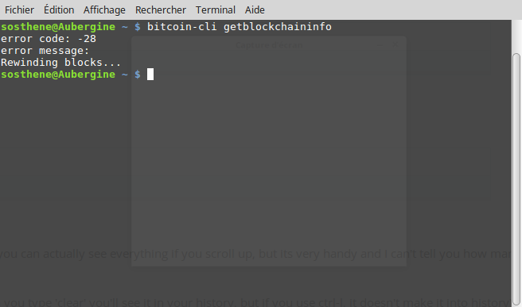
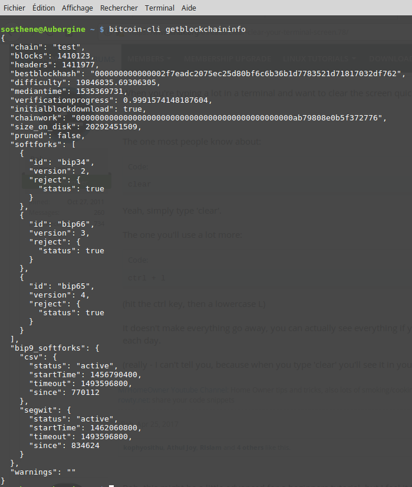
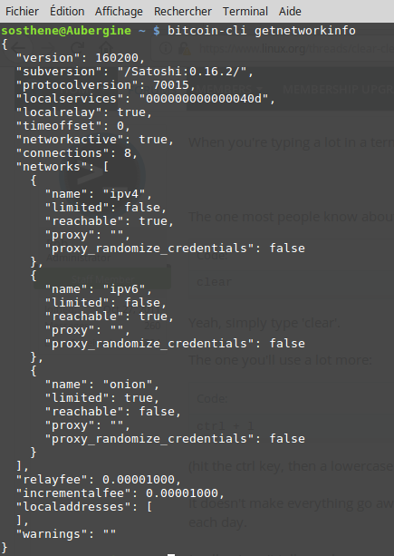

[ [Intro](README.md) ] -- [ [Préparatifs](thunderbadger_10_preparations.md) ] -- [ [Thunder Badger](thunderbadger_20_ThunderBadger.md) ] -- [ **Bitcoin** ] -- [ [LND](thunderbadger_40_lnd.md) ] -- [ [Mainnet](thunderbadger_50_mainnet.md) ]

-------
### Thunder Badger : un nœud Bitcoin et ⚡Lightning️⚡ dans votre vieux portable pourri !
--------

# Bitcoin
À la base de Lightning se trouve un nœud [Bitcoin Core](https://bitcoin.org/en/bitcoin-core/), qui conserve une copie complète de la blockchain et valide toutes les transactions et les blocs. 

Bitcoin dispose d'un réseau de test, judicieusement appelé "testnet". Avant de nous lancer sur le réseau principal, le "mainnet", il peut donc être utile de se familiariser d'abord aux diverses commandes en jouant avec des bitcoins de test (symbolisés par tBTC).

Le testnet fonctionne presque complètement de la même façon que le mainnet, et un de ses avantages est que sa blockchain est beaucoup plus légère que celle du mainnet (une quinzaine de Go), et peut donc être synchronisée en quelques heures, même sur un ordinateur qui mettrait littéralement des semaines à synchroniser le mainnet.

### Installation
Nous allons tout d'abord télécharger le dernier [fichier binaire](https://fr.wikipedia.org/wiki/Fichier_binaire) de Bitcoin Core (17.0 en octobre 2018), et comparer l'empreinte du fichier téléchargé avec le [checksum signé](https://bitcoin.org/bin/bitcoin-core-0.17.0/SHA256SUMS.asc) (souvenez-vous, nous l'avons fait également lorsque nous avons téléchargé Bitcoin Core pour Windows à [l'étape 1](thunderbadger_10_preparations.md)).

* Se connecter en tant qu'utilisateur "bitcoin" sur le Thunder Badger :
`$ ssh [UTILISATEUR]@[IP]`
* Dans le répertoire de l'utilisateur, créer un nouveau dossier `bitcoin` :
`$ mkdir bitcoin`
* Entrer dans le dossier `bitcoin` :
`$ cd bitcoin`

**Note** : le nom de l'utilisateur avec lequel vous êtes connecté apparaît toujours dans le terminal sous la forme `user@host`. Si vous ne savez plus dans quel dossier vous vous trouvez, regardez ce qu'il y a avant le symbole `$`. Si besoin, la commande `$ pwd` vous donnera votre emplacement.

* Télécharger les différents fichiers dont nous avons besoin grâce à la commande `wget`. **Attention, le lien ci-dessous est valable pour la version actuelle (17.0)**, pensez à vous rendre sur [bitcoincore.org/en/download/](https://bitcoincore.org/en/download/) pour vérifier quelle est la dernière version.  
`$ wget https://bitcoincore.org/bin/bitcoin-core-0.17.0/bitcoin-0.17.0-x86_64-linux-gnu.tar.gz`  
`$ wget https://bitcoincore.org/bin/bitcoin-core-0.17.0/SHA256SUMS.asc`  
`$ wget https://bitcoincore.org/keys/laanwj-releases.asc`

* Vérifier que le checksum de référence correspond à celui du fichier téléchargé :  
`$ sha256sum --check SHA256SUMS.asc --ignore-missing`  
`> bitcoin-0.17.0-x86_64-linux-gnu.tar.gz: Réussi`

:warning: Si jamais vous ne voyez pas le même message suite à cette dernière commande, **quelque chose ne va pas**, n'allez pas plus loin tant que vous n'avez pas compris ce qu'il se passe.

* Vérifier manuellement l'empreinte de la clé publique :  
`$ gpg ./laanwj-releases.asc`  
`> 01EA5486DE18A882D4C2684590C8019E36C2E964`

* Importer la clé publique de Wladimir van der Laan, vérifier le checksum signé et à nouveau l'empreinte juste au cas où la clé serait corrompue :  
`$ gpg --import ./laanwj-releases.asc`  
`$ gpg --verify SHA256SUMS.asc`  
`> gpg: Bonne signature de « Wladimir J. van der Laan (Bitcoin Core binary release signing key) <laanwj@gmail.com> » [inconnu]`  
`> Empreinte de clef principale : 01EA 5486 DE18 A882 D4C2  6845 90C8 019E 36C2 E964`  

:warning: Même remarque, si vous ne voyez pas `Bonne signature...`, c'est qu'il y a peut-être un problème, essayez d'abord de comprendre avant d'aller plus loin.

Pour la prochaine étape, il nous faut les droits d'administrateur. Basculer d'abord sur votre utilisateur "admin" :
`$ su [UTILISATEUR]` (vous devez saisir votre mot de passe)

* Extraire et installer le fichier binaire de l'archive que vous avez téléchargée (commande `tar`) :  
  `$ tar -xvf bitcoin-0.17.0-x86_64-linux-gnu.tar.gz`  
  `$ sudo install -m 0755 -o bitcoin -g bitcoin -t /usr/local/bin bitcoin-0.17.0/bin`  
* Vérifier qu'il est bien installé avec la bonne version :
  `$ bitcoind --version`  
  `> Bitcoin Core Daemon version v0.17.0`
* Revenir sur l'utilisateur `bitcoin`

### Configuration
Nous allons maintenant créer le répertoire de configuration de bitcoind. Son emplacement par défaut est dans le répertoire de l'utilisateur, en l'occurrence "bitcoin".

Pour y retourner depuis le répertoire `bitcoin` : 
`$ cd ..`

Créez le répertoire de configuration :
`$ mkdir .bitcoin`

Créez le fichier de configuration :
`$ nano .bitcoin/bitcoin.conf`

Maintenant, copiez-collez l'intégralité du texte ci-dessous :

```bash
# /home/bitcoin/.bitcoin/bitcoin.conf

# Retirer la ligne ci-dessous pour activer Bitcoin sur le mainnet
testnet=1

# Ne touchez pas à ça
server=1
daemon=1
txindex=1
addresstype=bech32

# Informations pour LND
zmqpubrawblock=tcp://127.0.0.1:28332
zmqpubrawtx=tcp://127.0.0.1:28332

# RAM consacrée à la base de données (en Mo), impact sur la synchronisation, peu d'impact si vous ne la faites pas sur cette machine 
dbcache=1000

# Nombre de connexions maximum, comprenant 8 connexions "sortantes". À vous de voir selon votre machine et votre connexion internet, mais ce n'est pas la peine de mettre une valeur trop élevée
maxconnections=16
```

Pour neutraliser une ligne, vous n'avez pas besoin de l'effacer, vous pouvez simplement ajouter `#` devant elle. Le symbole `#` signifie que ce qui suit est un commentaire et ne doit pas être prise en compte par le programme.

:point_right: vous trouverez plus d'informations sur le fichier de configuration [sur le Bitcoin wiki](https://en.bitcoin.it/wiki/Running_Bitcoin#Command-line_arguments).

### Lancer bitcoind sur le testnet

Nous allons faire un premier test sans risque pour vous familiariser avec les commandes.

Comme nous avons ajouté la ligne `testnet=1` dans le fichier de configuration, lancez bitcoind sans options :
`$ bitcoind`

Attendez quelques instants, et essayez les commandes suivantes :
`$ bitcoin-cli getblockchaininfo`
`$ bitcoin-cli getnetworkinfo`


_Si vous voyez ce message, cela signifie que `bitcoind` n'a pas encore démarré, réessayez dans une ou deux minutes._

Vous devriez voir un certain nombre d'informations, si vous ne comprenez rien ce n'est pas grave, l'essentiel c'est que vous n'ayez pas de message d'erreur. 


_Remarquez que sur la première ligne, il y a `test`. Si nous étions sur le mainnet, ce serait `main`



Pour avoir davantage d'informations, notamment si vous rencontrez des problèmes, vous pouvez suivre en temps réel les logs de bitcoind (c'est-à-dire, les messages générés à chaque événement) :
`$ tail -f /home/bitcoin/.bitcoin/testnet3/debug.log`

Quittez avec `Ctrl-C`.

### Apprendre les commandes de `bitcoin-cli`

Bitcoin-cli est le programme qui vous permet de communiquer avec votre nœud. Grâce à lui, vous pouvez lui donner des ordres très simples (comme les commandes que nous avons faites ci-dessus), mais aussi plus tard d'autres affreusement compliquées (comme construire vos propres transactions avec un contrôle total sur tous les paramètres). 

Les commandes sont toutes construites sur le modèle suivant :
`$ bitcoin-cli [COMMANDE] [ARG1] [ARG2] [ARG_N]`

Certaines commandes ne font qu'imprimer des informations à l'écran, d'autres exécutent certaines actions. 

Si vous voulez avoir la liste de toutes les commandes :
`$ bitcoin-cli help`

Pour avoir des instructions détaillées sur une commande en particulier :
`$ bitcoin-cli help [commande]`

:point_right: pour avoir plus d'informations sur les différentes commandes, vous pouvez aussi regardez [cette page](https://en.bitcoin.it/wiki/Original_Bitcoin_client/API_calls_list).

Jouez un petit peu avec les commandes en attendant que votre nœud de test soit synchronisé. Vous pouvez aussi demander des bitcoins de test sur un faucet, par exemple [ici](https://testnet.manu.backend.hamburg/faucet), mais il y en a d'autres. Cela vous permettra d'expérimenter les commandes de paiement, et aussi Lightning lors de la prochaine étape. 

Lorsque votre nœud est synchronisé, passez à l'étape suivante.

---

[ [Page précédente](thunderbadger_20_ThunderBadger.md) ] -- [ [Page suivante](thunderbadger_40_lnd.md) ]