# The perfect Bitcoin Lightning️ node

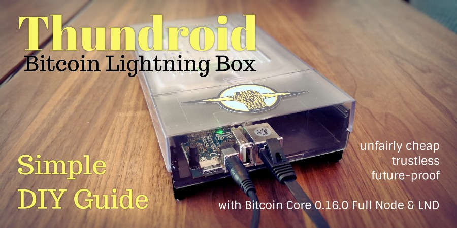

> This article was first published in the [Odroid Magazine June 2018](https://magazine.odroid.com/article/thundroid-perfect-bitcoin-lightning-node/) issue. 
>
> Part 1: Setup of Bitcoin & Lightning on testnet (this guide)  
> Part 2: [Move to Bitcoin mainnet](thundroid_pt2.md)  
> Part 3: Additional apps like desktop & mobile wallet

## Introduction

Bitcoin is a native digital currency for the internet age. It can be thought of as just another international currency, but without a native country, so it defies borders, trade policies and arbitrary inflation. In the 2008 [whitepaper](https://bitcoin.org/bitcoin.pdf) by the pseudonymous Satoshi Nakamoto it is described as:

> A purely peer-to-peer version of electronic cash [which] would allow online payments to be sent directly from one party to another without going through a financial institution. 

Being peer-too-peer means that **Bitcoin** does not rely on a middleman (eg. a bank) and can be transfered as a bearer asset, like physical cash, without asking anyone for permission. With the added benefit that it does not need to be stored physically, as it is secured by a cryptographic key, and can be transferred within minutes to anyone anywhere in the world. One key component of this free open-source financial system is the blockchain, the ledger that keeps track of who owns how many bitcoin and that is stored as an identical copy by all users that decide to run a full Bitcoin node. (Learn more on [bitcoin.org](https://bitcoin.org))

Bitcoin is a economic experiment of epic scope, and its success is by no means certain. In any case, *Bitcoin as a new technology* is an incredibly interesting endeavor, especially because of its interdisciplinary nature and the very low barriers to entry. *Bitcoin as sound money*, being scarce and non-inflationary, challenging money as one of the last true monopolies of nation states, could have a major impact on economic principles and society as a whole. 

At the moment, Bitcoin is more a *store of value* and not really suited for small everyday transactions. Truly decentralized blockchains are a scarce resource and cannot scale to accommodate all global transactions. If you think about it, it cannot be good practice to store every coffee purchase redundantly all over the world for all eternety. That would be like forcing everyone to download everyone elses emails as well. These limitations are a great motivator to build better technology on top of the Bitcoin blockchain to scale exponentially, as opposed to just making everything bigger for linear scaling.

This is where the **Lightning Network** comes in. As one of several new blockchain “extensions”, its promise is to accommodate nearly unlimited transactions, with instant confirmation, minimal fees and increased privacy. It sounds almost too good to be true, but this technology is well researched, committed to the cypherpunk open-source ethos and leverages the solid underpinnings of Bitcoin. (Learn more: [Bitcoin Magazine article series](https://bitcoinmagazine.com/articles/understanding-the-lightning-network-part-building-a-bidirectional-payment-channel-1464710791/))

To preserve the decentralized nature of this monetary system, it is important that everybody has at least the possibility to run their own trustless Bitcoin node, preferably on cheap hardware like Odroid.

---

⚠️ *Please be aware that while Bitcoin has been battle-tested for almost a decade, the Lightning Network is still in beta and under heavy development. This guide also allows you to set up your Bitcoin node while just igrnoring the Lightning part. Read the "financial best practices" part before commiting real bitcoin to your node.*

---

### Purpose

This guide allows you to be your own bank. The aim is to set up a Bitcoin and Lightning node that 

* is as fully validating Bitcoin Full Node and does not require any trust in a 3rd party,
* is reliably running 24/7,
* is part of and supports the decentralization of the Lightning network by routing payments and
* can be used to send and receive personal payments using the command line interface.

This server is set up without graphical user interface and is used  remotely using the Secure Shell (SSH) command line. It can also function as a personal Bitcoin backend for the desktop Electrum wallet.

### Target audience

This guide strives to give simple and foolproof instructions. But the goal is also to do everything ourselves, no shortcuts that involve trust in a 3rd party allowed. This makes this guide quite technical, but I try to make it as straightforward as possible and explain everything for you to gain a basic understanding of the how and why.

### A word of caution

All components of the Lightning network are still under development  and we are dealing with real money here. So this guide follows a  conservative approach: first setup and test everything on Bitcoin  testnet, then - once you are comfortable to put real money on the line -  switch to Bitcoin mainnet with a few simple changes.

------

## Preparations

### Choosing the Odroid HC2

After publishing the "Beginner's Guide to Lightning on a Raspberry Pi", I started to explore other hardware, as the Pi has drawbacks, mainly in the area of performance and the the hassle with attaching external storage which is important when storing the big Bitcoin blockchain. 

The [Hardkernel Odroid HC2](https://www.hardkernel.com/shop/odroid-hc2-home-cloud-two/) (or the HC1 for a smaller form factor) as a Linux-based mini PC is a perfect fit. Compared to a Rasperry Pi, it has the following advantages:

* price comparable to Raspberry Pi
* more powerful (8 core CPU, 2 GB RAM, Gigabit Ethernet)
* internal housing of harddisk, direct connection using SATA3
* only one power adapter for everything

Not available are features like HDMI output, built-in Wifi or GPIO pins, but these are not relevant to this project. Performance is way better, thus it seems more future-proof as Bitcoin and Lightning are certain to evolve.

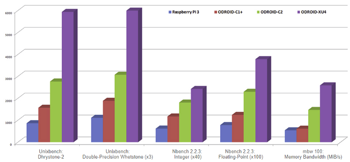*Performance of Odroid HC2 is identical to XU4 (which is more of a media pc)*

I decided to try this setup, ordered the Odroid HC2 and, after setting it up and running it for two month now, I think this is as good as it gets for a low-cost Bitcoin / Lightning node. As this project needs a cheesy name as well, I’ll call my node **Thundroid**. :-)

I ordered the following items directly with Hardkernel in Singapore. There are [resellers](https://www.hardkernel.com/distributors/) available worldwide.

* [Hardkernel Odroid HC2](https://www.hardkernel.com/shop/odroid-hc2-home-cloud-two/) ($54)
* [Power adapter](https://www.hardkernel.com/shop/12v-2a-power-supply-unit/) & [cord](https://www.hardkernel.com/shop/2pin-us-power-cord/) ($5.90, $0.7)
* optional: [Odroid HC2 case](https://www.hardkernel.com/shop/odroid-hc2-case-clear/) ($5)

You also need the following:

* Micro SD card: 16 GB, incl. adapter to your regular computer
* Internal hard disk: 500 GB or more, SATA, 3.5" hdd, or 2.5" hdd/ssd
* Network RJ45 cable

Assembly is easy, just enter the hard disk and fix it with the the screws included with your Odroid. If you ordered the plastic case, slide it over the metal body. 

### Installing the operating system

We use Ubuntu 16.04.03 LTE (Minimal, Bare OS) that is provided by Hardkernel. Download the image from the Odroid-XU4 section on [wiki.odroid.com](https://wiki.odroid.com/).

Exact file used: [ubuntu-16.04.3-4.14-minimal-odroid-xu4-20171213.img.xz](https://odroid.in/ubuntu_16.04lts/ubuntu-16.04.3-4.14-minimal-odroid-xu4-20171213.img.xz)

Download the image, flash it on your MicroSD card, put it into your Thundroid, connect it to your network via cable and connect the power adapter. The initial boot can take several minutes. 

Configure your network router to assign a static IP address to your Thundroid. 

------

## Working on your Thundroid

### Write down your passwords

You will need several passwords and I find it easiest to write them all down in the beginning, instead of bumping into them throughout the guide. They should be unique and very secure, at least 12 characters in length. Do not use uncommon special characters, blanks or quotes (‘ or “).

```
[ A ] User password
[ B ] Bitcoin RPC password
[ C ] Lightning API password
[ D ] Lightning seed passphrase
```

Store a copy of your passwords somewhere safe (preferably in a password manager like KeePass or LastPass) and keep your original notes out of sight once your system is up and running. 

### The command line

Everything is configured on the Linux command prompt. Throughout this guide I use the following notation:

```
# this is a comment, just for information

$ command            This is a single-line command to enter (without the $) 
                     and confirm with the enter key

No prefix or         This is either an output of the command above
>                    or something you can copy/paste into a file
```

* **Auto-complete commands**: When you enter commands, you can use the `Tab` key for auto-completion, eg. for commands, directories or filenames.
* **Command history**: by pressing ⬆️ and ⬇️ on your keyboard, you can recall your previously entered commands.
* **Use admin privileges**: Our users has no admin privileges. If a command needs to edit the system configuration, we need to use the `sudo` ("superuser do") command as prefix. Instead of editing a system file with `nano /etc/fstab`, we use `sudo nano /etc/fstab`.
* **Using the Nano text editor**: We use the Nano editor  to create new text files or edit existing ones. It's not complicated,  but to save and exit is not intuitive.
  * Save: hit `Ctrl-O` (for Output), confirm the filename, and hit the `Enter` key
  * Exit: hit `Ctrl-X`
* **Copy / Paste**: If you are using Windows and the PuTTY SSH client, you can copy text from the shell by selecting it with your  mouse (no need to click anything), and paste stuff at the cursor  position with a right-click anywhere in the ssh window.

### Connecting to Thundroid

Now it’s time to connect via SSH and get to work. For that, a  Secure Shell (SSH) client is needed. Install, start and connect: 

* **Windows**: I recommend to use the SSH client [KiTTY](http://kitty.9bis.com). You can **copy** text from the shell by selecting it with your mouse (no need to click anything), and **paste** stuff with a right-click.
* **Mac OS**: built-in SSH client (see [this article](http://osxdaily.com/2017/04/28/howto-ssh-client-mac/)) 
* **Linux**: just use the native command, eg. `ssh root@192.168.0.20` 

Use the following SSH connection settings:

* host name: the static address you set in the router, eg. `192.168.0.20`
* port: `22`
* username: `root`
* password:  `odroid`.

### Basic configuration

You are now on the command line of your own Bitcoin node. First we take care of the basic configuration. Enter the following commands: 

```
# change root password to [password A]
$ passwd 

# update the operating system
$ apt update
$ apt upgrade
$ apt dist-upgrade
$ apt install linux-image-xu3 
# answer [y], then [no] (do not abort)

# install some additional software
$ apt install htop git curl bash-completion jq

# set time zone & localization
$ dpkg-reconfigure tzdata
$ dpkg-reconfigure locales
```

When using the Nano text editor, you can use the same keyboard shortcuts  to save (Ctrl-O, confirm or change filename & press enter) and exit (Ctrl-X).

```
# change hostname (replace "odroid" with "thundroid" :) in both files
$ nano /etc/hostname
$ nano /etc/hosts

# create user "admin", set [password A] and make it a superuser
$ adduser admin
$ adduser admin sudo

# create user "bitcoin" and set password [password A]
$ sudo adduser bitcoin
```

### Mounting the hard disk

The external hard disk is attached to the file system and can be accessed as a regular folder (this is called “mounting”). As a server installation, the Linux native file system Ext4 is the best choice for the external hard disk. 

⚠️ All data on this hard disk will be erased with the following steps! 

```
# get NAME for hard disk
$ lsblk -o UUID,NAME,FSTYPE,SIZE,LABEL,MODEL

# format hard disk (use [NAME] from above, e.g /dev/sda1)
$ mkfs.ext4 /dev/[NAME]

# get UUID for hard disk, copy into notepad
$ lsblk -o UUID,NAME,FSTYPE,SIZE,LABEL,MODEL

# edit fstab and enter new line (replace UUID) at the end, save & exit
$ nano /etc/fstab
UUID=123456 /mnt/hdd ext4 noexec,defaults 0 0

# create mount point, mount, check and set owner
$ mkdir /mnt/hdd
$ mount -a
$ df /mnt/hdd
Filesystem     1K-blocks      Used Available Use% Mounted on
/dev/sda1      961300808 600388836 312057600  66% /mnt/hdd

$ chown -R bitcoin:bitcoin /mnt/hdd/
```

### Moving the Swap File

The usage of a swap file can degrade the SD card very quickly. Therefore, we will move it to the external hard disk.

```
# install necessary software package
$ apt install dphys-swapfile

# change configuration file to use swapfile on external hard disk
$ nano /etc/dphys-swapfile
CONF_SWAPFILE=/mnt/hdd/swapfile

# enable new swap configuration
$ sudo dphys-swapfile setup
$ sudo dphys-swapfile swapon

# reboot, login as "admin" and delete old swapfile
$ shutdown -r now  
$ sudo rm /var/swap
```

------

## Hardening your Thundroid

Your Thundroid will be visible from the internet and therefore needs to be  secured against attacks. A firewall controls what traffic is permitted  and closes possible security holes.

Login as “admin” (we will not use “root” again).

### UFW: Uncomplicated Firewall

The firewall denies all connection attempts from other peers by default and allows only specific ports to be used.

:warning: The line `ufw allow from 192.168.0.0/24 …` below assumes that the IP address of your Thundroid is something like `192.168.0.???`, the ??? being any number from 0 to 255. If your IP address is `12.34.56.78`, you must adapt this line to `ufw allow from 12.34.56.0/24 …`. Otherwise you will lock yourself out for good.

```
# change session to "root"
$ sudo su
$ apt install ufw
$ ufw default deny incoming
$ ufw default allow outgoing

# make sure to use the correct subnet mask (see warning above)
$ ufw allow from 192.168.0.0/24 to any port 22 comment 'allow SSH from local LAN'

$ ufw allow 9735 comment 'allow Lightning'
$ ufw deny 8333 comment  'deny Bitcoin mainnet'
$ ufw allow 18333 comment 'allow Bitcoin testnet'
$ ufw enable
$ systemctl enable ufw
$ ufw status

# exit "root" session back to "admin"
$ exit
```

### fail2ban

Fail2ban monitors SSH login attempts and bans a remote peer after 5 unsuccessful tries for 10 minutes. This makes a brute-force attack unfeasible, as it would simply take too long. 

```
$ sudo apt install fail2ban
```

### SSH Keys

One of the best options to secure the SSH login is to completely  disable the password login and require a SSH key certificate. Only  someone with physical possession of the private key can login.

* Set up SSH keys for the "admin" user by following this article:  *Configure “No Password SSH Keys Authentication” with PuTTY on Linux Servers*  
  https://www.tecmint.com/ssh-passwordless-login-with-putty

You should now generated three files. Keep them safe, we will now disable the password login.  
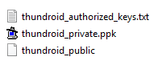

* Logout (`exit`) and make sure that you can log in as "admin" with your SSH key
* Edit ssh config file
   `$ sudo nano /etc/ssh/sshd_config`
* Change settings "ChallengeResponseAuthentication" and  "PasswordAuthentication" to "no" (uncomment the line by removing # if  necessary), save and exit  
   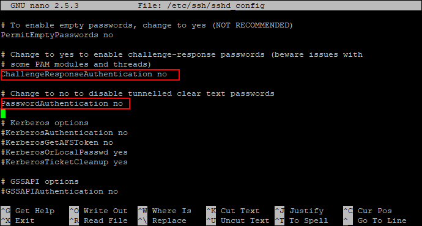

```
# copy the ssh key to user "root", just in case
$ sudo mkdir /root/.ssh  
$ sudo cp /home/admin/.ssh/authorized_keys /root/.ssh/  
$ sudo chown -R root:root /root/.ssh/  
$ sudo chmod -R 700 /root/.ssh/  
$ sudo systemctl restart ssh

# exit and login again with your private key
$ exit
```

You can now only login with “admin” or “root” and your SSH key. As you cannot connect a screen to the Odroid, SSH is your only option.

⚠️ **Backup your SSH key! There is no fallback login!**

Worst case scenario: you need to flash the MicroSD card and set up the system again, all important stuff is still on the harddrive.

### Increase your open files limit

In case your Thundroid is swamped with internet requests (honest or  malicious due to a DDoS attack), you will quickly encounter the `can't accept connection: too many open files` error. This is due to a limit on open files (representing individual tcp connections) that is set too low.

Edit the following three files, add the additional line(s) right before the end comment, save and exit.

```
$ sudo nano /etc/security/limits.conf
*    soft nofile 128000
*    hard nofile 128000
root soft nofile 128000
root hard nofile 128000
```


```
$ sudo nano /etc/pam.d/common-session
session required pam_limits.so
```


```
$ sudo nano /etc/pam.d/common-session-noninteractive
session required pam_limits.so
```


------

## Bitcoin

The foundation of the Lightning node is a fully trustless [Bitcoin node](https://bitcoin.org/en/bitcoin-core/). It keeps a complete copy of the blockchain and validates all  transactions and blocks. By doing all this work ourselves, nobody else  needs to be trusted.

In the beginning, we will use the Bitcoin testnet to familiarize  ourselves with its operations. This sync is handled directly by the Thundroid and should not take longer than a few hours. Just let it sync overnight.

### Installation

We will download the software directly from bitcoin.org, verify its signature to make sure that we use an official release and install it.

* Login as "admin" and create a download folder  
   `$ mkdir /home/admin/download`  
   `$ cd /home/admin/download`

We download the latest Bitcoin Core binaries (the application) and  compare the file with the signed checksum. This is a precaution to make  sure that this is an official release and not a malicious version trying  to steal our money.

Get the latest download links at [bitcoin.org/en/download](https://bitcoin.org/en/download), they change  with each update. Then run the following  commands (with adjusted  filenames) and check the output where indicated.

```bash
# download Bitcoin Core binary
$ wget https://bitcoincore.org/bin/bitcoin-core-0.17.1/bitcoin-0.17.1-arm-linux-gnueabihf.tar.gz
$ wget https://bitcoincore.org/bin/bitcoin-core-0.17.1/SHA256SUMS.asc
$ wget https://bitcoin.org/laanwj-releases.asc

# check that the reference checksum matches the real checksum
# (ignore the "lines are improperly formatted" warning)
$ sha256sum --check SHA256SUMS.asc --ignore-missing
> bitcoin-0.17.1-arm-linux-gnueabihf.tar.gz: OK

# manually check the fingerprint of the public key
$ gpg --with-fingerprint ./laanwj-releases.asc
> 01EA 5486 DE18 A882 D4C2  6845 90C8 019E 36C2 E964

# import the public key of Wladimir van der Laan, verify the signed  checksum file
# and check the fingerprint again in case of malicious keys
$ gpg --import ./laanwj-releases.asc
$ gpg --verify SHA256SUMS.asc
> gpg: Good signature from "Wladimir J. van der Laan ..."
> Primary key fingerprint: 01EA 5486 DE18 A882 D4C2 6845 90C8 019E 36C2 E964
```

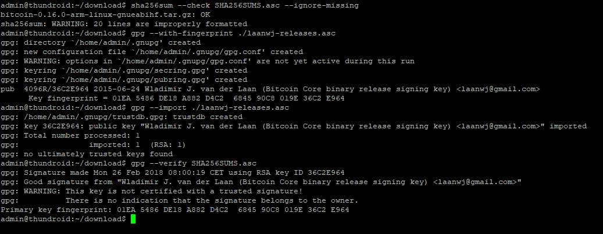

Extract the Bitcoin Core binaries, install them and check the version.

```bash
$ tar -xvf bitcoin-0.17.1-arm-linux-gnueabihf.tar.gz
$ sudo install -m 0755 -o root -g root -t /usr/local/bin bitcoin-0.17.1/bin/*
$ bitcoind --version
> Bitcoin Core Daemon version v0.17.1
```

### Prepare Bitcoin Core directory

We use the Bitcoin daemon, called “bitcoind”, that runs in the  background without user interface and stores all data in a the directory   `/home/bitcoin/.bitcoin`. Instead of creating a real directory, we create a link that points to a directory on the external hard disk.

```
# change to user "bitcoin"
$ sudo su bitcoin

# add symbolic link that points to the external hard drive
$ mkdir /mnt/hdd/bitcoin
$ ln -s /mnt/hdd/bitcoin /home/bitcoin/.bitcoin

# Navigate to home directory and check the symbolic link (the target must not be red). 
$ cd
$ ls -la
```

The content of this directory will actually be  on the external hard disk.


### Configuration

Now, the configuration file for bitcoind needs to be created. Open it  with Nano and paste the configuration below . Save and exit.  
 `$ nano /home/bitcoin/.bitcoin/bitcoin.conf`

```
# Thundroid: bitcoind configuration
# /home/bitcoin/.bitcoin/bitcoin.conf

# remove the following line to enable Bitcoin mainnet
testnet=1

# Bitcoind options
server=1
daemon=1
txindex=1
disablewallet=1

# Connection settings
rpcuser=bitcoin
rpcpassword=PASSWORD_[B]
zmqpubrawblock=tcp://127.0.0.1:29000
zmqpubrawtx=tcp://127.0.0.1:29000

# Optimizations for limited hardware
dbcache=100
maxorphantx=10
maxmempool=50
maxconnections=40
maxuploadtarget=5000
```

⚠️ Change rpcpassword to your secure `password [B]`, otherwise your funds might get stolen. 

### Autostart bitcoind

The system needs to run the bitcoin daemon automatically in the  background, even when nobody is logged in. We use “systemd“, a daemon  that controls the startup process using configuration files.

* Exit the “bitcoin” user session back to user “admin”  
   `$ exit`
* Create the configuration file in the Nano text editor and copy the following paragraph.  Save and exit.  
   `$ sudo nano /etc/systemd/system/bitcoind.service`

```
# Thundroid: systemd unit for bitcoind
# /etc/systemd/system/bitcoind.service

[Unit]
Description=Bitcoin daemon
After=network.target

[Service]
ExecStart=/usr/local/bin/bitcoind -daemon -conf=/home/bitcoin/.bitcoin/bitcoin.conf -pid=/run/bitcoind/bitcoind.pid
# Creates /run/bitcoind owned by bitcoin
RuntimeDirectory=bitcoind
User=bitcoin
Group=bitcoin
Type=forking
PIDFile=/run/bitcoind/bitcoind.pid
Restart=on-failure

# Hardening measures
####################

# Provide a private /tmp and /var/tmp.
PrivateTmp=true

# Mount /usr, /boot/ and /etc read-only for the process.
ProtectSystem=full

# Disallow the process and all of its children to gain
# new privileges through execve().
NoNewPrivileges=true

# Use a new /dev namespace only populated with API pseudo devices
# such as /dev/null, /dev/zero and /dev/random.
PrivateDevices=true

# Deny the creation of writable and executable memory mappings.
MemoryDenyWriteExecute=true

[Install]
WantedBy=multi-user.target
```

* Enable the configuration file  
   `$ sudo systemctl enable bitcoind.service`
* Copy `bitcoin.conf` to user "admin" home directory for RPC credentials  
   `$ mkdir /home/admin/.bitcoin`  
   `$ sudo cp /home/bitcoin/.bitcoin/bitcoin.conf /home/admin/.bitcoin/`  
   `$ sudo chown admin:admin /home/admin/.bitcoin/bitcoin.conf` 
* Restart the Thundroid  
   `$ sudo shutdown -r now`

### Verification of bitcoind operations

After rebooting, the bitcoind should start and begin to sync and validate the Bitcoin blockchain.

* Wait a bit, reconnect via SSH and login with the user “admin”.

* Check the status of the bitcoin daemon that was started by systemd (exit with `Ctrl-C`)  
  `$ sudo systemctl status bitcoind`

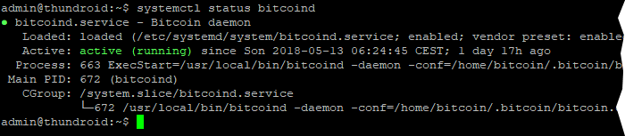

* See bitcoind in action by monitoring its log file (exit with `Ctrl-C`)  
   `$ sudo tail -f /home/bitcoin/.bitcoin/testnet3/debug.log`

* Use the Bitcoin Core client `bitcoin-cli` to get information about the current blockchain  
   `$ bitcoin-cli getblockchaininfo`

* Please note:

  * When “bitcoind” is still starting, you may get an error message like  “verifying blocks”. That’s normal, just give it a few minutes.
  * Among other infos, the “verificationprogress” is shown. Once this  value reaches almost 1 (0.999…), the blockchain is up-to-date and fully  validated.

------

## Lightning Network

We will download and install the LND (Lightning Network Daemon) by [Lightning Labs](http://lightning.engineering/). Check out their [Github repository](https://github.com/lightningnetwork/lnd/blob/master/README.md) for a wealth of information about their open-source project and Lightning in general. 

### Install LND

Now to the good stuff: download, verify and install the LND binaries.

```
$ cd /home/admin/download
$ wget https://github.com/lightningnetwork/lnd/releases/download/v0.4.1-beta/lnd-linux-arm-v0.4.1-beta.tar.gz
$ wget https://github.com/lightningnetwork/lnd/releases/download/v0.4.1-beta/manifest-v0.4.1-beta.txt
$ wget https://github.com/lightningnetwork/lnd/releases/download/v0.4.1-beta/manifest-v0.4.1-beta.txt.sig
$ wget https://keybase.io/roasbeef/pgp_keys.asc

$ sha256sum --check manifest-v0.4.1-beta.txt --ignore-missing
> lnd-linux-arm-v0.4-beta.tar.gz: OK

$ gpg ./pgp_keys.asc
> pub  4096R/DD637C21 2017-09-12 Olaoluwa Osuntokun <laolu32@gmail.com>
> sub  4096R/5FA079A1 2017-09-12 [expires: 2021-09-12]
> 65317176B6857F98834EDBE8964EA263DD637C21

$ gpg --import ./pgp_keys.asc
$ gpg --verify manifest-v0.4.1-beta.txt.sig
> gpg: Good signature from "Olaoluwa Osuntokun <laolu32@gmail.com>" [unknown]
> Primary key fingerprint: 6531 7176 B685 7F98 834E  DBE8 964E A263 DD63 7C21
```

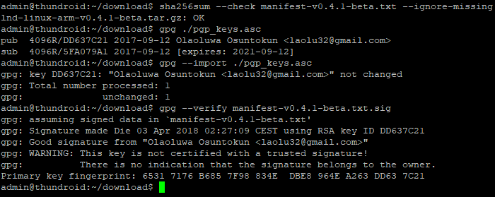

```
$ tar -xzf lnd-linux-arm-v0.4.1-beta.tar.gz
$ ls -la
$ sudo install -m 0755 -o root -g root -t /usr/local/bin lnd-linux-arm-v0.4.1-beta/*
$ lnd --version
> lnd version 0.4.1-beta commit=
```


### LND configuration

Now that LND is installed, we need to configure it to work with Bitcoin Core and run automatically on startup.

* Open a "bitcoin" user session  
   `$ sudo su bitcoin`
* Create the LND working directory and the corresponding symbolic link  
   `$ mkdir /mnt/hdd/lnd`  
   `$ ln -s /mnt/hdd/lnd /home/bitcoin/.lnd`  
   `$ cd`  
   `$ ls -la`

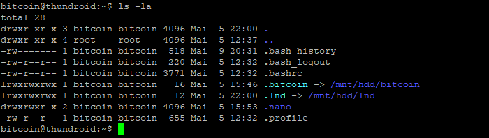

* Create the LND configuration file and paste the following content (adjust to your alias). Save and exit.  
   `$ nano /home/bitcoin/.lnd/lnd.conf`

```
# Thundroid: lnd configuration
# /home/bitcoin/.lnd/lnd.conf

[Application Options]
debuglevel=info
debughtlc=true
maxpendingchannels=5
alias=YOUR_NAME [LND]
color=#68F442

[Bitcoin]
bitcoin.active=1

# enable either testnet or mainnet
bitcoin.testnet=1
#bitcoin.mainnet=1

bitcoin.node=bitcoind

[autopilot]
autopilot.active=1
autopilot.maxchannels=5
autopilot.allocation=0.6
```

👉 Additional information: [sample-lnd.conf](https://github.com/lightningnetwork/lnd/blob/master/sample-lnd.conf) in the LND project repository

* exit the "bitcoin" user session back to "admin"  
   `$ exit`
* create LND systemd unit and with the following content. Save and exit.  
   `$ sudo nano /etc/systemd/system/lnd.service`

```
# Thundroid: systemd unit for lnd
# /etc/systemd/system/lnd.service

[Unit]
Description=LND Lightning Daemon
Wants=bitcoind.service
After=bitcoind.service

[Service]
ExecStart=/usr/local/bin/lnd
PIDFile=/home/bitcoin/.lnd/lnd.pid
User=bitcoin
Group=bitcoin
LimitNOFILE=128000
Type=simple
KillMode=process
TimeoutSec=180
Restart=always
RestartSec=60

[Install]
WantedBy=multi-user.target
```

* enable and start LND  
   `$ sudo systemctl enable lnd`  
   `$ sudo systemctl start lnd`  
   `$ sudo systemctl status lnd`
* monitor the LND logfile in realtime (exit with `Ctrl-C`)  
   `$ sudo journalctl -f -u lnd`

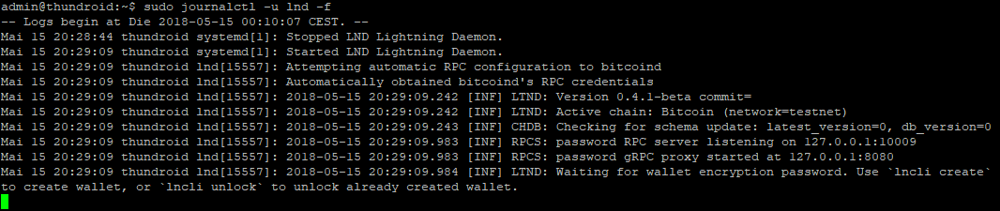

### LND wallet setup

Once LND is started, the process waits for us to create the integrated Bitcoin wallet (it does not use the bitcoind wallet).

* Start a "bitcoin" user session  
   `$ sudo su bitcoin`
* Create the LND wallet  
  `$ lncli create`
* If you want to create a new wallet, enter your `password [C]` as wallet password, select `n` regarding an existing seed and enter the optional `password [D]` as seed passphrase. A new cipher seed consisting of 24 words is created.

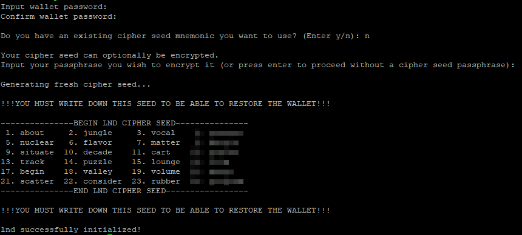

These 24 words, combined with your passphrase (optional `password [D]`)   is all that you need to restore your Bitcoin wallet and all Lighting  channels. The current state of your channels, however, cannot be  recreated from this seed, this is still  under development for LND.

⚠️ This information must be kept secret at all times. **Write these 24 words down manually on a piece of paper and store it in a safe place.**  This piece of paper is all an attacker needs to completely empty your  wallet! Do not store it on a computer. Do not take a picture with your  mobile phone. **This information should never be stored anywhere in digital form.**

* exit "bitcoin" user session  
   `$ exit`

### Assign LND permissions to "admin"

* Check if permission files `admin.macaroon` and `readonly.macaroon` have been created (if not, see open LND issue [#890](https://github.com/lightningnetwork/lnd/issues/890)).  
   `$ ls -la /home/bitcoin/.lnd/`

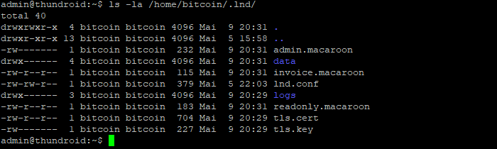

* Copy permission files and TLS cert to user "admin" to use `lncli`  
   `$ mkdir /home/admin/.lnd`  
   `$ sudo cp /home/bitcoin/.lnd/tls.cert /home/admin/.lnd`  
   `$ sudo cp /home/bitcoin/.lnd/admin.macaroon /home/admin/.lnd`  
   `$ sudo chown -R admin:admin /home/admin/.lnd/`
* Make sure that `lncli` works by unlocking your wallet (enter `password [C]` ) and getting some node infos.  
   `$ sudo systemctl restart lnd`  
   `$ lncli unlock`
* Monitor the LND startup progress until it caught up with the testnet  blockchain (about 1.3m blocks at the moment). This can take up to 2  hours, after that you see a lot of very fast chatter (exit with `Ctrl-C`).  
    `$ sudo journalctl -f -u lnd`

### Get some testnet Bitcoin

Now your Lightning node is ready. To use it in testnet, you can get some free testnet bitcoin from a faucet.

* Generate a new Bitcoin address to receive funds on-chain  
   `$ lncli newaddress np2wkh`  
   `> "address": "2NCoq9q7............dkuca5LzPXnJ9NQ"`
* Get testnet bitcoin:  
   <https://testnet.manu.backend.hamburg/faucet>
* Check your LND wallet balance  
   `$ lncli walletbalance`
* Monitor your transaction (the faucet shows the TX ID) on a Blockchain explorer:  
   <https://testnet.smartbit.com.au>

### LND in action

As soon as your funding transaction is mined and confirmed, LND will  start to open and maintain channels. This feature is called "Autopilot"  and is configured in the "lnd.conf" file. If you would like to maintain  your channels manually, you can disable the autopilot.

Get yourself a payment request on [StarBlocks](https://starblocks.acinq.co/#/) or [Y’alls](https://yalls.org/) and move some coins!

Some commands to try:  

* list all arguments for the command line interface (cli)  
  `$ lncli`
* get help for a specific argument  
  `$ lncli help [ARGUMENT]`
* find out some general stats about your node:  
  `$ lncli getinfo`
* connect to a peer (you can find some nodes to connect to here: <https://1ml.com/>):  
  `$ lncli connect [NODE_URI]`
* check the peers you are currently connected to:  
  `$ lncli listpeers`
* open a channel with a peer:  
  `$ lncli openchannel [NODE_PUBKEY] [AMOUNT_IN_SATOSHIS] 0`  
  *keep in mind that [NODE_URI] includes @IP:PORT at the end, while [NODE_PUBKEY] doesn't*
* check the status of your pending channels:  
  `$ lncli pendingchannels`
* check the status of your active channels:  
  `$ lncli listchannels`
* before paying an invoice, you should decode it to check if the amount and other infos are correct:  
  `$ lncli decodepayreq [INVOICE]`
* pay an invoice:  
  `$ lncli payinvoice [INVOICE]`
* check the payments that you sent:  
  `$ lncli listpayments`
* create an invoice:  
  `$ lncli addinvoice [AMOUNT_IN_SATOSHIS]`
* list all invoices:  
  `$ lncli listinvoices`
* to close a channel, you need the following two arguments that can be determined with `listchannels` and are listed as "channelpoint": `FUNDING_TXID` : `OUTPUT_INDEX` .  
  `$ lncli listchannels`  
  `$ lncli closechannel [FUNDING_TXID] [OUTPUT_INDEX]`
* to force close a channel (if your peer is offline or not cooperative), use  
  `$ lncli closechannel --force [FUNDING_TXID] [OUTPUT_INDEX]`

👉 see [Lightning API reference](http://api.lightning.community/) for additional information

------

## Outlook: Prepare for Bitcoin mainnet

In part 2 of this guide we will move the Thundroid Bitcoin & Lightning node to the Bitcoin mainnet, that uses a different blockchain. Like the small testnet blockchain, the mainnet blockchain records all Bitcoin transactions and basically defines  who owns how many bitcoin. This is the most crucial of all information  and we should not rely on someone else to provide this data. To set up  our Bitcoin Full Node on mainnet, we need to

* download the whole blockchain (~ 200 GB),
* verify every Bitcoin transaction that ever occurred and every block ever mined,
* create an index database for all transactions, so that we can query it later on,
* calculate all bitcoin address balances (called the UTXO set).

👉 See [Running a Full Node](https://bitcoin.org/en/full-node) for additional information.

You can imagine that the Thundroid is not quite up to this huge  task. The download is not the problem, but to initially process the  whole blockchain would take weeks due to its resource restrictions. We need to download and verify the blockchain  with Bitcoin Core on a regular computer and then transfer the data to  the Thundroid. This needs to be done only once. After that the Thundroid can easily  keep up with new blocks.

For the switch to mainnet, the mainnet blockchain should be ready, so we'll already start this task now.

### Using a regular computer

This guide assumes that you will use a  Windows machine for this  task, but it works with most operating systems. You need to have about  250 GB free disk space available, internally or on an external hard disk. As indexing creates heavy  read/write traffic, the faster your hard disk the better. An internal  drive or an external USB3 hard disk will be significantly faster than  one with a USB2 connection.

### Download and verify Bitcoin Core

Download the Bitcoin Core installer from [bitcoin.org/download]() and  store it in the directory you want to use to download the blockchain. To  check the authenticity of the program, calculate its checksum and  compare it with the checksums provided.

In Windows, I’ll preface all commands you need to enter with `>` , so with the command `> cd bitcoin` , just enter `cd bitcoin` and hit enter.

Open the Windows command prompt (`Win+R`, enter `cmd`, hit `Enter`), navigate to the bitcoin directory (for me, it's on drive `D:`, check in Windows Explorer) and create the new directory `bitcoin_mainnet`. Then calculate the checksum of the already downloaded program.

```bash
> G:
> cd \bitcoin
> mkdir bitcoin_mainnet
> dir
> certutil -hashfile bitcoin-0.17.1-win64-setup.exe sha256
fa1e80c5e4ecc705549a8061e5e7e0aa6b2d26967f99681b5989d9bd938d8467
```


You can check this checksums with the the reference checksums on your Thundroid, from the file we downloaded previously and have already checked for authenticity. Compare the following output with  the checksum of your Windows Bitcoin Core download.

```bash
# on Thundroid, with user "admin"
$ cat /home/admin/download/SHA256SUMS.asc | grep win

e9245e682126ef9fa4998eabbbdd1c3959df811dc10df60be626a5e5ffba9b78  bitcoin-0.17.1-win32-setup.exe
6464aa2d338f3697950613bb88124e58d6ce78ead5e9ecacb5ba79d1e86a4e30  bitcoin-0.17.1-win32.zip
fa1e80c5e4ecc705549a8061e5e7e0aa6b2d26967f99681b5989d9bd938d8467  bitcoin-0.17.1-win64-setup.exe
1abbe6aa170ce7d8263d262f8cb0ae2a5bb3993aacd2f0c7e5316ae595fe81d7  bitcoin-0.17.1-win64.zip
```

### Installing Bitcoin Core

Execute the Bitcoin Core installation file (you might need to  right-click and choose "Run as administrator") and install it using the  default settings. Start the program `bitcoin-qt.exe` in the directory "C:\Program Files\Bitcoin". Choose your new “bitcoin_mainnet” folder as the custom data directory.


:warning: **IMPORTANT: The next step is crucial. Without `txindex=1` your whole Bitcoin blockchain will be useless** :warning:  
Bitcoin Core opens and starts immediately syncing the blockchain. We need to set one **very important** additional setting in the  “bitcoin.conf” file. Using the menu, open `Settings` / `Options` and click the button `Open Configuration File`. Enter the following line:

```
txindex=1
```

If your computer has a lot of memory, you can increase the database in-memory cache by adding the following line (with megabytes of memory  to use, adjusted to your computer) as well:

```
dbcache=6000
```

Save and close the text file, quit Bitcoin Core using `File` / `Exit` and restart the program. The program will start syncing again.

Let the blockchain sync for now, this will take a day or two. 

----

## Before proceeding to mainnet

In part 2 of this guide, we will transition to the Bitcoin mainnet. This will be the point of no return. Up until now, you can just start  over. Experiment with testnet bitcoin. Open and close channels on the  testnet. It's important that you feel comfortable with Thundroid operations, before putting real money on the line.

Once you switch to mainnet and send real bitcoin to your Thundroid, you have "skin in the game".

* Make sure your RaspiBolt is working as expected.
* Get a some practice with `bitcoin-cli` and its options (see [Bitcoin Core RPC documentation](https://bitcoin-rpc.github.io/))
* Do a dry run with `lncli` and its many options (see [Lightning API reference](http://api.lightning.community/))
* Try a few restarts (`sudo shutdown -r now`), is everything starting fine?

------

See you soon in part 2 of the guide "The perfect Bitcoin Lightning️ node".
