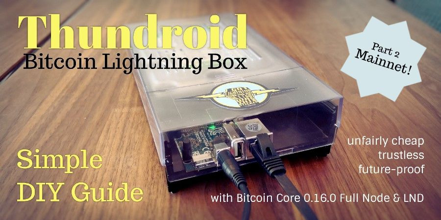
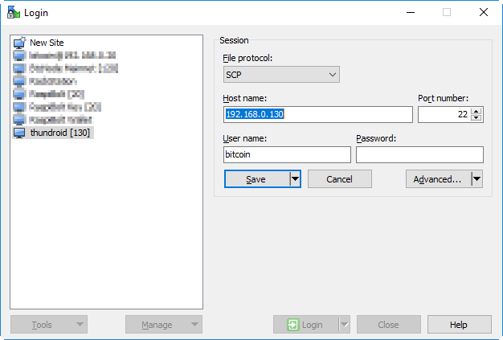
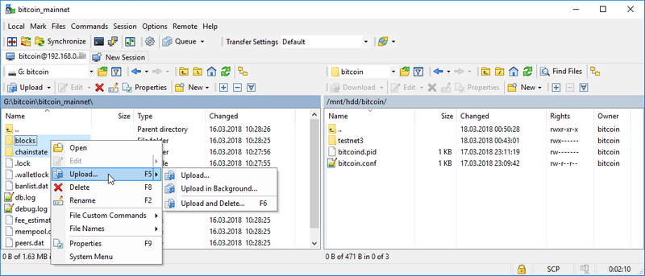
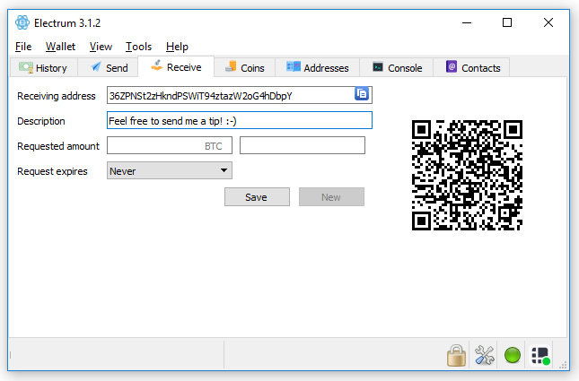
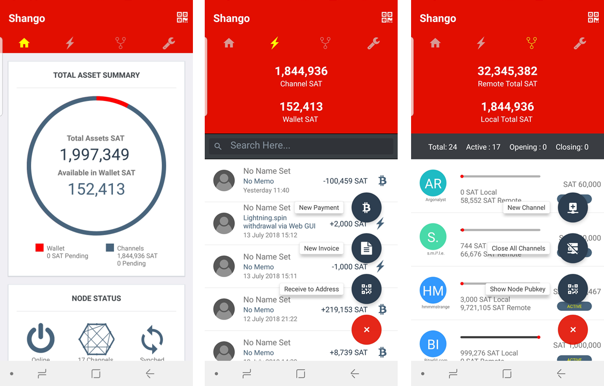

# The perfect Bitcoin Lightning️ node: Part 2



> This article was first published in the Odroid Magazine August 2018 issue. 
>
> [Part 1: Setup of Bitcoin & Lightning on testnet](https://github.com/Stadicus/guides/blob/master/thundroid/README.md)  
> Part 2: Move to Bitcoin mainnet (this guide)  
> Part 3: Additional apps like desktop & mobile wallet

## Introduction to Part 2: Mainnet!

Remember Part 1 of this guide? We set up a Bitcoin full node with Lightning from scratch, went to quite some length to secure our box and started testing Bitcoin on testnet. If you did not catch [Part 1](https://github.com/Stadicus/guides/blob/master/thundroid/README.md), please read it first, as this part won't make much sense without it.

The goal of this guide is to switch our Thundroid from Bitcoin testnet to mainnet and to transact with real money. 

#### Financial best pracices

Bitcoin is a bearer asset like physical cash, so transactions cannot be reversed. Controlling your bitcoin actually means controlling the private keys that allow you use them. This means that if someone has access to your private keys, this person has full control over your bitcoins and once they are sent to a different address, there's nothing you can do to get them back.

To manage your bitcoin, you need a wallet. This is an application that manages the private keys for you. There is an important discinction:

* <u>Hot wallet</u>: an application that manages your private key and is exposed to the internet. It's very convenient (eg. a mobile application), but could potentially be hacked. This type of wallet is used for smaller amounts and for everyday use.
* <u>Cold storage</u>: your private key is never been exposed to any network. Examples are paper wallets (created / printed using an offline computer) or hardware wallets like a [Ledger](https://www.ledgerwallet.com) or [Trezor](https://trezor.io/). This is how you secure your savings in bitcoin.

By definition, this project is a hot wallet as it is connected to the internet. That means: **do not store large amounts of money on your Thundroid**! 

* <u>Bitcoin</u>: don't use the wallet built into Bitcoin Core at all. The way to go is to use a small hardware wallet  to secure your private keys with Thundroid as your trusted backend to send / verify transactionsbut. More on that later.
* <u>Lightning</u>: as the whole network is still in beta, it goes without saying that you should not put your life savings into it. Experimenting with small amounts is fine, but do it at your own risk.

Also, please be aware that while Bitcoin has been battle-tested for almost a decade and is used to move billions of USD every day, the Lightning Network is still in beta and under heavy development. This guide also allows you to set up your Bitcoin node while just ignoring the Lightning part.

## Moving to Mainnet

The current setup of your Thundroid runs on Bitcoin testnet. Make sure that your box running smoothly so that we can move on to copy the mainnet blockchain that you already downloaded on a regular computer (see [Part 1](https://github.com/Stadicus/guides/blob/master/thundroid/README.md#outlook-prepare-for-bitcoin-mainnet)) to the box.

On your regular computer, check the verification progress in Bitcoin Core. To proceed, it  should be fully synced (see  status bar). Shut down Bitcoin Core on  Windows so that we can copy the whole data structure to the Thundroid.  This takes about 6 hours.

:information_source: **If you get stuck**, please [check out my GitHub repository](https://github.com/Stadicus/guides). You can search for already solved issues there, or open a new issue if necessary. 

### Temporarily enable password login

In order to copy the data with the user "bitcoin", we need to temporarily enable the password login.

* As user "admin", edit the SSH config file and put a `#` in front of "PasswordAuthentication no" to disable the whole line. Save and exit.  
   `$ sudo nano /etc/ssh/sshd_config`  
   `# PasswordAuthentication no`
* Restart the SSH daemon.  
   `$ sudo systemctl restart ssh`

### Copy mainnet blockchain using SCP

We are using "Secure Copy" (SCP), so [download and install WinSCP](https://winscp.net), a free open-source program. There are other SCP programs available for Mac or Linux that work similarly. Do not use `rsync` as this can lead to issues later on.

* With WinSCP, you can now connect to your Pi with the user "bitcoin". Both protocols SCP and SFTP work, in my experience SCP is a bit faster.  
   

* Accept the server certificate and navigate to the local and remote bitcoin directories:
  * Local: `d:\bitcoin\bitcoin_mainnet\`
  * Remote: `\mnt\hdd\bitcoin\`
* You can now copy the two subdirectories `blocks` and `chainstate` from Local to Remote. This will take about 6 hours.
   

⚠️ The transfer must not be interupted. Make sure your computer does not go to sleep.

### Disable password login again

As user "admin", remove the `#` in front of "PasswordAuthentication no" to enable the line. Save, exit the config file and restart the ssh daemon.

```
$ sudo nano /etc/ssh/sshd_config
PasswordAuthentication no

# Restart the SSH daemon.
$ sudo systemctl restart ssh
```

### Send back your testnet Bitcoin

To avoid burning our testnet Bitcoin, and as a courtesy to the next  testers, we close all our channels and withdraw the funds to the address  stated on the website of the [Bitcoin Testnet Faucet](https://testnet.manu.backend.hamburg/faucet).

* `$ lncli closeallchannels`
* Wait unitl the the channel balance is zero and the funds to be back in our on-chain wallet.  
   `$ lncli channelbalance`  
   `$ lncli walletbalance`

* Send the amount provided by `walletbalance` minus 500  satoshis to account for fees. If you get an "insufficient funds" error,  deduct a bit more until the transaction gets broadcasted.  
   `$ lncli sendcoins 2N8hwP1WmJrFF5QWABn38y63uYLhnJYJYTF [amount]`

### Adjust configuration

* Stop the Bitcoin and Lightning services.  
   `$ sudo systemctl stop lnd`  
   `$ sudo systemctl stop bitcoind`

* Delete LND wallet 

* Edit "bitcoin.conf" file by commenting  `testnet=1` out. Save and exit.  
   `$ sudo nano /home/bitcoin/.bitcoin/bitcoin.conf`    

   ```
   # remove the following line to enable Bitcoin mainnet
   #testnet=1
   ```

* Copy updated "bitcoin.conf" to user "admin" for credentials (the command `bitcoin-cli` looks up the "rpcpassword")  
   `$ sudo cp /home/bitcoin/.bitcoin/bitcoin.conf /home/admin/.bitcoin/`  

* Edit "lnd.conf" file by switching from `bitcoin.testnet=1` to `bitcoin.mainnet=1`. Save and exit.  
   `$ sudo nano /home/bitcoin/.lnd/lnd.conf`   

   ```
   # enable either testnet or mainnet
   #bitcoin.testnet=1
   bitcoin.mainnet=1
   ```

* Delete the LND authorization files (*.macaroon). They are linked to the currently active wallet and need to be created when we will create a new wallet for mainnet. 

   ```
   $ sudo rm /home/bitcoin/.lnd/*.macaroon
   $ sudo rm /home/bitcoin/.lnd/data/macaroons.db
   ```

### Restart bitcoind & lnd for mainnet

⚠️ **Do not proceed** until the copy task of the mainnet blockchain is completely finished.

* Start Bitcoind and check if it's operating on mainnet  

  ```
  $ sudo systemctl start bitcoind
  $ systemctl status bitcoind.service
  $ sudo tail -f /home/bitcoin/.bitcoin/debug.log  (exit with Ctrl-C)
  $ bitcoin-cli getblockchaininfo
  ```

* **Wait until the blockchain is fully synced**: "blocks" = "headers", otherwise you might run into performance / memory issues when creating a new lnd mainnet wallet. 

* Start LND and check its operation (it will wait for the wallet to be created)

   ```
   $ sudo systemctl start lnd
   $ systemctl status lnd
   ```

### Create mainnet wallet

Once LND is started, we need to create a new integrated Bitcoin wallet for mainnet. 

* Start a "bitcoin" user session and create a new wallet  

  ```
  $ sudo su - bitcoin
  $ lncli create
  ```

* If you want to create a new wallet, enter your `password [C]` as wallet password, select `n` regarding an existing seed and enter the optional `password [D]` as seed passphrase. 

[](https://github.com/Stadicus/guides/blob/odroid_pt2/thundroid/images/40_cipher_seed.png)

The 24 seed words that are displayed, combined with your optional passphrase, is the backup for your on-chain Bitcoin. The current state of your channels, however, cannot be recreated from this seed, this is still  under development for LND.

⚠️ This information must be kept secret at all times. **Write these 24 words down manually on a piece of paper and store it in a safe place.**   This piece of paper is all an attacker needs to completely empty your   wallet! Do not store it on a computer. Do not take a picture with your   mobile phone. **This information should never be stored anywhere in digital form.**

* Exit the "bitcoin" user session. To use  `lncli`  with the "admin" user, copy the permission files and the TLS certificate. Check if it's working.

   ```
   $ exit
   $ sudo cp /home/bitcoin/.lnd/tls.cert /home/admin/.lnd
   $ sudo cp /home/bitcoin/.lnd/admin.macaroon /home/admin/.lnd
   ```

* Check if it works by getting some node infos  
   `$ lncli getinfo`

* Restart `lnd` and unlock your wallet (enter `password [C]` )    

   ```
   $ sudo systemctl restart lnd   
   $ lncli unlock 
   ```

* Monitor the LND startup progress until it caught up with the mainnet  blockchain (about 515k blocks at the moment). This can take up to 2  hours, then you see a lot of very fast chatter (exit with `Ctrl-C`).  
   `$ sudo journalctl -f -u lnd`

* This command will return "synced_to_chain: true" if LND is ready   
   `$ lncli getinfo`

### Improve startup process

It takes a litte getting used to the fact that the LND wallet needs to be manually unlocked everytime the LND daemon is restarted. This makes sense from a security perspective, as the wallet is encrypted and the key is not stored on the same machine. For reliable operations, however, this is not optimal, as you can easily recover LND after it restarts for some reason (crash or power outage), but then it's stuck with a locked wallet and cannot operate at all. 

This is why a script that automatically unlocks the wallet is helpful. The password is stored in a root-only directory as plaintext, so clearly not so secure, but for reasonable amounts this is a good middle-ground in my opinion. You can always decide to stick to manual unlocking, or implement a solution that unlocks the wallet from a remote machine.

* As user "admin", create a new directory and save your LND wallet password [C] into a text file  
  `$ sudo mkdir /etc/lnd`   
  `$ sudo nano /etc/lnd/pwd` 

* The following script unlocks the LND wallet through its web service (REST interface). Copy it into a new file.    
  `$ sudo nano /etc/lnd/unlock`   

  ```
  #!/bin/sh
  # LND wallet auto-unlock script
  # 2018 by meeDamian, robclark56
  
  # Delay is needed to make sure bitcoind and lnd are ready. You can still 
  # unlock the wallet manually if you like. Adjust to your needs:
  /bin/sleep 300s
  
  LN_ROOT=/home/bitcoin/.lnd
  
  curl -s \
          -H "Grpc-Metadata-macaroon: $(xxd -ps -u -c 1000 ${LN_ROOT}/admin.macaroon)" \
          --cacert ${LN_ROOT}/tls.cert \
          -d "{\"wallet_password\": \"$(cat /etc/lnd/pwd | tr -d '\n' | base64 -w0)\"}" \
          https://localhost:8080/v1/unlockwallet > /dev/null 2>&1
  
  echo "$? $(date)" >> /etc/lnd/unlocks.log
  exit 0
  ```

* Make the directory and all content accessible only for "root"  

  ```
  $ sudo chmod 400 /etc/lnd/pwd
  $ sudo chmod 100 /etc/lnd/unlock
  $ sudo chown root:root /etc/lnd/*
  ```

* Create a new systemd unit that starts directly after LND.   
  `$ sudo nano /etc/systemd/system/lnd-unlock.service `

  ```
  # Thundroid: system unit for lnd unlock script
  # /etc/systemd/system/lnd-unlock.service
  
  [Unit]
  Description=LND wallet unlock
  After=lnd.service
  Wants=lnd.service
  
  [Service]
  ExecStart=/etc/lnd/unlock
  Type=simple
  
  [Install]
  WantedBy=multi-user.target
  ```

* Edit the LND config file to enable the REST interface on port 8080  

  `$ sudo nano /home/bitcoin/.lnd/lnd.conf`  

  ```
  # add the following line in the [Application Options] section
  restlisten=localhost:8080
  ```

* Reload systemd and enable the new unit. Restart your Thundroid and watch the startup process to see if the wallet is automatically unlocked

  ```
  $ sudo systemctl daemon-reload
  $ sudo systemctl enable lnd-unlock.service
  $ sudo shutdown -r now
  ---- reconnect ----
  # Unlocking the wallet will take several minutes due to the build in delay
  $ sudo journalctl -u lnd -f
  ```

*Note:  a more elegant way were to run the script with `ExecStartPost=+/etc/lnd/unlock` in the lnd.service unit. This would it able to unlock the wallet if LND service is restarted outside the startup process. The `=+` is necessary to run LND with user "bitcoin" and the unlock script with root privileges. Unfortunately, this is only supported starting with systemd version 331, but we are using version 229.*

## Start using the Lightning Network

### Fund your node

Congratulations, your Thundroid is now live on the Bitcoin mainnet! To  open channels and start using it, you need to fund it with some bitcoin.  For starters, put only on your node what you are willing to lose.  Monopoly money.

* Generate a new Bitcoin address to receive funds on-chain  
   `$ lncli newaddress np2wkh`  
   `> "address": "3.........................."`
* From your regular Bitcoin wallet, send a small amount of bitcoin to this address, or ask your one annoying Bitcoin friend to send you a few bucks. :-)
* Check your LND wallet balance  
   `$ lncli walletbalance`
* Monitor your transaction on a Blockchain explorer: <https://smartbit.com.au>

### LND in action

As soon as your funding transaction is mined and confirmed, LND will  start to open and maintain channels. This feature is called "Autopilot"  and is configured in the "lnd.conf" file. If you would like to maintain  your channels manually, you can disable the autopilot.

You can use the same commands that were listed in [Part 1](https://github.com/Stadicus/guides/blob/odroid_pt2/thundroid/README.md#lnd-in-action) of this guide or use, go to [LND API reference](http://api.lightning.community/) or just type `lncli --help`.

### Try it out and explore Lightning mainnet

There are a lot of great resources to explore the Lightning mainnet in regard to your own node.

* [Lightning Spin](https://www.lightningspin.com/): simple Wheel of Fortune game
* [Lightning Network Stores](http://lightningnetworkstores.com/): Stores and services accepting Lightning payments
* [Recksplorer](https://rompert.com/recksplorer/): Lightning Network Map
* [1ML](https://1ml.com): Lightning Network Search and Analysis Engine
* [lnroute.com](http://lnroute.com): comprehensive Lightning Network resources list


## What's next?

You now have your own Bitcoin / Lightning full node. THe initially stated goals were the follows and I we achieved them all:

* [x] is as fully validating Bitcoin Full Node and does not require any trust in a 3rd party
* [x] is reliably running 24/7
* [x] is part of and supports the decentralization of the Lightning network by routing payments
* [x] can be used to send and receive personal payments using the command line interface.
* [ ] Usability? Not so much...

Is it the perfect Bitcoin Lightning node yet? It's cluky and the command line does just not cut it. In Part 3 of this guide we will therefore go on to extend the Thundroid with additional applications that use it as our own private backend.

* The **Electrum** desktop wallet is the perfect power-user wallet to handle regular on-chain Bitcoin transaction. Because it supports a wide variety of hardware-wallets, you private keys never need to be exposed to any (possibly compromised) online computer. With the **Electrum Personal Server** running on Thundroid, you have full control to send, receive & verify Bitcoin transactions with great security and privacy.



* The **Shango** lightning mobile wallet is perfect for small, instant payments on the go. It connects to your Thundroid and provides a neat user interface on your iOS / Android phone to send and receive payments, manage peers and channels. While still in closed beta, I hope it will be public just in time. 

  

  

------

Join me in part 3 of the guide "The perfect Bitcoin Lightning️ node" soon to discover some cutting edge applications that work on top of our own Bitcoin full node!