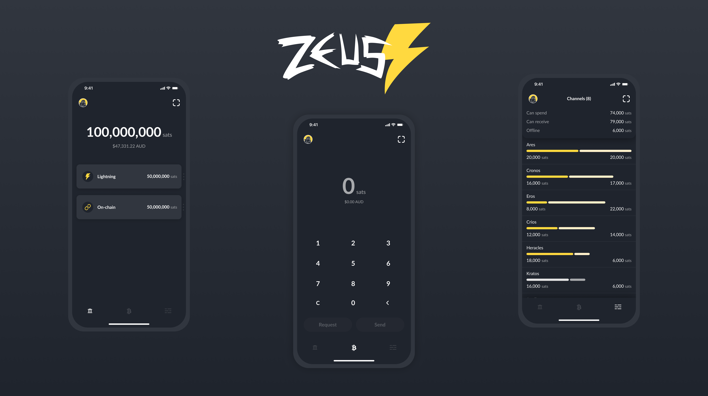

<!-- markdownlint-disable MD014 MD022 MD025 MD033 MD040 -->
# Zeus
{: .no_toc }

We install [Zeus](https://zeusln.app/){:target="_blank"}, a cross-platforms mobile app that connect to your LN node over Tor.  Make payments with lightning or on-chain and manage your channels whle you're on the go.



---

Difficulty: Easy
{: .label .label-green }

Status: Tested v3
{: .label .label-green }

Download the Zeus app, APKs available here: https://github.com/ZeusLN/zeus/releases, 
on F-Droid and Google Play.

Log in to your RaspiBolt through ssh.

Edit `torrc` with `sudo nano /etc/tor/torrc` and add the following lines:
```
HiddenServiceDir /var/lib/tor/lnd_api/
HiddenServiceVersion 3
HiddenServicePort 8080 127.0.0.1:8080
HiddenServicePort 10009 127.0.0.1:10009
```
Save (Ctrl+O, ENTER) and exit (Ctrl+X)

Restart Tor:
```
$ sudo systemctl restart tor
```

View the private credentials of your new hidden service. The first part is the onion address, the second part is the secret.
```
$ sudo cat /var/lib/tor/lnd_api/hostname
z1234567890abc.onion
```

Make sure Go is installed (should be v1.11 or higher):  
```
$ go version 
```
If need to install Go, run these:

```
$ wget https://storage.googleapis.com/golang/go1.11.linux-armv6l.tar.gz
$ sudo tar -C /usr/local -xzf go1.11.linux-armv6l.tar.gz
$ sudo rm *.gz
$ sudo mkdir /usr/local/gocode
$ sudo chmod 777 /usr/local/gocode
$ export GOROOT=/usr/local/go
$ export PATH=$PATH:$GOROOT/bin
$ export GOPATH=/usr/local/gocode
$ export PATH=$PATH:$GOPATH/bin
```

Install [lndconnect](https://github.com/LN-Zap/lndconnect):
```
$ cd ~/download
$ wget https://github.com/LN-Zap/lndconnect/releases/download/v0.1.0/lndconnect-linux-armv7-v0.1.0.tar.gz
$ sudo tar -xvf lndconnect-linux-armv7-v0.1.0.tar.gz --strip=1 -C /usr/local/bin
```
Switch to user `bitcoin` and generate the LND connect URI QR code (or String):  
It will be a big QR code so maximize your terminal window and use CTRL - to shrink the code further to fit the screen.
Replace the `host` variable with the onion address previously generated.
To generate QR Code:
```
$ sudo su bitcoin
$ lndconnect --lnddir=/home/bitcoin/.lnd --host=z1234567890abc.onion --port=8080
```
To generate a String:
```
$ sudo su bitcoin
$ lndconnect --lnddir=/home/bitcoin/.lnd --host=z1234567890abc.onion --port=8080 -j
```
Scan or copy paste it with Zeus and you are done.

------

<< Back: [+ Lightning](index.md)
