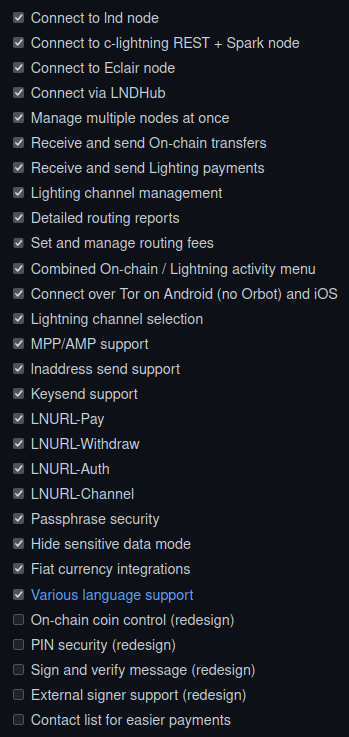

<!-- markdownlint-disable MD014 MD022 MD025 MD033 MD040 -->
# Zeus
{: .no_toc }

We install [Zeus](https://zeusln.app/){:target="_blank"}, a cross-platform mobile app that connect to your LN node over Tor.  Make payments with lightning or on-chain and manage your channels wihle you're on the go.


---

## Table of contents
{: .no_toc .text-delta }

1. TOC
{:toc}

---

### Preparations

#### Access over Tor

Zeus will access the node via Tor.

* Add the following three lines in the section for “location-hidden services” in the `torrc` file. Save and exit.

  ```sh
  $ sudo nano /etc/tor/torrc
  ```

  ```ini
  ############### This section is just for location-hidden services ###
  HiddenServiceDir /var/lib/tor/hidden_service_lnd_rest/
  HiddenServiceVersion 3
  HiddenServicePort 8080 127.0.0.1:8080
  ```

* Reload Tor configuration and get your connection address.

   ```sh
   $ sudo systemctl reload tor
   $ sudo cat /var/lib/tor/hidden_service_lnd_rest/hostname
   > abcdefg..............xyz.onion
   ```

* Save the onion address in a safe place (e.g., password manager)
   
#### Check if Go is installed

* Check if you have already installed Go

  ```sh
  $ go version
  > go version go1.17.4 linux/arm64
  ```

* If not, use the next section to install Go on your node

#### Install Go

* Check the latest stable version of the arm64 binary at [https://golang.org/dl/](https://golang.org/dl/) and download it

  ```sh
  $ cd /tmp
  $ wget https://go.dev/dl/go1.17.4.linux-arm64.tar.gz
  ```

* Check on the download page what is the SHA256 checksum of the file, e.g. for above: 617a46bd083e59877bb5680998571b3ddd4f6dcdaf9f8bf65ad4edc8f3eafb13. Get the SHA256 hash of the downloaded file, it should be the same number as the one on the website

  ```sh 
  $ sha256sum go1.17.4.linux-arm64.tar.gz
  > 617a46bd083e59877bb5680998571b3ddd4f6dcdaf9f8bf65ad4edc8f3eafb13  go1.17.4.linux-arm64.tar.gz
  ```

* Install Go in the `/usr/local` directory

  ```sh 
  $ sudo tar -xvf go1.17.4.linux-arm64.tar.gz -C /usr/local
  $ rm go1.17.4.linux-arm64.tar.gz
  ```

* Add the binary to PATH to not have to type the full path each time you are using it. For a global installation of Go (that users other than "admin" can use), open `/etc/profile`

  ```sh
  $ sudo nano /etc/profile
  ```

* Add the following line at the end of the file, save and exit

  ```ini
  export PATH=$PATH:/usr/local/go/bin
  ```

* To make the changes effective immediately (and not wait for the next login), execute them from the profile using the following command

  ```sh
  $ source /etc/profile
  ```

* Test that Go has been properly installed by checking its version

  ```sh
  $ go version
  > go version go1.17.4 linux/arm64
  ```

#### Install lndconnect

[lndconnect](https://github.com/LN-Zap/lndconnect){:target="_blank"}, created by Zap, is a utility that generates QR Code or URI to connect applications to lnd instances.

* Create a "lndconnect" user and add it to the "lnd" group
  
  ```sh
  $ sudo adduser --disabled-password --gecos "" lndconnect
  $ sudo adduser lndconnect lnd
  $ sudo su - lndconnect
  ```

* Clone the repository and install lndconnect
  
  ```sh
  $ git clone https://github.com/LN-Zap/lndconnect
  $ cd lndconnect
  $ go build
  ```
  
* Update PATH
  
  ```sh
  $ cd ~/
  $ echo 'export PATH=$PATH:/home/lndconnect/lndconnect' >> /home/lndconnect/.bashrc
  $ source /home/lndconnect/.bashrc
  ```
  
#### Create a lndconnect QR code

lnconnect can generate a URI and create a QR code that can then be read by Zeus.

* Still with the "lndconnect" user, use the following command. Make sure to replace the .onion address with the one you generated above.

  ```sh  
  $ lndconnect --host=abcdefg..............xyz.onion --port=8080
  ```
  
* It will be a big QR code so maximize your terminal window and use CTRL - to shrink the code further to fit the screen

* Keep the SSH session with the QR code opened, it will be needed later

---

### Install Zeus on the phone

#### On Android

##### Download the APK file

* On your phone, go to the Zeus [release page](https://github.com/ZeusLN/zeus/releases){:target="_blank"} and download the latest Android APK file in the 'Assets' section (e.g., `zeus-v0.6.0-alpha4.apk`).

##### Verify the checksum of the file

* On your phone, install [Hash Droid](https://f-droid.org/en/packages/com.hobbyone.HashDroid/){:target="_blank"} from F-Droid or Google Play.

* Open Hash Droid, select 'Hash a file', select the 'SHA-256' hash function and select the downloaded APK file and click 'Calculate' (e.g., `41006ef7019f471529d35ab5c846986919c4b6f8cdf07d01c5851ff08b41ce02`)

* On your computer, open the '...signature.txt' file located in the 'Assets' section (e.g., `zeus-v0.6.0-alpha4-signature.txt`), it contains a line with the hash sum of the APK file (e.g., `SHA256(zeus-v0.6.0-alpha4.apk)= 41006ef7019f471529d35ab5c846986919c4b6f8cdf07d01c5851ff08b41ce02`)

* Compare the calculated hash value (Hash Droid) with the expected hash value from the text file, they should be the same.

##### Verify the signature of the file

* On your computer, open a terminal and download the public key used to sign the releases

  ```sh
  $ wget https://zeusln.app/PGP.txt
  ```
  
* Check the public key’s fingerprint

  ```sh
  $ gpg --show-keys PGP.txt
  > pub   rsa4096 2021-10-20 [SC] [expires: 2023-10-20]
  >    96C225207F2137E278C31CF7AAC48DE8AB8DEE84
  > uid                      Zeus LN <zeusln@tutanota.com>
  > sub   rsa4096 2021-10-20 [E] [expires: 2023-10-20]
  ```

* Import the PGP key

  ```sh
  $ gpg --import PGP.txt
  > gpg: key AAC48DE8AB8DEE84: public key "Zeus LN <zeusln@tutanota.com>" imported
  > gpg: Total number processed: 1
  > gpg:               imported: 1
  ```

* Download the APK file and its associated signature file

  ```sh
  $ wget https://github.com/ZeusLN/zeus/releases/download/v0.6.0-alpha4/zeus-v0.6.0-alpha4.apk
  $ wget https://github.com/ZeusLN/zeus/releases/download/v0.6.0-alpha4/zeus-v0.6.0-alpha4.apk.asc
  ```
  
* Verify that the APK file has been properly signed

   ```sh
   $ gpg --verify zeus-v0.6.0-alpha4.apk.asc zeus-v0.6.0-alpha4.apk
   > gpg: Signature made Wed 01 Dec 2021 00:07:34 -01
   > gpg:                using RSA key 96C225207F2137E278C31CF7AAC48DE8AB8DEE84
   > gpg:                issuer "zeusln@tutanota.com"
   > gpg: Good signature from "Zeus LN <zeusln@tutanota.com>" [unknown]
   > [...]
   ```
   
##### Install Zeus

* Now that we've proven the integrity of the downloaded APK, install Zeus by double-clicking on the APK file.

* Once the installation is finished, quit and delete all the APK file, it is not needed anymore.


#### On iOS

To install the latest version of Zeus (not available in the Apple Store yet), you will use TestFlight.

* Install TestFlight on your phone by following these instructions: [https://testflight.apple.com/](https://testflight.apple.com/){:target="_blank"}.

* Once installed, open the following link on your phone: [https://testflight.apple.com/join/gpVFzEHN](https://testflight.apple.com/join/gpVFzEHN){:target="_blank"} and follow the instructions.

---

### Connect Zeus to your node

* Open Zeus and click on 'Get started'
* The screen proposes several settings, we'll come back to them later, for now select 'Connect a node' at the top, and then '+ Add a new node'

* Click on 'Use Tor

* Click on 'Scan LNDConnect config' and when prompted, allow Zeus to take pictures

* Scan the QR code generated earlier

* Click on 'Save settings', Zeus is now connecting to your node, it might take a while the first time.

---

### Security

#### Add a password to access your node in the app

* In the app, go to the settings and select 'Security' and set a passphrase (save your passphrase somewhere safe, e.g., your password manager).

#### Uninstall lndconnect

* Unless you plan to reuse lndconnect soon, it is safer to uninstall the program and "lndconect" user

  ```sh
  $ sudo su -
  $ userdel -r lndconnect
  $ exit
  ```

#### Temporarily disabling the Tor hidden service

* If you don't plan to use the Zeus app for a significant period of time, it is safer to disable the Tor hidden service. With user "admin", open the torrc configuration file, comment out the LND REST API Tor hidden service lines, save and exit and restart Tor.

  ```sh
  $ sudo nano /etc/tor/torrc
  ```

  ```ini
  #HiddenServiceDir /var/lib/tor/hidden_service_lnd_rest/
  #HiddenServiceVersion 3
  #HiddenServicePort 8080 127.0.0.1:8080
  ```
  
  ```sh
  $ sudo systemctl reload tor
  ```

* If you want to reuse Zeus later on, uncomment the three lines and restart Tor

---

### Zeus in action

Below is a list of Zeus existing (ticked) and coming soon (unticked) features:



---

### Update

To update Zeus, download the desired APK and follow the install process above.

---

### Uninstall

To uninstall, you need to uninstall the app on your phone, uninstall lndconnect and deactivate the LND REST API Tor hidden service

* Uninstall the app on your phone

* To uninstall lndconnect, follow the guidelines provided in [this section](#Uninstall lndconnect)

* To deactivate the LND REST API Tor hidden service, follow the guidelines in [this section](# Temporarily disabling the Tor hidden service)

---

Next: [Bonus Section >>](bonus/index.md)
